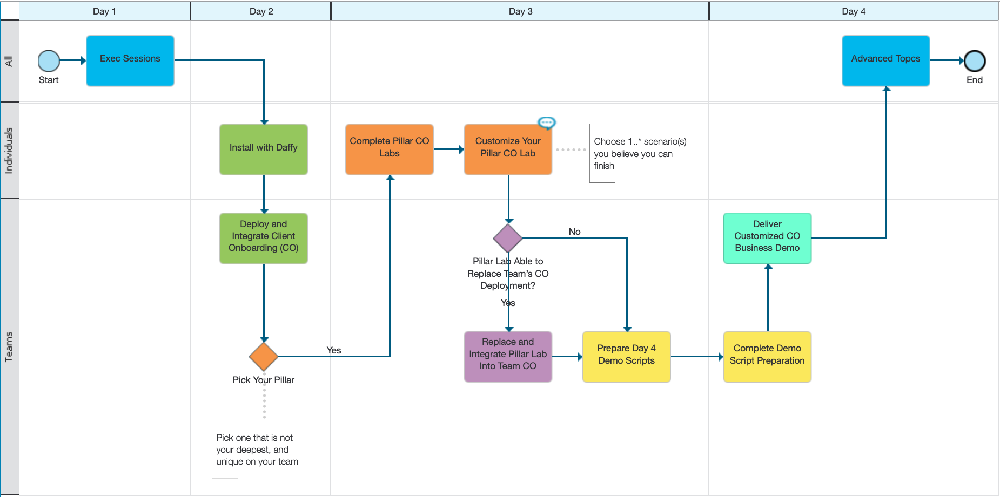

The process diagram below represents the activities for this event.

<a href="https://ibm.biz/SKOTechAcademyProcess" target="_blank">{width="1944"}</a>

!!! note "Course Breakdown"

    === "Day 1"
        Exec Sessions
        
        |Day   | Time          | Session / Activity                                           |
        | :--- | :------------ | :----------------------------------------------------------- |
        |Day 1 | 1:00 – 1:30   | Opening Remarks – Sarah McAndrew, Carlos Camilion            |
        |      | 1:30 – 2:15   | Automation Roadmap and Strategy - Bill Lobig                 |
        |      | 2:15 – 2:30   | Support and Feedback process                                 |
        |      | 2:30 – 2:45   | Break                                                        |
        |      | 2:45 – 3:45   | Segment Strategy - (Segment VP’s/Execs: Matt Warta, Rakesh Ranjan, Eileen Lowry, John Greene) |
        |      | 4:00 –5:15    | Team Building                                                |
        |      | Evening       | Team Dinner                                                  |
        
    === "Day 2"
        1. Each attendee will set up Daffy and provision a cluster in ROKS.
        1. Teams member assignments will be published and also given a pre-provisioned team cluster.
        1. Team members will work together on the team cluster and perform the Deploy and Integrate section to deploy artifacts for the Client Onboarding solution.
        

        |Day   | Time          | Session / Activity                                           |
        | :--- | :------------ | :----------------------------------------------------------- |
        |Day 2 | 8:00 - 8:30   | Introduction                                                 |
        |      | 8:30 - 10:30  | Deployment - Daffy & Cluster Build [Individual]              |
        |      | 10:30 - 11:00 | Break                                                        |
        |      | 11:00 - 12:30 | [Client Onboarding Demonstration - Art of the Possible](/client-onboarding/co-overview) |
        |      | 12:30 - 1:30  | Lunch                                                        |
        |      | 1:30 - 5:00   | Client Onboarding - Deploy and Integrate [Team]              |
    
    === "Day 3"
        1. Review Stand and Deliver Guidelines
        1. Team members will work together on the team cluster and rebuild portions of the Client Onboarding solution, selecting a capability that is not their deepest expertise and/or is the most needed skill in their market.  Every member of the team should select a different rebuild lab.
        1. Customization use case scenarios will be provided prior to lunch.
        
        |Day   | Time          | Session / Activity                                           |
        | :--- | :------------ | :----------------------------------------------------------- |
        |Day 3 | 8:00 - 8:15   | Briefing on activities for the day   Review Stand and Deliver Guidelines |
        |      | 8:15 - 12:30  | Client Onboarding - Rebuild portion of solution [Individual] |
        |      | 12:00 - 12:30 | Prior to lunch, customization use case scenarios will be posted to the slack channel |
        |      | 12:30 - 1:00  | Lunch                                                        |
        |      | 1:30 - 5:00   | Continue Rebuild & Begin Customizations [Team/Individual]    |

    === "Day 4"
        1. Team members will prepare and deliver the customized Client Onboarding demo. 
        1. Advanced Topics & Best Practices
        
        |Day   | Time          | Session / Activity                                           |
        | :--- | :------------ | :----------------------------------------------------------- |
        |Day 4 | 8:00 - 8:15   | Briefing on activities for the day                           |
        |      | 8:15 - 10:00  | Prep for demo                                                |
        |      | 10:00 - 12:30 | Deliver Customized Client Onboarding Demo [Team]             |
        |      | 12:00 - 1:00  | Lunch                                                        |
        |      | 1:00 - 4:00   | Advanced Topics & Best Practices                             |
        |Day 4 | 4:00 PM       | Attendees required to stay until 4:00 PM                     |

  
