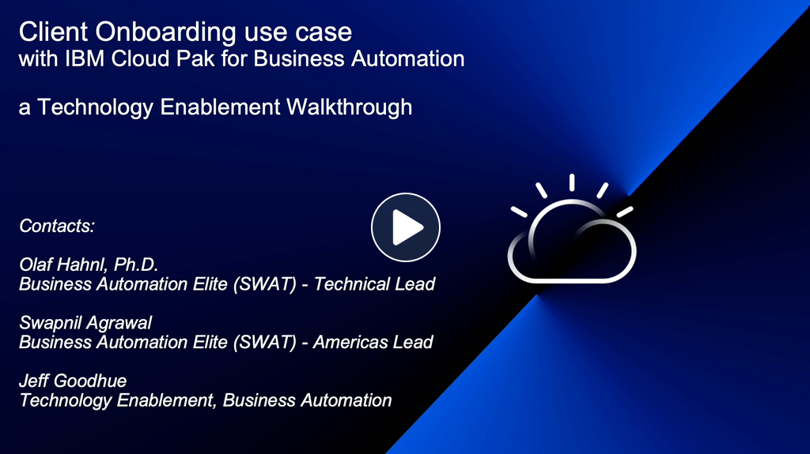

    
The client onboarding scenario is an end-to-end solution that showcases the art of the possible with IBM Cloud Pak for Business Automation (CP4BA).  

You can see the end-to-end in action in this video:
<a href="http://ibm.biz/cp4ba-overview-video" target="_blank">{width="400"}</a>

The instruction to demonstrate the end-to-end scenario can be found here:
  
