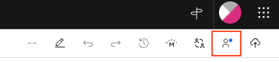
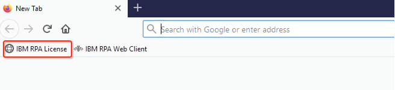
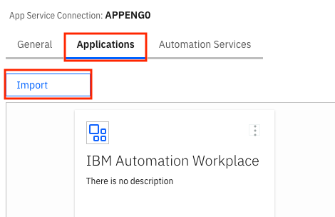
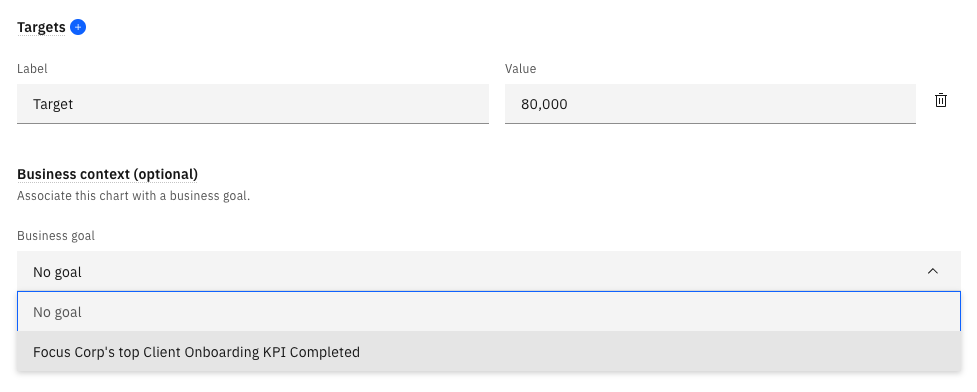
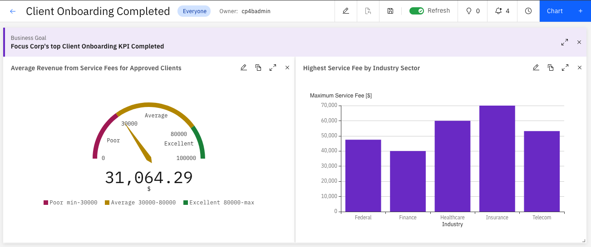
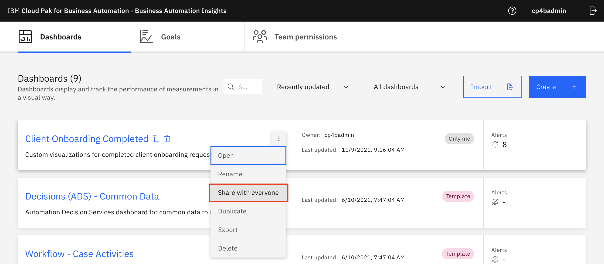

# Deploy and Integrate (Team)

!!! note
    These instructions assume that you have Cloud Pak for Business Automation 21.0.3 installed along with **Open Prediction Service (OPS)**.  
    <br>
    The CP4BA cluster that has been provisioned for you for Tech Academy meets these requirements.

!!! warning
    You must use the artifacts downloaded from this site.  
    <br>
    Do **NOT** use the original SWAT artifacts you may have downloaded previously as these are from a Production deployment of CP4BA and there are subtle differences.

## Instructions

There are 7 sections that you will need to import and build the **Client Onboarding**[^1] solution into your team cluster.  

[^1]:
    The Client Onboarding assets have been adapted from the
    <a href="https://github.com/IBM/cp4ba-labs/tree/main/21.0.3" target="_blank">IBM TechJam 21.0.3</a>
    materials as developed by the IBM SWAT Team


Below are the recommended tracks so that different members of the team can be the primary driver of the lab. Please designate the primary driver using a team member that may not be the most experienced in each capability. As a recommendation, use the Slack huddle feature so members of the team can clearly see the steps that are being performed.  

| Track   | Section(s) | Description                                                                                      |
| --------| -----------| -------------------------------------------------------------------------------------------------|
| A       | 1<br>2     | Import the ADS ML Model <br> Import the ADS Project                                              |
| B       | 4<br>5     | Import the Workflow Solution <br> Import objects into FileNet Content Manager                    |
| C       | 6<br>7     | Import the Business Automation Application app <br> Import the Business Automation Insights data |
| D       | 3<br>9     | Setup the RPA Server (optional) <br> Validate the RPA Integration (optional)                     |

Section 8 - **Validate Client Onboarding solution** should be completed as a team when all the section have been completed.

You can access the github repo for this event using the link in the top-right corner. This will provide access to PDF's,
pre-built solutions and lab assets.


## Installation Links
<a name="installation-links"></a>
??? note summary "Expand to view"

    Each team will be allocated a pre-configured CP4BA cluster, hosted using an enterprise account on [**IBM Cloud**](https://cloud.ibm.com/){target="_blank"} to which you have been invited.  
    <br>
    Log into [**IBM Cloud**](https://cloud.ibm.com/){target="_blank"} and switch to the enterprise account **2326304 - itztsglenablement01** as shown below:  
    <br>
    

    Select the burger icon in the top-left corner and select **OpenShift**, then **Clusters**  
    <br>
    

    To find your cluster enter your allocated lab name in the search box, (here I'm using **lab01**).  
    <br>
    Click on the three dots on the right hand side of the screen adjacent to your cluster and select **OpenShift Web Console**.  
    <br>
    

    Login to the **OpenShift Web Console** and locate the config map called **icp4adeploy-cp4ba-access-info**.  
    <br>
    

    Select the **icp4adeploy-cp4ba-access-info** config map then select **YAML** and then **Download**  
    <br>
    

    You will find all the links and credentials for your deployment. Specify **Enterprise LDAP** when you log into an application.  

!!! NOTE
    A deeper understanding of each of the sections below will be covered in the labs in the [**Rebuild**](co-rebuild.md){target="_blank"} section.
    

## 1. Import the ADS ML Model
<a name="deploy-integrate-1"></a>
??? note summary "Expand to view"

    1\. Open the ADS ML Service (Open Prediction Service) in your browser.  
    <br>
    To find the link for this component, open the OpenShift web console and select **Networking** then **Routes**. These are all the public links exposed by the OpenShift cluster. To easily find the **ADS ML Service** public link, select **ads-ml-service** from the project dropdown near the top of the screen as shown in the diagram below.  
    <br>
    From the **Location** column, click on the link to open the **Swagger UI** for the **ADS ML Service**.  
    <br>
    
    
    2\. Under `manage`, expand the `POST /models Add Model` section  
    

    3\. Click on `Try it out`

    4\. Use the contents of the [addModel.json](Solution%20Exports/Automation%20Decision%20Services/ML/addModel.json) file as the request body. It's easier if you right click on the link and open it in a new tab.

    5\. Click on `Execute` and scroll down to the actual server repsonse (scroll past the example)

    6\. Copy the ID of the created model from the response body. It is typically `1` as this ADS ML Service is currently empty.  
    {width="600"}  

    7\. We've added the meta-data of the model, now we must add the model binary. Under `manage`, expand the `POST /models/{model_id} Add Binary` section  
    

    8\. Click on `Try it out`

    9\. Use the ID copied from the last API call, typically `1`.

    10\. In the request body, keep `pickle` selected as the `format`

    11\. Download this [pickle file](Solution%20Exports/Automation%20Decision%20Services/ML/service-payment-default-risk-v0-archive.pkl) onto your computer and use it as as the selected file  
    {width="600"}  

    12\. Click on `Execute`. The response code is 201. The model named `service-payment-default-risk` is succesfully deployed.
    The following instructions validate that this deployment can be safely executed.

    13\. Under `run`, expand the `/predictions` section

    14\. Click on `Try it out`

    15\. Use the contents of the [runModel.json](Solution%20Exports/Automation%20Decision%20Services/ML/runModel.json) file as the request body  
    <br>
    Note: from your browser, please ensure to select **Raw Data** to view/copy the request body:  
    {width="300"}  

    16\. Update the `$PREDICTION-ID$` in the json to the `ID` copied before, typically this is `1`.

    17\. Click on `Execute`. The result should be as follows:

        `{ "result": {  "predictions": 0,  "scores": [   0.9068544064724676,   0.0931455935275324  ]}}`

     

    ***Tip*** Keep this browser window open, you'll need the URL in the next step.  

    !!! success
       ℹ️ &nbsp; You have successfully imported the ADS ML Service, please proceed to the next section
         
    [Go to top of section](#deploy-integrate-1) | [Go to top of page](#instructions)

## 2. Import the ADS Project
<a name="deploy-integrate-2"></a>
??? note summary "Expand to view"

    !!! warning
        The ADS Project requires an empty github repo and a git API token, if your team doesn't have git knowledge please contact an instructor.
        Public github seems to be the most reliable.  
        <br>
        Create a **Personal Access Token** under **Developer Settings**.  
        If you need additional guidance, please refer to section
        [Item 91 - Creating a git repo for ADS](../../troubleshooting/troubleshooting/#faq-91) in the [Troubleshooting](../../troubleshooting/troubleshooting) section.  
        
    1. Download [ClientOnboardingDecisions.zip](Solution%20Exports/Automation%20Decision%20Services/ClientOnboardingDecisions.zip)

    2. Create an empty GIT repo and get its URL and API Key

    3. Log into your CP4BA cluster and Open IBM Business Automation Studio, select LDAP authentication at the login screen.

    4. Click to the menu in the upper-left corner and go to `Design` --> `Business Automations`

    5. Click on `Create` --> `Decision Automations`

    6. Provide `Client Onboarding` as the project name and click `Create`

    7. Once the editor loads, click on `Import` and import the previously downloaded file ClientOnboardingDecisions.zip into the project  
    <br>
    {width="400"}

    8. Click on `Connect to Github` icon  
    <br>
    {width="400"}

    9. Enter the URL and API key of the GIT repo created previously

    10. Click on `Connect` in the top-right corner

    11. Go to the `Machine learning providers` tab

    12. Click on `New` in the top-right corner

    13. In the dialog, select `Open Prediction Service` as the `Type`

    14. Enter `OPS` as the name

    15. Use the ADS ML Service (Open Prediction Service) URL in the `URL` field
        **Note:** This is the same URL you used for importing the predictive model without the `/docs` suffix at the end.

    16. Click on `Test Connection`  
    <br>
    {width="400"}

    17. Click on `Save`

    18. Go back to the `Client Onboarding` project  
    <br>
    {width="400"}

    19. Open `Client Onboarding Decisions`

    20. Click on `Machine learning scoreboard`

    21. Click on `Connect` and select `OPS` as the machine learning provider

    22. Expand the `service-payment-default-risk` ML model and select the `service-payment-default-risk` deployment  
    <br>
    {width="800"}

    23. Click `Next` twice to `Test invocation`

    24. Test the decision by entering the following values:

        - clientAnnualRevenue: 15708854
        - clientExistenceDuration: 12
        - clientEmployeeNumber: 3
        - clientIndustry: 0
  
    25. Click on `Run`
  
    26. Verify that the output matches the following:  
    <br>
    ```
    {
        "result": {
            "predictions": 1,
            "scores": [
                0.014675209287711932,
                0.9853247907122881
            ]
        }
    }
    ```
    <br>
    <br>
    {width="800"}  
    
    27. Click on `Next`
    
    28. Click on `Generate from test output` then click `OK`. Verify that `predictions` and `scores` are added to the output schema.
    
    29. Click on `Apply` in the upper-right corner
    
    30. Under `Share changes` at the top, click on the number of changes  
    <br>
    
    
    31. Click on `Share` and then `Share` again in the popup
    
    32. In the `View history` tab, click on `Version +` and create a new version named `v21`
    
    33. In the `Deploy` tab, expand `v21`, click on `Deploy` and wait for deployment to complete  
    {width="800"}

    34. Back in the studio, go to `Design` --> `Business Automations` -->`Decisions` and click on the `Client Onboarding` Decision project   

    35. Select the three-dot menu for `v21` and click on `Publish` and then click on `Publish` again to make the automation service available without restricting access.  
  
    !!! success
        ℹ️ &nbsp; You have successfully imported the ADS project.
        
    [Go to top of section](#deploy-integrate-2) | [Go to top of page](#instructions)

## 3. Setup the RPA Server (optional)
<a name="deploy-integrate-3"></a>
??? note summary "Expand to view"

    **Note:** You only need to perform these steps if you want to demo the RPA execution. You can choose to skip the execution of the RPA bot when you import the Workflow solution.

    1. Request auto-onboarding onto the SWAT RPA Tenant using this [form](http://159.122.122.170:8080/RPA4SKO/)
    2. Reserve an environment from [here](https://techzone.ibm.com/collection/cloud-pak-for-business-automation-cp-4-ba-onboarding-rpa) using your IBMID.
       
    3. Click **Environments** on the left panel, and then click **computer icon**.  
       
    4. Click **Reserve for now**, then click **Submit**.  
       
    5. On the reservation page, make the appropriate selections as below. Once done, click **Submit**.  
       
    6. Once you have reserved an environment, you will receive an email with a link to access the management console for the environment including a password (**Desktop Access Information**). It also contains a **URL to access the IBM RPA Rest Service remotely (Application Service Information)**, please copy the Application Service Information URL and change **HTTP** to **HTTPS**. This will be used in the Workflow solution.  
       
    7. Click the **Desktop Access link** above to open your environment. When you are prompted to enter environment password, enter the desktop password above. Wait a few minutes, your environment will be started as below.  
       
    8. Click **VM 5 – RPA** to open the RPA client environment.  
    9. Start Firefox, click **IBM RPA license** from the bookmark toolbar to open IBM RPA license manager.  
       
    10. You will see the message **Not Licensed**. Click **Activate** button to open the License Activation window.  
       
    11. Enter your RPA **license ID** and **Password**, (ask the instructors for this) then click the **Activate** button. Once after the license is activated, you should be able to see the number of licenses available for each component.  
          

    !!! success
        ℹ️ &nbsp; You have successfully set up the RPA server, please proceed to the next section

    Once you have setup the RPA server, [import the Workflow solution](#deploy-integrate-4).

    [Go to top of section](#deploy-integrate-3) | [Go to top of page](#instructions)

## 4. Import the Workflow Solution
<a name="deploy-integrate-4"></a>
??? note summary "Expand to view"

    1. <span style="color:Red">ℹ️ **[SKO UPDATE]**</span> Download the workflow app. (This version contains minor
    changes to account for environmental differences).
    [Workflow twx file](Solution%20Exports/Business%20Automation%20Workflow/Client_Onboarding - v4.3.twx).

    2. Login to **IBM Business Automation Studio**

    3. In the top-left corner, click on the menu icon and go to **Business automations**.  
    

    4. Click on **Workflow**.  
    

    5. Click on the **Import** button.

    6. Click on **Browse** and select the twx file downloaded in Step 1.

    7. Click on OK.

    8. Once the import completes, click on tile for the **Client Onboarding** Workflow project (Don't click on the open button but just the tile).

    9. Click on the 3-dot menu next to the Open button on the right and select **Open in Process Designer**
    

        !!! note
            The version numbers and dates in the screenshots maybe different from what you see in your system

    10. In Process Designer, click on the **Environment Variables** tab.

    11. Fill out credentials for a gmail account in the **emailID** and **emailPassword** fields under the **Default** column. Note that the password here must be an [App Password](https://support.google.com/accounts/answer/185833?hl=en) and not your gmail password.
    This gmail account is used by the solution to send outbound emails. If you don't have a gmail account configured
    with an app password you should create one now or use the default one provided.  
    

    12. If you are showcasing ADP as a part of the scenario, enter the ADP host, username, password, and projectID in their respective fields. If you are not, set **adpEnabled** to false.

        !!! note
            ℹ️ &nbsp; For 2022 SKO Tech Academy, we will not be showcasing ADP in this scenario  

    13. For the **documentUploadPage** environment variable, use the URL for Business Automation Navigator for CP4BA and add "?desktop=CODocumentUpload". You will add this desktop to the navigator in a later step.
    The default value is from another environment and illustrates a typical value but you must build yours using your navigator URL.

    14. The RPA bot is currently only executed if the user running the scenario matches the **rpaBotExecutionUser**. You can change this by updating the value of the **rpaBotExecutionUser** environment variable.
    In this environment the rpaBotExecution user will be called cp4admin, so only set this value to cp4admin once your option RPA server and configuration is complete otherwise the workflow will encounter errors.
    It is recommeded that you DO NOT set this value to be cp4admin until you have validated that the end to end COB scenario works without RPA first.

    15. If you are executing the RPA bot, update the value for the **rpaServer** environment variable from the environment you reserved using the previous step.

    16. The default target object store name is **TARGET**. If you have changed this, update the value for the **tosName** environment variable. Demo environments have the default target object store name of **TARGET**.

    17. In the top-right corner, click on the **Finish Editing** button.  
    

    18. In the top-left corner, click on **Business automations** to go back to the BA Studio.  
    

    19. Click on **Open** for the **Client Onboarding** Workflow automation project to open it in the Case Builder.  
    

    20. In the top-right corner, click on the **Deploy** button. The deployment will take a few seconds. Wait until there is a green checkmark next to the button.  
    

    21. In the top-left corner, click on **Automations** to go back to the BA Studio.  
    

    22. Click on the tile for the **Client Onboarding** Workflow automation project.

    23. Click on the 3-dot menu for latest version of the project and click on **Publish**.  
    

    24. Close the dialog that shows that the automation services were published successfully.

    25. In the top-left corner, click on the menu icon and go to **Design** --> **Business automations**.

    26. Click on **Create** --> **External**.

    27. Select **Business Automation Workflow** under **Select the connection type**. Note: this is now done automatically.

    28. Click on **Next**. Note: this is now done automatically.

    29. In the **Connection name** field, enter **External BAW System**.

    30. <span style="color:Red">ℹ️ **[SKO UPDATE]**</span> In the **System URL** field, use the Cloudpak Dashboard URL you retrieved from the confing map add /bas to the end of this URL.

    31. <span style="color:Red">ℹ️ **[SKO UPDATE]**</span> Enter the cp4admin credentials you retrieved from the confing map and click **Next**.

    32. In the **Select a process application** dropdown, select **Client Onboarding**.

    33. Select the checkbox for **New Client Onboarding Request**.  
    

    34. Click on **Next**.

    35. In the **Name** field, enter **Client_Onboarding_Workflows_External**.

    36. Click on **Publish**.

    !!! success
        ℹ️ &nbsp; You have successfully published the workflow solution.

    [Go to top of subsection](#deploy-integrate-41) | [Go to top of section](#deploy-integrate-4) | [Go to top of page](#instructions)


## 5. Import objects into FileNet Content Manager
<a name="deploy-integrate-5"></a>
??? note summary "Expand to view"
    !!! warning
        You must complete the **[Import the Workflow Solution](#deploy-integrate-4)** prior to this step as the document subclasses are created during the workflow import

    1. Login to ACCE using the URL for "Content Platform Engine administration" You can switch to english locale if needed by clicking on the persona icon in upper right corner, and select `Change Language and Locale Settings`.  

    2. Open the target object store (`TARGET` OR `BAWTOS`), by clicking on it. In the Tech Academy systems this is `TARGET` so don't be alarmed by the image below that shows `BAWTOS`.   
      
       
    3. Create a new folder named `Client Documents` under the root folder.  
        
        1. On the navigation area on the left side, open `Browse` and click on `Root folder`.  
          
        
        2. Click on the `Actions` pulldown menu and click on `New Folder`.  
          
        
        3. The `Define New Folders Dialog` opens on the right side. Set the Folder name to `Client Documents`. Then click on `Next >` two times, then on `Finish`.  
          
       
    4. In the `Client Documents` folder, create the documents from the table below (see instructions below the table on how to add a document).
    It is recommended that you open each PDF and image in a new browser tab and save the PDF or image from that tab :  
       
       | Document                                                     | Document Title | Document Class  | Document Properties                                          |
       | ------------------------------------------------------------ | -------------- | --------------- | ------------------------------------------------------------ |
       | [Banking Information - Automation Elite Inc.pdf](Solution%20Exports/FileNet%20Content%20Manager/Client%20Documents/Banking%20Information%20-%20Automation%20Elite%20Inc.pdf) | Banking Information - Automation Elite Inc | Banking Information | Client Name: Automation Elite Inc.<br />Account Number: 1179476345 |
       | [Certificate of Incorporation - Automation Elite Inc.pdf](Solution%20Exports/FileNet%20Content%20Manager/Client%20Documents/Certificate%20of%20Incorporation%20-%20Automation%20Elite%20Inc.pdf) | Certificate of Incorporation - Automation Elite Inc | Client Document | Client Name: Automation Elite Inc.                           |
       | [Utility Bill - Automation Elite Inc.pdf](Solution%20Exports/FileNet%20Content%20Manager/Client%20Documents/Utility%20Bill%20-%20Automation%20Elite%20Inc.pdf) | Utility Bill - Automation Elite Inc                 | Utility Bill        | Client Name: Automation Elite Inc.<br />Service Address: 3974 Carson St, Lansing, MI 48911 |
       | [June Marie - Driver's License.png](Solution%20Exports/FileNet%20Content%20Manager/Client%20Documents/June%20Marie%20-%20Driver's%20License.png) | June Marie - Driver's License                       | Client Document     | Client Name: Automation Elite Inc.<br />                     |
       | [Legacy Consulting - Banking Information.pdf](Solution%20Exports/FileNet%20Content%20Manager/Client%20Documents/Legacy%20Consulting%20-%20Banking%20Information.pdf) | Legacy Consulting - Banking Information             | Banking Information | Client Name: Legacy Consulting<br />Account Number: 7250512345 |
       | [Legacy Consulting - Certificate of Incorporation.pdf](Solution%20Exports/FileNet%20Content%20Manager/Client%20Documents/Legacy%20Consulting%20-%20Certificate%20of%20Incorporation.pdf) | Legacy Consulting - Certificate of Incorporation | Client Document | Client Name: Legacy Consulting |
       
    ### Perform the steps below for each document in the table above
    <a name="deploy-integrate-51"></a>
    ??? note summary "Expand to view (*REQUIRED*)"

        a\. In the navigation area, navigate to "Browse", and "Root Folder". Click on "Client Documents" to bring up the contents of the folder. From the opened "Client Documents" folder, invoke "New Document" from the Actions pulldown menu.  

          

        b\. In the New Document wizard, on the first page provide the document title, and select the Document Class from the table. Then click "Next".  

          

        c\. On the "Document Content Source" page, click on "Add" in the "Content Element" section. Use the popup window to upload the document. Click "Browse" and locate the document on your harddisk, then click on "Add Content" to close the dialog. Then click "Next" on the "New Document" wizard.  

          

        d\. On the next page, provide the property values, according to the table above. No further changes are required, so press "Next" until the final page, then "Finish" and then "Close".  
        
        !!! success
            ℹ️ &nbsp; You have successfully imported the objects required for the solution into FileNet Content Manager. Next, proceed to [Import the Business Automation Application into IBM Business Automation Navigator](#deploy-integrate-6).

        
    ### Prepare a shared environment for labs (*OPTIONAL*)
    <a name="deploy-integrate-51"></a>
    ??? note summary "Expand to view (*NOT REQUIRED FOR SKO TECH ACADEMY*)"
                    
        !!! warning ""
             ⚠️ &nbsp; These steps are not required for SKO Tech Academy.  If you are using an environment that will be shared by multiple **teams**, it is important to disable certain permissions so that the objects defined for the Client Onboarding scenario are immutable.
        
        1. For the `Client Document` document class, update the security settings: remove the shared group (eg: cp4bausers) from the **Default Instance Security**. Update the **Security** and lower the access level for the cp4bausers group to `Modify properties`.

            1. On the Navigation area on the left side, open `Data Design`, `Classes`, `Document` and click on the `Client Document` class to bring up its properties on the right side.  
            

            2. Select the `Default Instance Security` tab. Select the checkbox in front of the line with the shared user group (eg: cp4bausers) group and click on `Remove`. Then click on `Save`.  
            

            3. Select the `Security` tab. Select the checkbox in front of the line with the shared user group (eg: cp4bausers) and click on `Edit...`. In the dialog, set the permission group to `Modify properties`, then click on `Ok`. Click on `Save` again on the `Client Document` class properties.  
            

        2. Expand the `Client Document` class on the left and repeat the previous step for the `Banking Information` and `Utility Bill` document classes.

        !!! success
            ℹ️ &nbsp; You have successfully imported the objects required for the solution into FileNet Content Manager. Next, proceed to [Import the Business Automation Application into IBM Business Automation Navigator](#deploy-integrate-6).
  
    <br>
  
    [Go to top of section](#deploy-integrate-5) | [Go to top of page](#instructions)

## 6. Import the Business Automation Application app
<a name="deploy-integrate-6"></a>
??? note summary "Expand to view"

    <span style="color:Red">ℹ️ **[SKO UPDATE]**</span> Regenerate the applications from their twx source files before importing them as apps into Navigator.  

    1. Download the the two twx files shown below :
        
        - [Client_Onboarding_Request - 6.twx](Solution%20Exports/Business%20Automation%20Application/Client_Onboarding_Request - 6.twx)  
        - [Client_Onboarding_Document_Upload - v1.3.twx](Solution%20Exports/Business%20Automation%20Application/Client_Onboarding_Document_Upload - v1.3.twx)

        In the top-left corner, click on the menu icon and go to **Business applications**.  
        { width="300" }  

        Click on import and import both applications, one at at a time.
    
        Once both applications have been imported go into each application and export a zip file.  
          
        Save these exported zip files somewhere you can find them, you'll need them for the next step.

    2. Login to the **Navigator admin desktop** (URL should end with `desktop=admin`). Use the URL for Business
    Automation Navigator for CP4BA and add `?desktop=admin`

    3. Click on **Connections** in the menu on the left.

        

    4. Select the the **APPENGO** connection and click on the **Edit** button.

        

    5. Click on the the **Connect...** button.

    6. Click on the **Applications** tab.

    7. Click on the **Import** button.

        

    8. Choose the the previously downloaded file **ClientOnboardingRequest.zip** and click on the **Import** button. If an information dialog pops up after import, you can close it.

        **NOTE: **The target object store name specified in the Application is **TARGET**. If you are using a production environment, the target store name could be different (eg: **BAWTOS**). In that case, the 2nd page of the application won't show any documents as it looks for the documents in the TARGET object store. To fix this, you can import the application template in Studio from the main SWAT COB Repo and rebuild the app.

    9. Click on the 3-dot menu for the **Client Onboarding** application and select **Details**,

    10. Click on the **Permissions** tab.

    11. Click on the **Add Teams** button.

    12. In the popup, enter **#** in the **Filter by Teams** field and hit **Enter**.

        

    13. Select the **#AUTHENTICATED-USERS** team and click on the right-facing arrow to move the team to the **Selected** column.

    14. Click on the **Add** button.

    15. Click on the **Close** button.

    16. Similarly, import the application **ClientOnboardingDocumentUpload.zip** and add the **#AUTHENTICATED-USERS** team to it.

    17. Close the **APPENGO** and **Connections** tabs at the top.

    18. In the **Desktops** tab, click on the **Import** button.

    19. Download the two desktop properties files   
        - [Client Onboarding Request Desktop](Solution%20Exports/Business%20Automation%20Navigator/ClientOnboardingRequestDesktop.properties)  
        - [CO Document Upload Desktop](Solution%20Exports/Business%20Automation%20Navigator/CODocumentUploadDesktop.properties)  

    20. Click the import button to import each desktop. Select each file in turn and click import, you can ignore any warnings.

    !!! success
        ℹ️ &nbsp; You have successfully imported the Business Automation Application app
 
    [Go to top of section](#deploy-integrate-6) | [Go to top of page](#instructions)

## 7. Import the Business Automation Insights data
<a name="deploy-integrate-7"></a>
??? note summary "Expand to view"

    !!! warning
        There is a defect in CP4BA 21.0.3 IF008 affecting Case/BAI, events from Case are not emitted. If you are building dashboards make sure these work with preloaded data and don't depend on something you've added to the Case solution. Process events are unaffected.
    
    ### 7.1 Prepare Data and Import Dashboard
    <a name="deploy-integrate-72"></a>
    ??? note summary "Expand to view"

        !!! note        
            These instructions describe how to update the BAI sample data so that it can be uploaded to your CP4BA cluster.
            If you need more guidance to update the BAI data please refer to
            [Item 84 - Preparing BAI Data](../../troubleshooting/troubleshooting/#faq-84) in the [Troubleshooting](../../troubleshooting/troubleshooting) section,
            where you will find a more prescriptive set of instructions to complete steps 1, 2 and 3 below.  
            
            It is recommended to read the outline instructions below to understand the goal of this exercise, but then use the
            steps in the troubleshooting section if you are not confident. If you use the alternative instructions in the
            troubleshooting section for steps 1-3, please return here to complete steps 4-6.
            <br>
        
        High level instructions :    
    
        1. Download the contents of the following directory - [Business Automation Insights](https://github.com/thomasyang44/sko-tech-academy/tree/main/docs/client-onboarding/Solution%20Exports/Business%20Automation%20Insights/){target="_blank"}.

        2. Replace the index names in the downloaded files:

            In the `process-data.json` and `case-data.json` files, the index name parameter must match the index names
            of your environment. The index names are dependent on the date of the install. For example, one of the
            index names in the provided data files is `icp4ba-bai-process-summaries-completed-idx-ibm-bai-2021.11.11-000001`.
            The date element `2021.11.11` must be replaced by the date in your new clusters index name. The image
            below shows an example of the data we need to update. You can use the tool of your choice to perform a
            global find & replace to update all the dates so they reflect the index names in your cluster. The
            VSCode editor works well, but any code editor should work. Section 84 of the troubleshooting guide
            describes this process and uses the sed command line tool to perform the substitution.  

            

            You can get the index names for your environment using the following command (Replace `{esadmin}` with the elasticsearch admin user ID, replace `{espassword}` with the elastichsearch admin user password & replace `{eshost}` with the elasticsearch URL):

                curl -k -XGET -u {esadmin}:{espassword} '{eshost}/_aliases'

        3. Once you have updated the sample data files, from the folder where you've downloaded the files and replaced the index names, run the following script to import the data (replace `{esadmin}` with the elasticsearch admin user ID, replace `{espassword}` with the elastichsearch admin user password & replace `{eshost}` with the elasticsearch URL):

                ES_ADMIN={esadmin}
                ES_PASSWORD={espassword}
                ES_HOST={eshost}

                curl -k -XPOST -H 'Content-Type: application/json' -u ${ES_ADMIN}:${ES_PASSWORD} ${ES_HOST}/_bulk --data-binary @case-data.json
                curl -k -XPOST -H 'Content-Type: application/json' -u ${ES_ADMIN}:${ES_PASSWORD} ${ES_HOST}/_bulk --data-binary @process-data.json
                curl -k -XPOST -H 'Content-Type: application/json' -u ${ES_ADMIN}:${ES_PASSWORD} ${ES_HOST}/_bulk --data-binary @ads-data.json

        4. Open **Business Performance Center** and click **Import.**  
        
            

        5. Click **Browse.**

        6. Select **Client Onboarding Completed.json** (downloaded earlier) and click **Import**.  

            
            
        [Go to top of subsection](#deploy-integrate-71) | [Go to top of section](#deploy-integrate-7) | [Go to top of page](#instructions)

    ### 7.2 Create and configure goals
    <a name="deploy-integrate-72"></a>
    ??? note summary "Expand to view"
        1. Open **Business Perfomance Center**

        2. Click on the **Goals** tab  

            

        3. Click **Create**  

            

        4. For Name enter **Focus Corp's top Client Onboarding KPI Completed**

        5. For Description enter **Focus on the three top KPI identified by senior management team**

        6. For Priority select **High**

        7. Click Goal color to **Purple**

        8. Your Goal definition should look exactly like this:  
      
            

        9. Click **Save**

        10. Click on the **Dashboards** tab

        11. Open the **Client Onboarding Completed** dashboard

        12. For the **Average Revenue from Services Fees for Approved Clients** visualization, click on the **Edit** icon.  
        
            

        13. For the **Business goal** field, select **Focus Corp's top Client Onboarding KPI** from the drop-down list  
      
            

        14. Click **Done**

        15. Repeat steps 11-14 to add the same goal to the **Highest Service Fee by Industry Sector** visualization  
  
        
  
        !!! success
            ℹ️ &nbsp; You have successfully imported the Business Automation Insights Data  

        [Go to top of subsection](#deploy-integrate-72) | [Go to top of section](#deploy-integrate-7) | [Go to top of page](#instructions)

    ### 7.3 Prepare shared environment
    <a name="deploy-integrate-73"></a>
    ??? note summary "Expand to view"   
    
        1. Open **Business Performance Center**

        2. On **Client Onboarding Completed** dashboard select the **3-dot menu** and click **Share with everyone**.
          
            

        !!! success
            ℹ️ &nbsp; You have successfully shared the environment
            
        [Go to top of subsection](#deploy-integrate-73) | [Go to top of section](#deploy-integrate-7) | [Go to top of page](#instructions)
    
    [Go to top of section](#deploy-integrate-7) | [Go to top of page](#instructions)

## 8. Validate Client Onboarding solution
<a name="deploy-integrate-7"></a>
??? note summary "Expand to view"
    <span style="color:Red">ℹ️ **[SKO UPDATE]**</span> This is a quick test to validate the main parts of the solution.
    This test does not include RPA integration
    
    !!! warning
        There is a defect in CP4BA 21.0.3 IF008 affecting Case/BAI, events from Case are not emitted. If you are building dashboards make sure these work with preloaded data and don't depend on something you've added to the Case solution. Process events are unaffected.


    1. Open the Client Onboarding desktop. The URL will begin with the URL from the config map called
    `Business Automation Navigator for CP4BA`. Add `?desktop=ClientOnboarding` to the end of this URL, for example:
    `https://cpd-cp4ba-starter.cp4ba-tech-academy-400310-64b8809ea4bdf3ac103ec2bdb80f1d21-0000.us-south.containers.appdomain.cloud/icn/navigator/?desktop=ClientOnboarding`

    2. Enter `el` in the client name, a type-ahead search should find Automation Elite Inc. Select Automation Elite Inc then click search. The values for the client should be populated.
     

    3. Scroll down to Service Onboarding and select Finance the Corporate Credit Card. Click Calculate Services Fee to trigger a calculation in ADS.
    

    4. Click Review Documents and the screen below will appear. It may take a few moments for the screen to appear and the documents to load.
    

    5. Click on Submit Onboarding Request and a confirmation screen will be displayed with a unique reference.  
    

    6. Load the BAW Process Inspector, Load Process Admin and select Process Inspector from the top menu bar. As this is
    a new cluster the only activity will be from from the Onboarding Request just sibmitted.  Click the refresh button
    and you should see a similar list of tasks as those below.  TODO - help t
    

    7. TODO  
    

    8. TODO  
    

## 9. Validate RPA Integration (optional)
<a name="deploy-integrate-7"></a>
??? note summary "Expand to view"

    If you have provisioned an RPA server and you'd like to test the integration follow these steps. Please make
    sure you have requested a userID on the SWAT tenant using this [link](http://159.122.122.170:8080/RPA4SKO/ )

    1. Refer to your TechZone reservation email and identify the URL for your RPA node  
    

    2. Login to your RPA node and open Firefox and click on the IBM RPA License bookmark. Click Activate.
    

    3. Enter the details of the RPA license (ask an instructor, this should be in Slack).   
    

    4. Open RPA Studio and enter your email address and password to the SWAT RPA tenant, refer to the note above.  
    

    5. Open the Client Onboarding Workflow in Process Designer and update the environment variables with your RPA reservation.
    Make sure the user is cp4admin, also make sure you use https. Save these settings.
    

    6. Run the onboarding scenario described in section 8 with these updated settings with your RPA VM running. If the RPA VM restarts you'll need
    to repeat the activation in step 2. If correctly configured you should see bot activity in the RPA VM.
    
