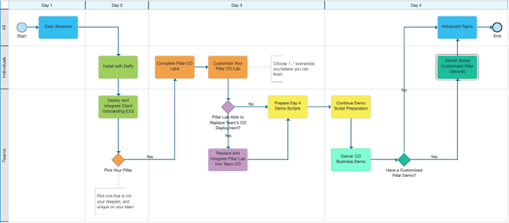

You should now have a good understanding of the Client Onboarding use case scenario. At the end of this course, you will present a customized version of the Client Onboarding solution designed to meet requirements for the client PoC.  

Below is a high-level overview of how your team will build the Client Onboarding solution:

| Item | Description                                                                        |
| :--- | :--------------------------------------------------------------------------------- |
| 1    | Deploy and integrate the Client Onboarding artifacts [Team]                        |
| 2    | Rebuild portions of the lab based on your client PoC requirements [Individual]     |
| 3    | Once each team member completes a pillar Client Onboarding labs from the Rebuild section, each team will choose one or more customization scenarios they believe they can finish in the allotted time.   This exercise serves to mimic a client surprising the tech seller during a PoC or providing a new requirement that you cannot negotiate out of the scenario, and you need to find a way to show it within the PoC you already built. |

**Additional note**  
  - Please also review the [Additional Use Cases](../../use-cases/accounts-pay) for additional ideas on customizations.  
  - Active participation will be critical to the success of this course. Specifically, there will be tremendous value learning  from your peers not only on the capabilities but by discussing experiences executing a client PoC.

!!! warning
    Content including the labs are based on the IBM SWAT Client Onboarding[^1] materials which are configured for the **Production** pattern.  Our environment uses the **Starter** pattern and based on that, you may encounter some differences at certain steps.  
     
    Below are some differences you should be aware of, please post to the slack channel if you encounter additional differences.  
    - BAWTOS => TARGET  
    - cp4bausers => cp4admin  

[^1]:
    The Client Onboarding assets have been adapted from the
    <a href="https://github.com/IBM/cp4ba-labs/tree/main/21.0.3" target="_blank">IBM TechJam 21.0.3</a>
    materials as developed by the IBM SWAT Team  

## Revisit Course Breakdown

??? note summary "Expand to view"
  
    {width="1944"}

## Stand & Deliver Guidelines

??? note summary "Expand to view"

    You and your team are required to demonstrate the Client Onboarding use case you’ve been working on during the technical academy. You are expected to present a business scenario (not only a technical feature demo) and customize your demo narration and/or content to make it specific to a client’s story and customization request(s) you’ve incorporated.  
    
     
    Click the link below to review the evaluation criteria for your team presentation:  
    <a href="https://ibm.seismic.com/Link/Content/DC8DGXXpd3pXdGfW93MTXWhRPGqj" target="_blank">**Stand & Deliver Guidelines**</a>  

    [Go to top of section](#instructions-1) | [Go to top of page](#overview)

## Team Assignment

??? note summary "Expand to view"

    Team assignments will be posted to the event slack channel.

    The setup of the Client Onboarding solution should be done as a team using a cluster that has been pre-provisioned for you.  Access information to the cluster will also be identified in the slack channel.  
    
    Please ensure every team member is aware of the
    <a href="https://ibm.seismic.com/Link/Content/DC8DGXXpd3pXdGfW93MTXWhRPGqj" target="_blank">**Stand & Deliver Guidelines**</a> and work together to craft your client's story including the client PoC requirements.  
    
    [Go to top of section](#instructions-1) | [Go to top of page](#overview)
