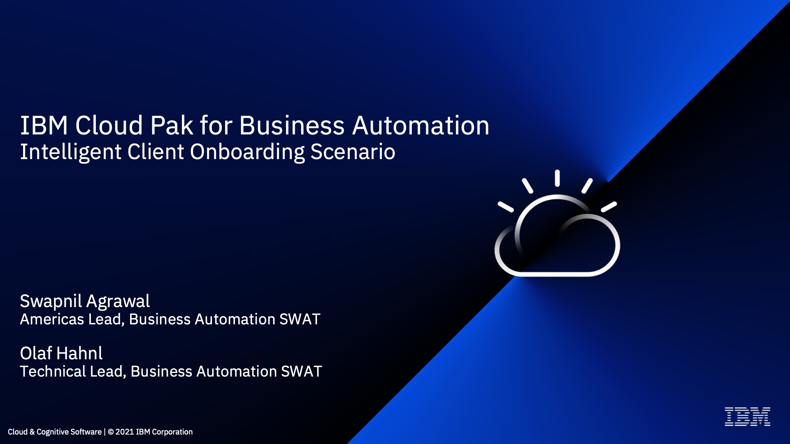
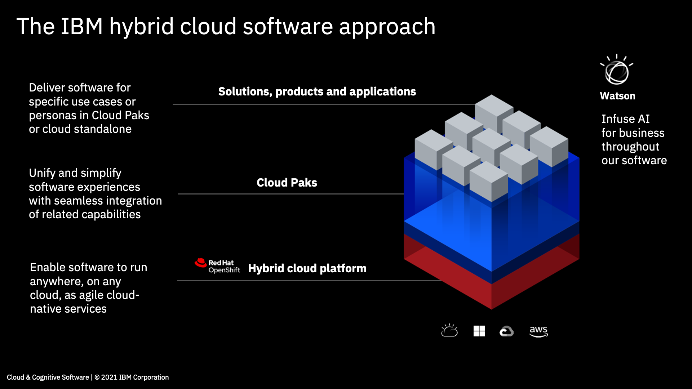
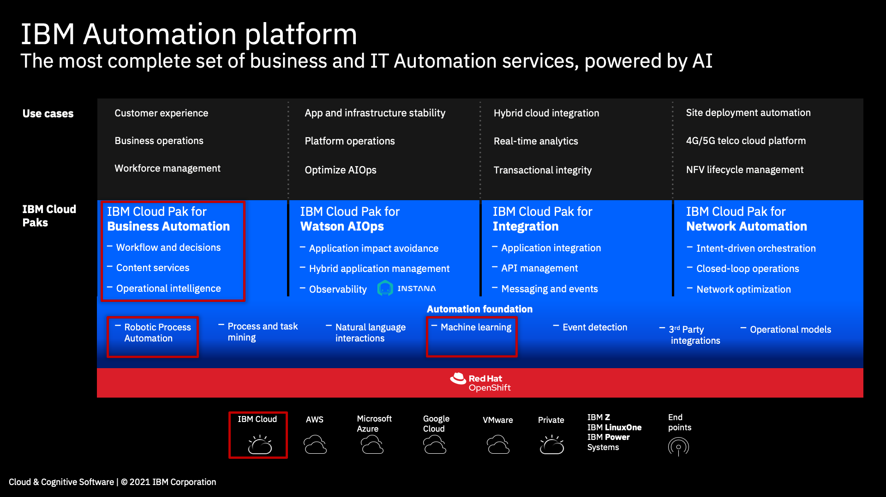
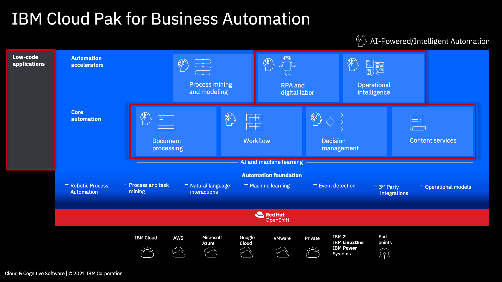
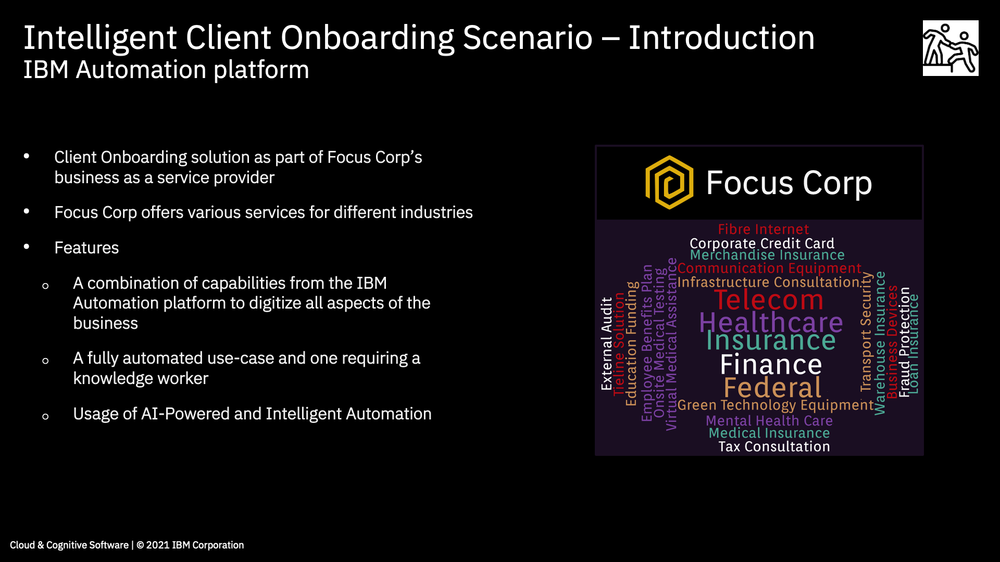
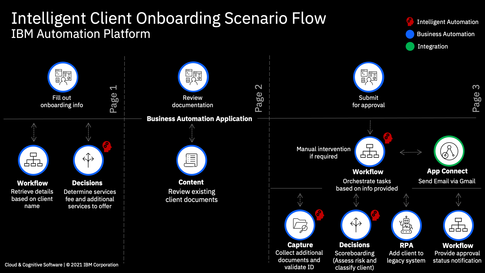
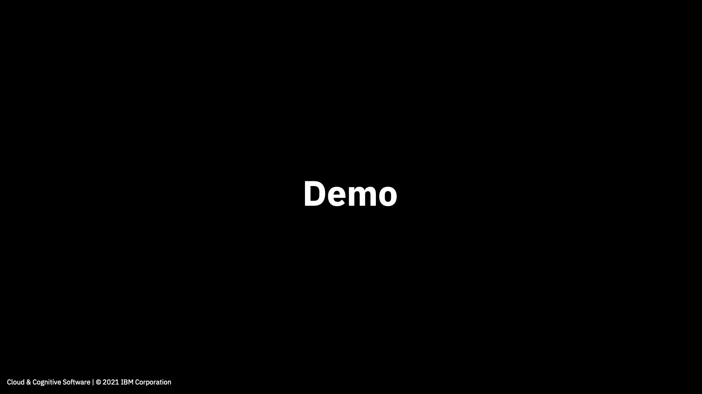
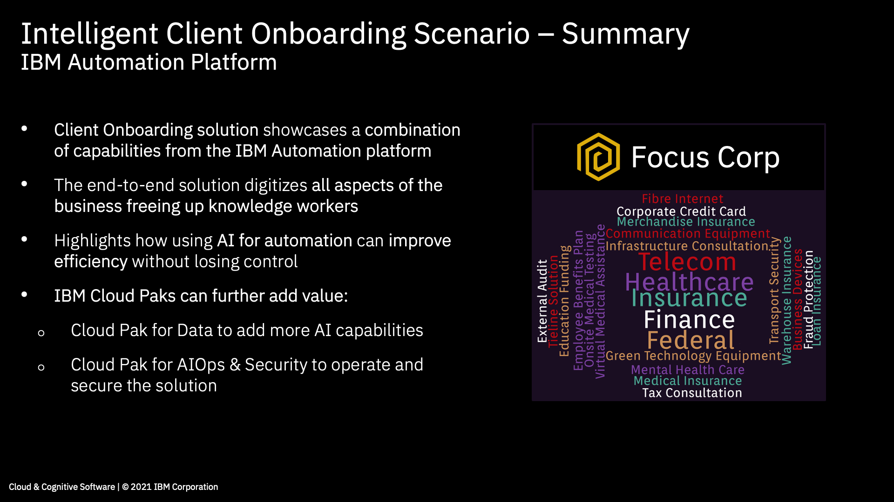
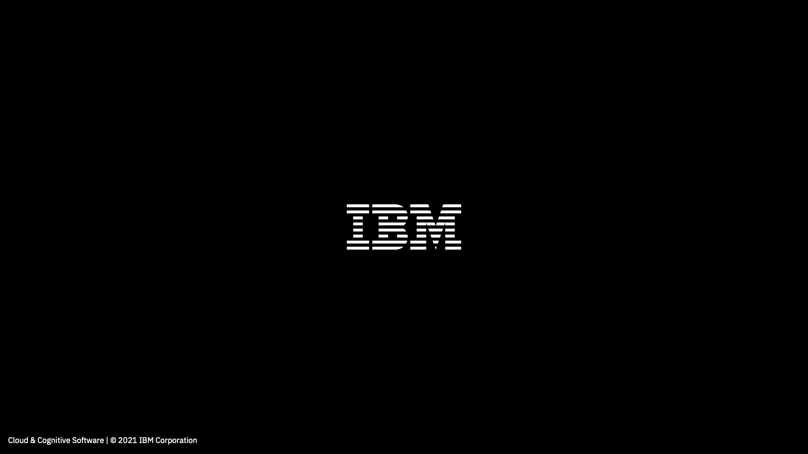
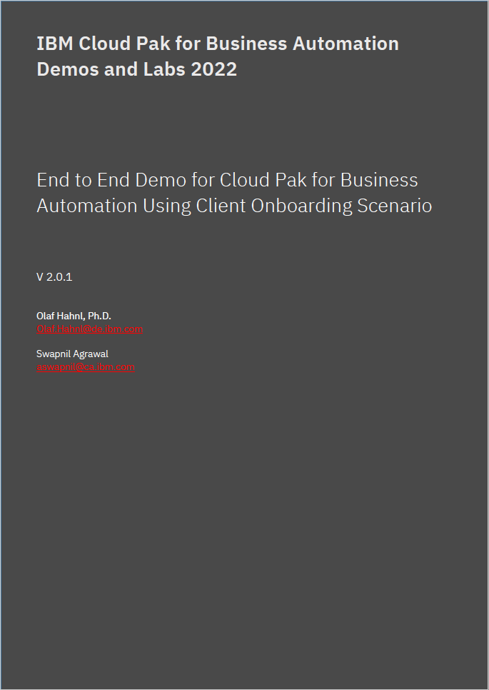

# Overview

IBM Cloud Pak® for Business Automation offers design, build, run, and automation services to rapidly scale your programs and fully execute and operationalize an automation strategy.

The Client Onboarding[^1] scenario is an end-to-end solution that showcases the art of the possible with IBM Cloud Pak for Business Automation (CP4BA).  

!!! note "Client Onboarding Overview"
    === "1"
        
    === "2"
        
    === "3"
        
    === "4"
        
    === "5"
        
    === "6"
        
    === "7"
        
    === "8"
        
    === "9"
        

[^1]:
    The Client Onboarding assets have been adapted from the
    <a href="https://github.com/IBM/cp4ba-labs/tree/main/21.0.3" target="_blank">IBM TechJam 21.0.3</a>
    materials as developed by the IBM SWAT Team
    
## End-to-End Demonstration Assets

??? note summary "Expand to view"

    View the end-to-end in action in this video:  
    
    <a href="http://ibm.biz/cp4ba-overview-video" target="_blank">{width="600"}</a>

    See below for instructions to demonstrate the Client Onboarding scenario:  
    [**IBM Cloud Pak for Business Automation: An End-to-End Demonstration**](labs/IBM%20Cloud%20Pak%20for%20Business%20Automation%20(End-to-End)/Lab%20Guide%20-%20End-to-End%20Scenario.pdf)  
        **Approximate Duration**: 2 hours  
    
    <a href="https://github.com/thomasyang44/sko-tech-academy/blob/main/docs/client-onboarding/labs/IBM%20Cloud%20Pak%20for%20Business%20Automation%20(End-to-End)/Lab%20Guide%20-%20End-to-End%20Scenario.pdf" target="_blank">{width="400"}</a>
    
    [Go to top of section](#c1) | [Go to top of page](#overview)
    
    
    
  
