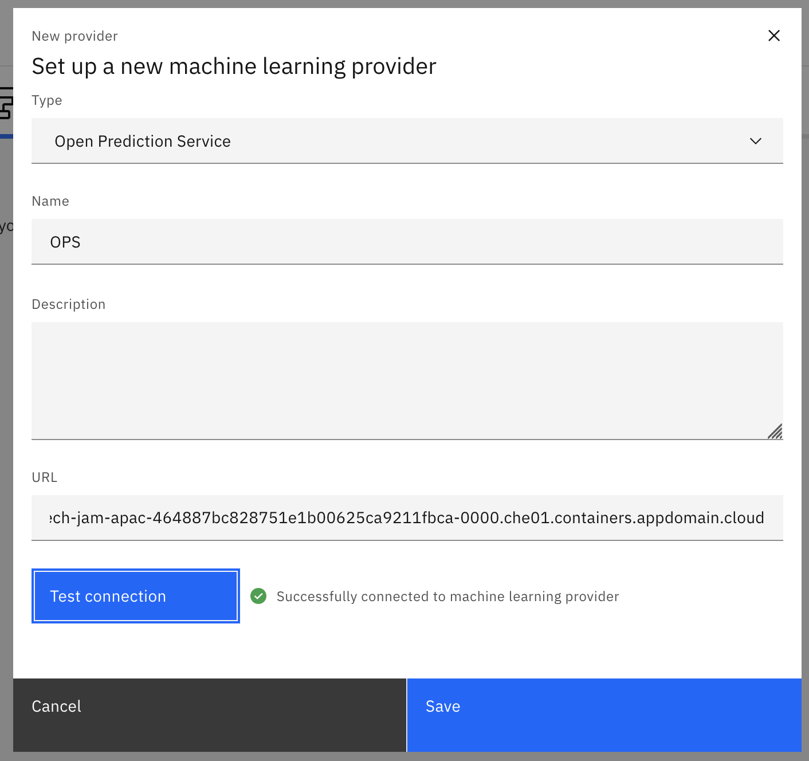

## Introduction
    
The client onboarding scenario is an end-to-end solution that showcases the art of the possible with IBM Cloud Pak for Business Automation (CP4BA).  

You can see the end-to-end in action in this video:

<a href="http://ibm.biz/cp4ba-overview-video" target="_blank">{ width="400"}</a>

The instruction to demonstrate the end-to-end scenario can be found here:
==ibm1  
  
==ibm2  
  
==ibm3  
  
 

## Deploy and Integrate - Import the Client Onboarding Scenarion
??? note summary "Expand to view"
    Below are the materials that you will need to import and build the client onboarding solution:  

    **Note:** These instructions assume that you have Cloud Pak for Business Automation 21.0.3 installed along with Open Predicition Service (OPS).

    1. [Import the ADS ML Model](Step%201%20-%20ADS%20ML%20Model.md)
    2. [Import the ADS Project](Step%202%20-%20ADS%20Project.md)
    4. [Setup the RPA Server (optional)](Step%204%20-%20RPA%20Server.md)
    5. [Import the Workflow Solution](Step%205%20-%20Workflow%20Solution.md)
    6. [Import objects into FileNet Content Manager](Step%206%20-%20Content%20Manager.md)
    7. [Import the Business Automation Application app](Step%207%20-%20Business%20Automation%20Application.md)
    8. [Import the Business Automation Insights data](Step%208%20-%20Business%20Automation%20Insights.md)

## Rebuild
??? note summary "Expand to view"
    Below are the materials that you will need to build the client onboarding solution:  

  
