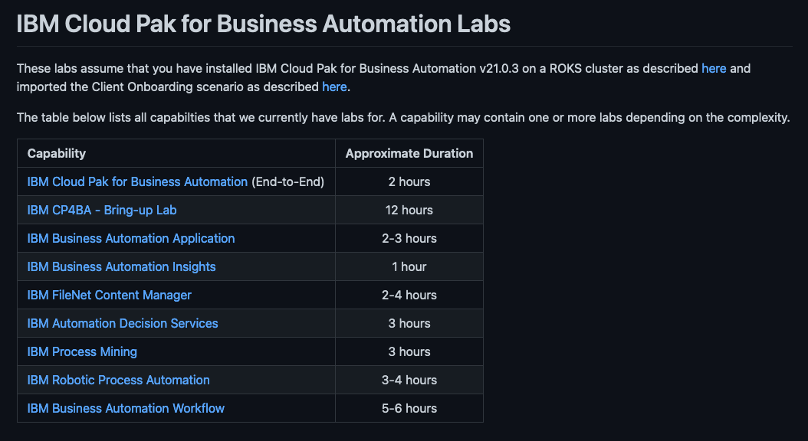

The client onboarding scenario is an end-to-end solution that showcases the art of the possible with IBM Cloud Pak for Business Automation (CP4BA).  
You can see the end-to-end in action with this <a href="http://ibm.biz/cp4ba-overview-video" target="_blank">pre-recorded video</a>.
  

Below are the materials that you will need to build the client onboarding solution:  

<a href="https://github.com/IBM/cp4ba-client-onboarding-scenario/blob/main/21.0.3/README.md" target="_blank">{ width="800"}</a>
  
<a href="https://github.com/IBM/cp4ba-labs/blob/main/21.0.3/README.md" target="_blank">{ width="800"}</a>

  
