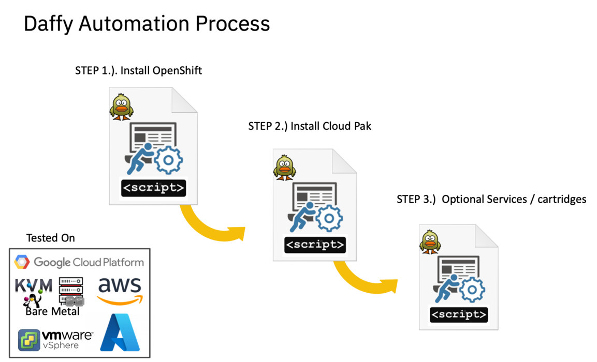
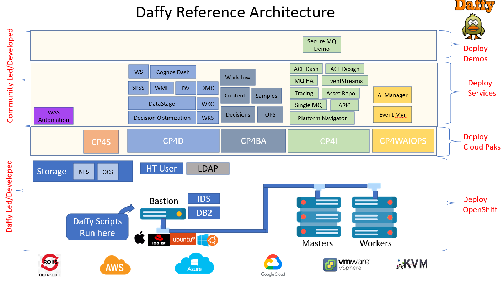
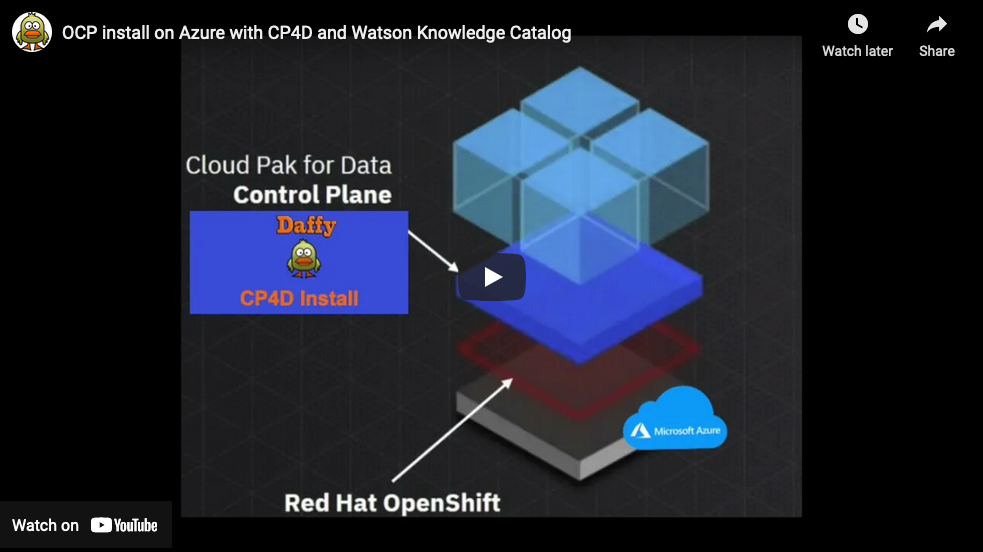

!!! note
    The Daffy setup should have been completed as part of your prework and for IBMers, this information was identified in your learning plan and also identified in the [**Prework - Daffy**](../../learning-plan/learning-plan/#prework-daffy) section.  
     
    If you are not an IBMer -and/or- you have not completed your Daffy Prework, please use this section to set up Daffy.

**Use the navigation menu to complete the following steps:**  
    - [Pre-requirements](requirements.md)  
        - Core Steps - [Access your Bastion server](step1.md)  
        - Core Steps - [Install Daffy](step2.md)  
        - Core Steps - [Create -env.sh](step3.md)  

 

**Steps to Cloud Pak Deployment**  
The Daffy (Deployment Automation Framework For You) automation process is a three step process resulting in the deployment of a Cloud Pak.  You can start at step 1 or step 2 or even step 3. For example, if you do not have a cluster, start at step 1.  If you have OpenShift Cluster already, start at step 2. If you have a OpenShift cluster and already have base cloud pak installed, but just need to deploy a cloud pak service, start at step 3.

!!! note ""
    === "Automation Process"
        
    === "Architecture"
        
    === "Demo Video"
        <a href="https://youtu.be/LFqc0WD7x-U" target="_blank">{width="800"}</a>        
        
    [Top of page](#daffy1) | [Top of section](#overview)  
            
