
    
**What is a bastion server? Why does it exist?**  
A bastion host is a server whose purpose is to provide access to a private network from an external network, such as the Internet. Because of its exposure to potential attack, a bastion host must minimize the chances of penetration. Openshift uses a bastion to help create a running cluster. A bastion can be reused for multiple clusters. In some scenarios for POC purposes such as User Provisioned Infrastructure (UPI), the bastion can be used as the proxy to the cluster.  

Bastion servers can be installed anywhere. This guide assumes the bastion server is Ubuntu 20.04 Minimal and will be in the IBM Cloud.  

Requirements for completing this task is to have an IBMid, an IBM cloud account, and a local SSH key. For more information, go to Daffy Prerequisites.  

Detailed below are the instructions to build your own bastion to do an IPI or MSP install.  

!!! note "If you do not have a bastion, select one of the options below."

    === "IBM Cloud Bastion"
        1\. First, open a web browser and go to [**http://cloud.ibm.com**](http://cloud.ibm.com){target="_blank"}  
        
        2\. Enter your id and click **Continue**  
        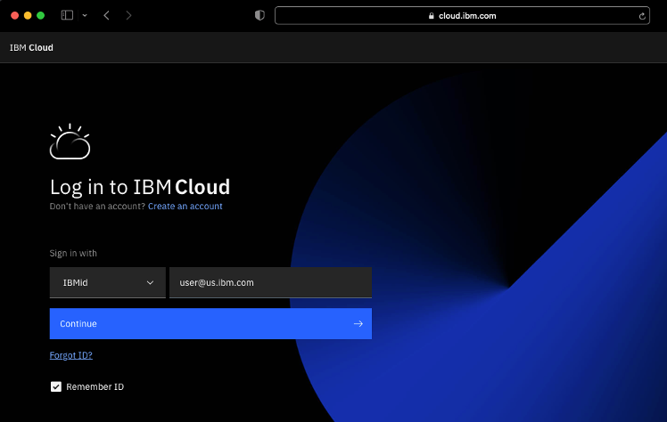{width="600"}

        3\. Once logged in, select **Catalog** in the top menu bar  
        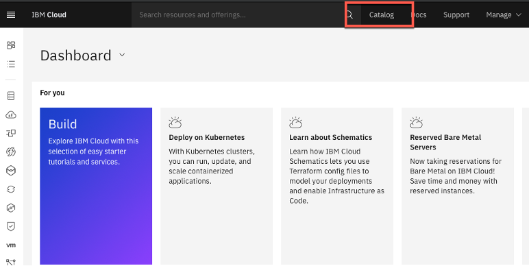{width="600"}

        4\. Once the Catalog is loaded, select **Compute** or search the catalog for Virtual Servers. Select **Virtual Server for Classic**  
        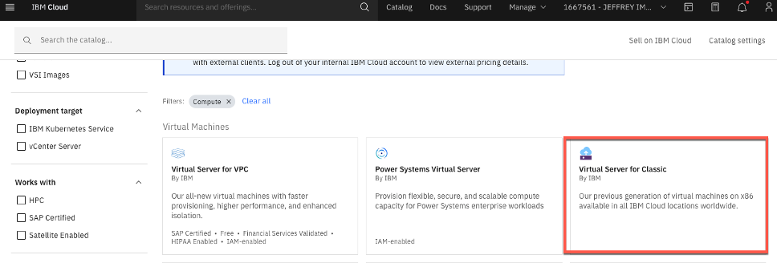{width="600"}

        Alternative: Skip step 3 and search for **virtual server**, choosing **virtual server for classic**. Both options achieve the same thing.
        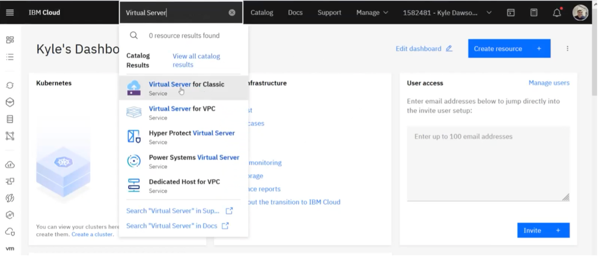{width="600"}

        5\. Fill out the details. (Public, hostname can be anything, and so can domain – feel free to leave what is there originally for your domain). Choose your billing method based on needs to be either **Hourly** or **Monthly** (~$40/mo.) and choose a **Location**.  
        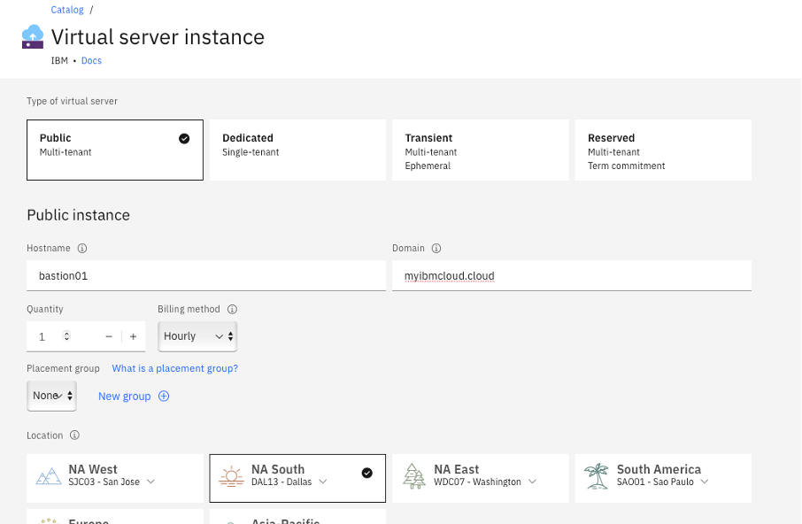{width="600"}

        6\. Scroll down and fill out the remainder of the information. Choose a **server type** and select your **SSH** key so you can login. Finally, make sure you have the **Ubuntu 20.04** Operating System selected.  
        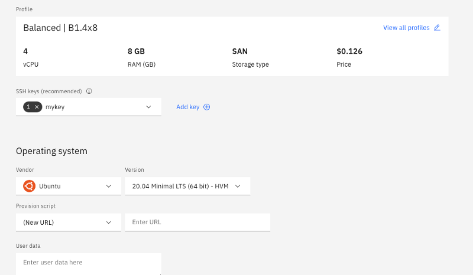{width="600"}

        !!! note
            You can use any other available tool to create a key if needed

        7\. Click the **agreement** on the right-hand pane and select **Create**  
        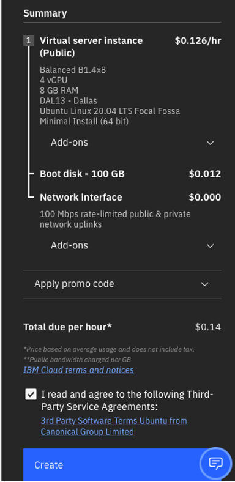{width="300"}

        8\. This will take you to a **device page**. You can search for your bastion you have created. Once your server is done provisioning and has a **start date**, you can login to it via Termius using the **Public IP address**.  
        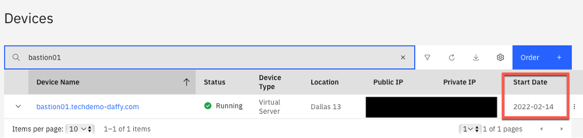{width="800"}

        !!! note  
            If connecting to a VPN to connect to the network, you will use the Private IP address, but Public will be used more frequently.
        
        9\. Create a new host in Termius: use your **SSH key as the password**, use **root as the username**, input the **Public IP Address** from the device list as your host's address, and **create a label**.  
        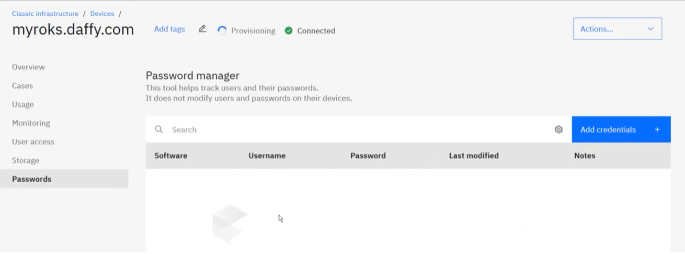{width="800"}

        !!! note
            If you don't use a SSH Key, you can go into the details of the bastion you created by double clicking on it and going to the passwords section. This password will not show until provisioning is complete.

        10\. Once you have connected your bastion to **Termius**, install **Daffy** to the terminal of your newly created host.  
        
    === "IBM Technology Zone Bastion"
        An alternative to creating a bastion using a paid IBM Cloud account is to use IBM Technology Zone.  
        
        1. Navigate to [**IBM Technology Zone**](https://techzone.ibm.com/collection/base-images){target="_blanks "}  
        2. Scroll down to environments, and choose **IBM Virtual Server Instance (Classic)**  

            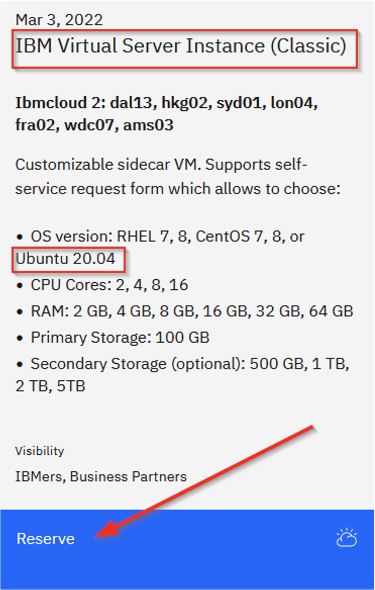{width="300"}

        3. From there, complete your reservation. Make sure to **fill out items 1 – 4**, leaving the other fields **blank**.

            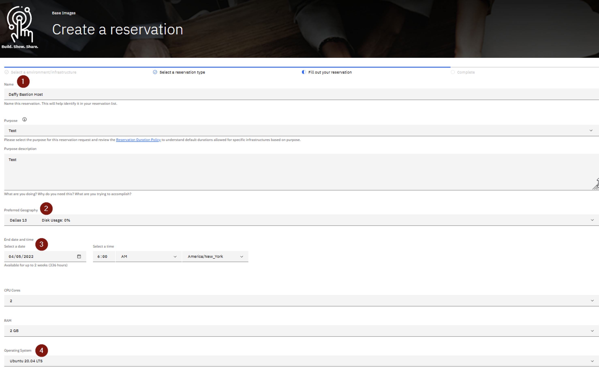{width="1024"}

[Go to top of section](#Step1) | [Go to top of page](#DaffyCoreSteps)
