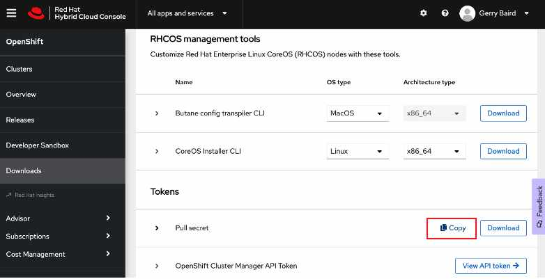
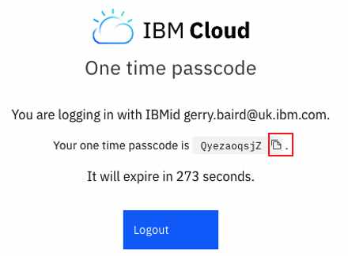

# Cluster Build

To create your cluster execute the following command:
```
/data/daffy/ocp/build.sh <your environment>
```

As a concrete example, if my environment file is called : cp4ba-tech-academy-lab25-env.sh then I would execute the following command:
```
/data/daffy/ocp/build.sh cp4ba-tech-academy-lab25
```

Once the build has completed some pre-checks you'll be asked to provide your RedHat pull secret. You should have 
registered and obtained this pull secret as part of the pre-work. Daffy will provide a link for you to get your pull 
secret if you haven't copied it already :

```commandline
To get your OpenShift Pull secret, you can go here:   https://console.redhat.com/openshift/downloads#tool-pull-secret

Missing PULL_SECRET, Please enter here so we can save to your ~/.profile
PULL_SECRET=
```

Login to the Red Hat website using the URL above and scroll down until you see the pull secret. Click on the highlighted 
copy icon then paste the secret into the Daffy terminal.

 

Daffy will store this pull secret in the user profile.

Next, you'll be asked to login into IBM Cloud. You'll see output like this:
```commandline
Validate ROKS Settings (LOG /data/daffy/log/acme-demo/ocp/ibm-*.log )
################################################################
You are not logged into ibmcloud. PLease login:
API endpoint: https://cloud.ibm.com
Region: eu-gb

Get a one-time code from https://identity-2.eu-central.iam.cloud.ibm.com/identity/passcode to proceed.
Open the URL in the default browser? [Y/n] > 
```

Enter 'n' as we don't have a browser on the bastion server. Daffy is now waiting for a one time passcode that you'll
obtain by logging into IBM Cloud using the URL shown.

Copy the URL from your terminal and paste the URL into a web browser. Once you've logged into IBM Cloud you'll see the 
one time passcode that's been generated for you. Copy the one time passcode by clicking on the highlighted copy icon
and paste the one time code into the Daffy terminal.

 

After pasting in the one time passcode Daffy should confirm your successful authentication:
```commandline
Get a one-time code from https://identity-2.eu-central.iam.cloud.ibm.com/identity/passcode to proceed.
Open the URL in the default browser? [Y/n] > n
One-time code > 
Authenticating...
OK
```

Very soon you'll be asked to confirm which IBM Cloud account you wish to use. Here's an example :

```commandline
Select an account:
1. GERALD BAIRD's Account (b158d441aaee226a9e57ece0e2764ffa) <-> 1896853
2. IBM Cloud UKI (4a88eb681ef4e9f4494c356954d2d25b)
3. IBM (71d0fea63129b7a147a3c207c67efbb2) <-> 1503769
4. Daniel Crow's Account (f5455df33587c3c80903085975de4a98) <-> 1528385
5. ITZ - SQUAD (5ac779bd279b4301adc82d45bea4fd85) <-> 2071092
6. ITZ - V2 (ead8711ba2cc4d08a16fd37427f4f01a) <-> 2112072
7. itztsglenablement01 (e1c69b1f9c6a412b8c73b3b8e78aaf10) <-> 2326304
8. Kyle Dawson - IBM Account (1df0f17a7f0213c2c6ee94b97e3712b7) <-> 1582481
Enter a number> 7
Targeted account itztsglenablement01 (e1c69b1f9c6a412b8c73b3b8e78aaf10) <-> 2326304
```
Please use your own account if you have infrastructure priviledges, if not make sure you select **itztsglenablement01**, 
in the example above this was listed as account (7).

Daffy will now create the Openshift cluster, you see output like this :

```
Create ROKS Cluster
################################################################
Creation of ROKS cluster is dependent on the IBM Provider, this typical takes 30-45 minutes.
ibmcloud oc cluster create classic --name acme-demo --version 4.8_openshift --zone lon06 --flavor b3c.16x64 --hardware shared --workers 7   --public-vlan 3226246 --private-vlan 3226248 --entitlement cloud_pak
Creating cluster...
OK
Cluster created with ID ca35fmfl0ujedhu1f0rg
Waiting for cluster to be ready                                                                                  
```

After about 30-40 mins cluster creation will complete and you'll see output like this:

```commandline
Creating cluster...
OK
Cluster created with ID ca35fmfl0ujedhu1f0rg
                                                                                                                 
COMPLETE  ROKS Cluster ready

Here is the login info you can use for all services and console:   
##########################################################################################################
Current User          :      system:admin
OpenShift Web Console :      https://c109-e.eu-gb.containers.cloud.ibm.com:30563
OC Commandline        :      export KUBECONFIG=/var/ibm-ocp/acme-demo/kubeconfig
OC Login command      :      oc login https://api.acme-demo.:6443 -u  -p  --insecure-skip-tls-verify
OC Client Download    :      https://mirror.openshift.com/pub/openshift-v4/clients/ocp/4.8.36
Install Temp Files    :      /data/daffy/tmp/acme-demo/ocp
openshift-install Dir :      /data/daffy/tmp/acme-demo/ocp/ocp-install
```

***Take note of the OpenShift Web Console URL as you will need this in the next step. The URL for your OpenShift Web Console
is displayed, if this isn't working it will be due to a delay creating the ingress networking, try again in a few minutes. ***

The Openshift cluster has now been created but nothing has been installed. In the next step we'll install the CP4BA 
Operators. Operators automate the creation, configuration, and management of instances of Kubernetes-native applications.
Please proceed to [Operators](operators.md)