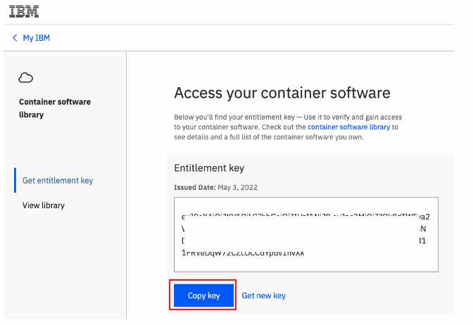

# Operators

Operators automate the creation, configuration, and management of instances of Kubernetes-native applications.To install 
the CP4BA Operator execute the following command in Daffy:

```commandline
/data/daffy/cp4ba/build.sh <your environment>
```

==Take care, this build command is in a different directory to the previous ocp build command.==

As a concrete example, if my environment file is called : cp4ba-tech-academy-lab25-env.sh then I would execute the following command:
```
/data/daffy/cp4ba/build.sh cp4ba-tech-academy-lab25
```
Daffy will need your IBM entitlement key to access the CP4BA software in the IBM Container Registry. You should have 
obtained this entitlement key as part of the pre-work but you can get it here [IBM Key](https://myibm.ibm.com/products-services/containerlibrary)

 

Paste this entitlement key ino the Daffy terminal when prompted.
```commandline
Missing IBM Entitlement Key, to get your key, go here with your browser:
https://myibm.ibm.com/products-services/containerlibrary
Please enter here so we can save to your ~/.profile
IBM_ENTITLEMENT_KEY=eyJ0eXAiOiJILOCCdYpdv1hvXk...etc etc etc....
```
Daffy will store this key and restart the cluster with these credentials added :
```commandline
Updating PullSecret to add IBM Entitlement Key
################################################################
Checking to see if IBM Entitlement Key exists in cluster
Adding Your IBM Token to the existing Pull Secret
secret/pull-secret data updated

Restart ROKS Nodes
################################################################
ibmcloud oc worker reload -q  -f -c cp4ba-acme-demo  -w kube-ca3ohi4l08bq4l61f0v0-cp4baacmede-default-000001ed  
-w kube-ca3ohi4l08bq4l61f0v0-cp4baacmede-default-00000236  -w kube-ca3ohi4l08bq4l61f0v0-cp4baacmede-default-000003d2  
-w kube-ca3ohi4l08bq4l61f0v0-cp4baacmede-default-00000445  -w kube-ca3ohi4l08bq4l61f0v0-cp4baacmede-default-000005d9  
-w kube-ca3ohi4l08bq4l61f0v0-cp4baacmede-default-00000610  -w kube-ca3ohi4l08bq4l61f0v0-cp4baacmede-default-000007e4 
Waiting for ROKS nodes to be ready -  6 Min(s) so far                                                            
```
Note how Daffy is waiting for the ROKS nodes to be ready. This is normal when running these commands immediately. It can take 15-20 mins for this step to complete.

Next, Daffy will need to login to your new cluster and run some commands to install the Operators. You'll see a request
from the Daffy terminal to login to your cluster console and copy/paste the oc admin login command:

```commandline
Cluster Admin setup (LOG -> /data/daffy/log/cp4ba-acme-demo/cp4ba/cp4a-clusteradmin-setup.log)
################################################################
wget https://github.com/IBM/cloud-pak/raw/master/repo/case/ibm-cp-automation-3.2.8.tgz
Please login to your cluster console and copy/paste the oc admin login command below:
https://c109-e.eu-gb.containers.cloud.ibm.com:32245
```

To get the oc login command you first need to login to the OpenShift web console. The URL for this was displayed when
the cluster was created. Look back in your Daffy output and look for a block of output like the example below: 
```commandline
Creating cluster...
OK
Cluster created with ID ca35fmfl0ujedhu1f0rg
                                                                                                                 
COMPLETE  ROKS Cluster ready

Here is the login info you can use for all services and console:   
##########################################################################################################
Current User          :      system:admin
OpenShift Web Console :      https://c109-e.eu-gb.containers.cloud.ibm.com:30563
OC Commandline        :      export KUBECONFIG=/var/ibm-ocp/acme-demo/kubeconfig
OC Login command      :      oc login https://api.acme-demo.:6443 -u  -p  --insecure-skip-tls-verify
OC Client Download    :      https://mirror.openshift.com/pub/openshift-v4/clients/ocp/4.8.36
Install Temp Files    :      /data/daffy/tmp/acme-demo/ocp
openshift-install Dir :      /data/daffy/tmp/acme-demo/ocp/ocp-install
```
Copy the URL for the OpenShift Web Console into a browser and open it (you will need to login to IBM Cloud with your
IBM ID). In the top right corner there is a drop-down, with 
your username as a label. Click the label and a Copy Login Command link will be shown, this is highlighted in red below.
(If the OpenShift Web Console is not loading on a newly created cluster, you'll just need to wait a few minutes the 
application to be deployed and the necessary networking to finish provisioning).


The next screen will display a link "Display Token". Click on this link and the page below will be displayed. Copy the 
oc login command as highlighted in red.


Paste this command into the Daffy terminal and Daffy will proceed with the operator install:

```commandline
Entitlement Registry key is valid.
secret/admin.registrykey created
secret/ibm-entitlement-key created
Applying the persistent volumes for the Cloud Pak operator by using the storage classname: ibmc-file-gold-gid...
persistentvolumeclaim/operator-shared-pvc created
persistentvolumeclaim/cp4a-shared-log-pvc created
catalogsource.operators.coreos.com/ibm-cp4a-operator-catalog created
catalogsource.operators.coreos.com/ibm-cp-automation-foundation-catalog created
catalogsource.operators.coreos.com/ibm-automation-foundation-core-catalog created
catalogsource.operators.coreos.com/opencloud-operators created
catalogsource.operators.coreos.com/ibm-db2uoperator-catalog created
catalogsource.operators.coreos.com/bts-operator created
catalogsource.operators.coreos.com/cloud-native-postgresql-catalog created
IBM Operator Catalog source created!
operatorgroup.operators.coreos.com/ibm-cp4a-operator-catalog-group created
CP4BA Operator Group Created!
subscription.operators.coreos.com/ibm-cp4a-operator created
CP4BA Operator Subscription Created!
Adding the user IAM#gerry.baird@uk.ibm.com to the ibm-cp4a-operator role...Done!
Applying no_root_squash for demo DB2 deployment on ROKS using CLI
New project cp4ba-starter has been setup for CP4BA in your cluster

serviceaccount/ibm-cp4ba-anyuid created
clusterrole.rbac.authorization.k8s.io/system:openshift:scc:anyuid added: "ibm-cp4ba-anyuid"

Copy JDBC Files to ibm-cp4a-operator Pod
################################################################
                                                                                                                 
Successfully copied JDBC files -> /data/daffy/db2/jdbc cp4ba-starter/ibm-cp4a-operator-7d968fd78b-n48fk:/opt/ansible/share

##########################################################################################################
End Time: Fri May 20 14:39:26 UTC 2022
CP4BA Build Completed in 1 hour(s), 27 minute(s) and 32 second(s)
##########################################################################################################
```

To confirm the operators are installed return to the OpenShift Web Console and select Operators from the left side menu,
then installed operators. You should see the various IBM Automation Foundation operators and the IBM Cloud Pak for 
Business Automation.


At this stage the operators are ready to install the CP4BA components. This will be covered in the next step.