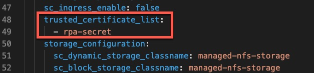

# RPA Connectivity

To enable BAW to call the RPA server we have to make a couple of changes to the configuration of the cluster. Further 
background is provided below the instructions.

## Instructions

Run the following command on the bastion server from your env directory :

```commandline
wget https://github.com/thomasyang44/sko-tech-academy/blob/main/cp4a-rpa.pem
```
This command downloads the certificate used by the TechZone RPA server.

Next create the OpenShift secret using the certificate (the cert is located in the file called cp4ba-rpa.pem). 
```commandline
oc create secret generic rpa-secret  --from-file=tls.crt=cp4a-rpa.pem -n cp4ba-starter
```

You can now proceed to the CP4BA services installation. If you'd like to know a little more about the config changes
to allow BAW connectivity to the RPA server then read on.


## Background

The client onboarding solution includes an API call to an RPA bot to update backend systems. BAW does not trust 
external systems that lack properly signed SSL certificates, such as our Techzone RPA server. For BAW to trust 
this otherwise smelly certificate we need to add the Techzone RPA certificate to BAW's trusted certificate list
and deactivate some validation checks checks. 

The main configuration of the CP4BA deployment is located in this file :

```commandline
/data/daffy/cp4ba/templates/services/samples/roks-starter-nfs-all-IF008.yaml
```


On line 48 we have added a secret which contains the SSL certificate used by the Techzone RPA environment.

 
 
This secret needs to be created manually before the deployment of CP4BA services (see instructions above). 