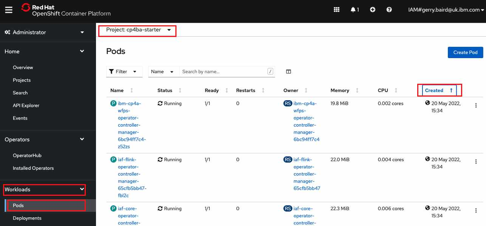

# Services

To create your CP4BA services execute the following command.
```
/data/daffy/cp4ba/service.sh <your environment>
```

As a concrete example, if my environment file is called : cp4ba-tech-academy-lab25-env.sh then I would execute the following command:
```
/data/daffy/cp4ba/service.sh cp4ba-tech-academy-lab25
```

Very soon you'll see output like this :

```commandline
Validate Storage Class to be used with Cloud Pak 
################################################################
PASSED  Storage class -> ibmc-file-gold-gid exist. 


PreCheck OPS
################################################################

All prechecks passed, lets get to work.
```

Daffy has instructed the operators to begin installing the CP4BA components. This process will take a few hours. To 
monitor the progress of the deployment open the OpenShift Web Console. Select workloads from the left hand menu, and 
select the sub-menu for pods. At the top change the project to cp4ba-starter and finally order the pods by creation 
date to show the newest pods at the top.

 
 
Various pods will be created during the deployment after several hours you may recognise pods such as the ADS runtime.
At this point completion is very close.

Alternatively you can watch the operator logs using the example command in the Daffy console : 

```commandline
oc logs -n cp4ba-starter --tail=100 -f deployment/ibm-cp4a-operator | grep -v proxy
```