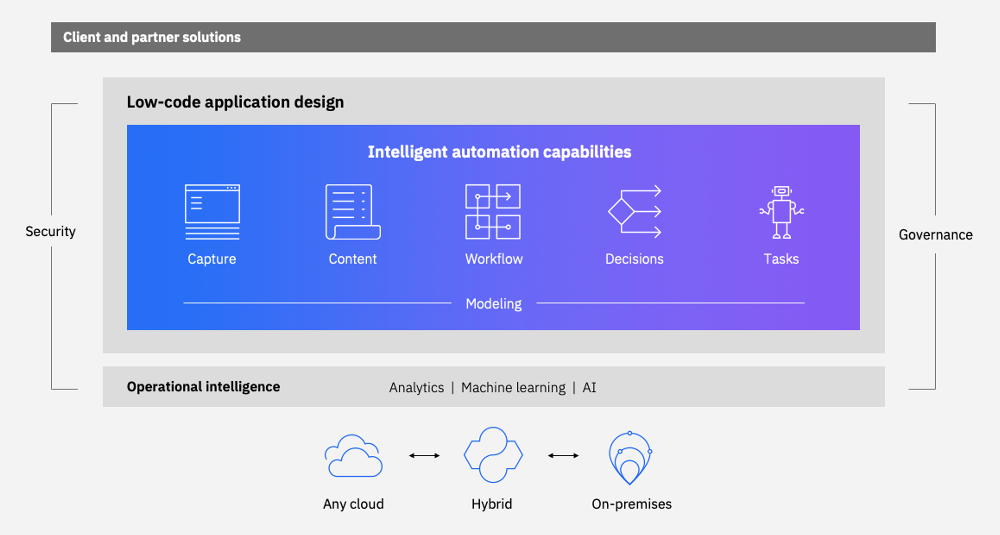

# Introduction

!!! info
    Updated 1/06/2022 - links to product release 21.03

## What is it about? 

This repository provides working a set of patterns, best practices and reusable code and executable scenarios to help you build and deploy application using digital business automation capabilities from the IBM Cloud Pak for Business Automation.

[Digital business automation](https://www.ibm.com/cloud/cloud-pak-for-automation)(DBA) allows an organization to improve its operations by streamlining the way people participate in business processes and workflows, automate repeatable decisions, and provide business users with the ability to edit and change the business logic involved in these business processes. DBA projects also aim to make documents easy to store and retrieve, digitize document content, such as with optical character recognition (OCR), and automate data entries with software robots, referred as robotic process automation.

The IBM Cloud Pak for Automation offers a software platform to develop, deploy, run and manage your digital business automation projects, using the capabilities shown in the following digram: 

* [Document Processing](https://www.ibm.com/docs/en/cloud-paks/cp-biz-automation/21.0.3?topic=software-automation-document-processing)
* [Content management](https://www.ibm.com/docs/en/cloud-paks/cp-biz-automation/21.0.3?topic=software-filenet-content-manager)
* [Business Automation Workflow](https://www.ibm.com/docs/en/cloud-paks/cp-biz-automation/21.0.3?topic=software-business-automation-workflow)
* [Automation Decision Services](https://www.ibm.com/docs/en/cloud-paks/cp-biz-automation/21.0.3?topic=software-automation-decision-services) provides a comprehensive environment for authoring, managing, and running decision services.
* [Tasks with Robot Process Automation](https://www.ibm.com/docs/en/cloud-paks/cp-biz-automation/21.0.3?topic=software-robotic-process-automation)
* [Business Automation Insight](https://www.ibm.com/docs/en/cloud-paks/cp-biz-automation/21.0.3?topic=software-business-automation-insights)
* [Business Automation Application](https://www.ibm.com/support/knowledgecenter/en/SSYHZ8_20.0.x/com.ibm.dba.offerings/topics/con_baa.html) is a low-code application builder that you can use to create, modify, and refine business automation-based applications (apps) that use the capabilities of the platform.
* [Operational Decision Manager](https://www.ibm.com/docs/en/cloud-paks/cp-biz-automation/21.0.3?topic=software-operational-decision-manager)
* [Process Mining](https://www.ibm.com/docs/en/cloud-paks/cp-biz-automation/21.0.3?topic=software-process-mining)

In this repository we are developing new content for integrating cloud native application, DevOps practices and Business Automation components. 

## Architecture center

The reference architecture is described in the [IBM reference architecture center](https://www.ibm.com/cloud/architecture/architectures/dba-architecture) and the content reflects standard capabilities to consider for deploying solution. 
The current web site includes other diagrams as reference physical deployments, use cases and demonstrations.

## Target Audiences

While the content of this repository is mostly technical in nature and is intended for a technical audience, it also introduces methodology practices, which would be used with business leaders to identify key business domain events and actions. You may find it useful to share this information with your business leaders before engaging them in such activities.

At a high level, this is what you should expect to learn by working through this repository and the related examples:

* **As an architect,** you will understand how the event-driven architecture provides capabilities which support development of event-driven solutions.
* **As a developer,** you will understand how to develop event-driven applications and develop analytics based on event streams.
* **As a project manager,** you may understand all the artifacts which may be required for an event-driven solution.

The related repositories provide sample code and best practices  which you may want to reuse during your future implementations. The reference architecture has been designed to be portable and applicable to Public Cloud, Hybrid Cloud and across multiple clouds. Examples given are directly deployable in IBM Public Cloud and Red Hat OpenShift Container Platform.
