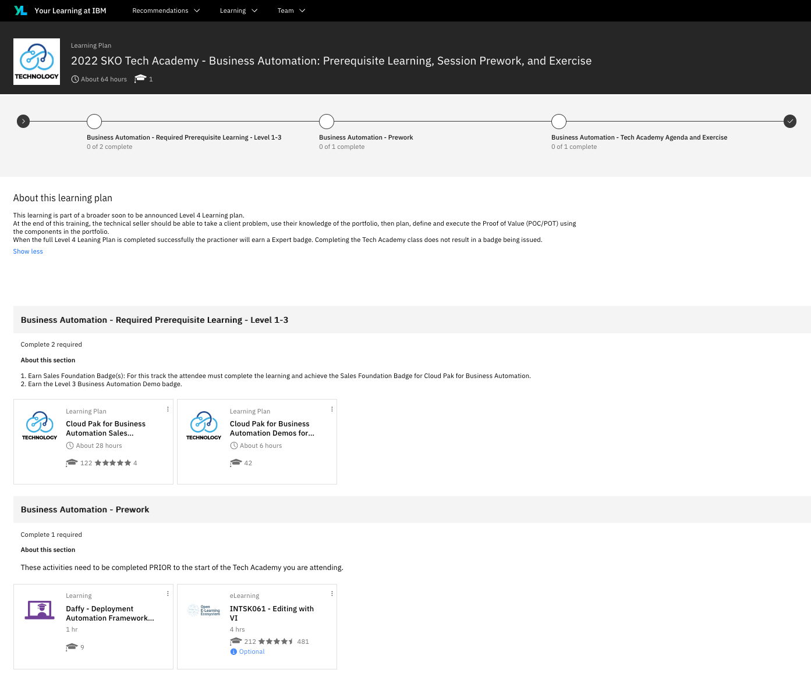

## Your Learning - Learning Plan
??? note summary "Expand to view the learning plan"

    Please review the Your Learning site for the prerequisites and prework required for this event at:  
    <a href="https://yourlearning.ibm.com/activity/PLAN-B3814805BBB4" target="_blank">2022 SKO Tech Academy - Business Automation: Prerequisite Learning, Session Prework, and Exercise</a>

    { width="800"}

## Prework - Daffy
??? note summary "Expand to view"
    !!! note ""

        === "IBMer"
            - <a href="https://ibm.github.io/daffy/Overview" target="_blank">Daffy Overview</a> 
                
            - <a href="https://ibm.github.io/daffy/Deploying-OCP/Pre-Req/" target="_blank">Daffy Prerequisites</a> 
                
            - <a href="https://ibm.github.io/daffy/Deploying-OCP/Core-steps/" target="_blank">Daffy Core Steps (Steps 1-3)</a> 

            - <a href="https://ibm.seismic.com/Link/Content/DCfR9mQC6PJ6g8hBTqb9JQ9DMWpB" target="_blank">Daffy Core Steps - Walkthrough Video</a> 

        === "Business Partner"

            - [Daffy Setup](../daffy/daffy.md)

            - <a href="https://ibm.seismic.com/Link/Content/DCfR9mQC6PJ6g8hBTqb9JQ9DMWpB" target="_blank">Daffy Core Steps - Walkthrough Video</a> 

## Prework - vi

If you can open a file with vi, make changes and save it, then you're probably ok.
    
??? note summary "Expand to view vi commands"
    
    **Basic vi commands you will use to edit your environment file**

    Use the arrows on your keyboard to go to location you want to edit, you can not use your mouse.

    [ESC] starts all modes and [ESC] will end all modes.

    **Modes**

    [ESC] x     = deletes one character where you cursor is. Once done [ESC]

    [ESC] i      =  puts you in insert mode, just start typing what you want to add. Once done [ESC]

    [ESC] dd  = delete entire line cursor is on.  Once done [ESC]

    [ESC] u     = will undo your last action.  Once done [ESC]

  
    **Once done, the following will save your file**

    [ESC] [SHIFT] : wq [ENTER]   

  
    **If you messed up the file and you want to exit and not save your file**

    [ESC] [SHIFT] :  q! [ENTER]   

  
    **Cheat Sheets**
  
    <a href="www.atmos.albany.edu/daes/atmclasses/atm350/vi_cheat_sheet.pdf" target="_blank">VI Cheat-sheet</a> 
    
    <a href="https://itsfoss.com/nano-editor-guide/" target="_blank">Nano Cheat-sheet</a> 
    
               
