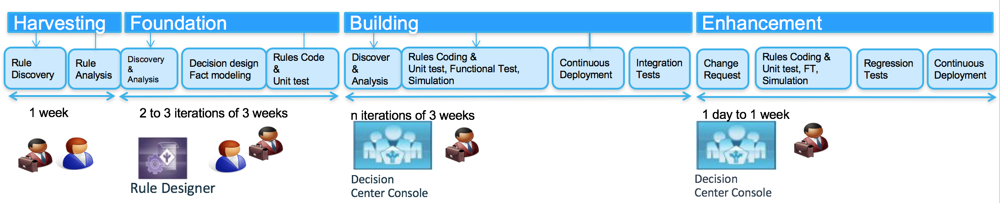
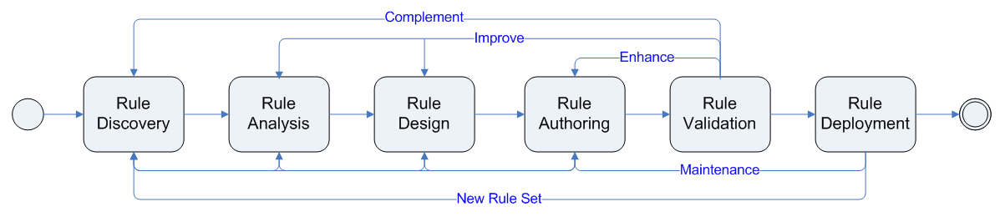
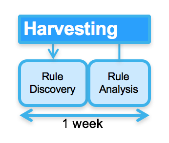
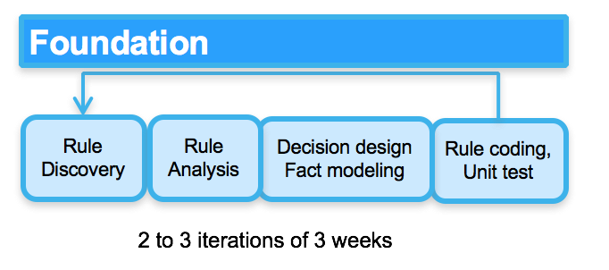
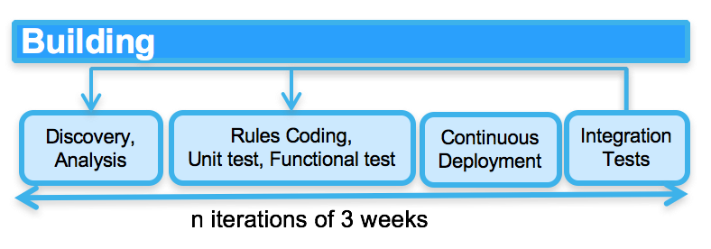
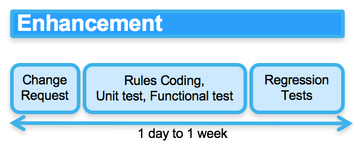

## Introduction

The Agile Business Rule Methodology was developed in 2004 at ILOG and then used on hundred of projects worldwide when projects need to integrate decision management into the business application. It is based from [Hafedh Mili and Jerome Boyer's book](http://www.springer.com/business+%26+management/business+information+systems/book/978-3-642-19040-7). The content is product agnostic and support incremental and iterative development for decision services. It starts from a business operation improvement idea that is assessed versus of set of criteria to validate the fit to use a Business Rule Management System, and then addresses all the project implementation tasks.

## Goals

ABRD applies the agile manifesto to efficiently implement business policies as executable rules. The goal is not having a team spending month to document thousand of rules, where those rules can be implemented, executed, tested in less time, even as early as the first day of your analysis. The goals can be summarized as:

* Separate rules as a manageable artifact using discovery, analysis and authoring activities and work products
* Trace rules during their full life cycle from requirement to deployment and maintenance
* Link rules to business context and motivation
* Develop the rule description using business terms and high level rule language
* Prepare the fact model for the rule implementation
* Prepare the rule set implementation and deployment as decision services in a Service Oriented Architecture or as Micro Services executed by a rule engine
* Articulate the rule governance processes


## Concepts

To get a good understanding of business rules, rule engines and other terms used in this content, see [this note](/methodology/abrd/concepts#business_rule)


## How to Adopt ABRD

BRMS enable managing business rule as a standalone artifact, owned by the business user, and maintainable over time into production system. The implementation of a business rule application follows some activities and tasks that are slightly different than traditional software development life cycle. The integration of one or more business analysts as part of the development team is also less traditional. Finally the core value of such technology is to be able to have business user maintaining the business rules in production with a minimum involvement of IT. Technology is one side of the coin, methodology and best practices is the other.

A Project Management Office can leverage ABRD as-is or integrate it as content for their own methodology.

If the team is new to business rule application, it is best to start with a small rule set and incrementally add rules and best practices over time. The team has to integrate the rule discovery and analysis activities in their own project plan.

Prototyping or Minimum Viable Product is a major approach, as it shows to the team concrete execution, and helps to drive issues, and requirements around business rules and even business process.

### Common Pitfalls

The most common pitfalls in implementing business rules application include:
* Starting by harvesting all the rules in a document without any implementation
* Ignoring the importance of the data model
* Not understanding where the rules are (should be) enforced
* Mixing the data model from the implementation point of view, with the domain model that is used by the business
* Involving IT only: never forget the business, involve them as early as possible and make them take ownership of the rules.
* Outsourcing business rule implementation: business rules are enterprise assets.
* Forgetting to test the rules outside of the application
* Not involving the business in the rule validation process
* Badly designing a rule set, by not applying standard design pattern as separation of concerns.


## Incremental Development

The following diagram illustrates how a decision service implementation is built from a business idea to an executable SOA service integrated with a BPM system or any consumers.



Within those phases we can find project activities that are executed multiple times during each phase:

* Rule discovery
* Rule analysis
* Fact model implementation
* Rule implementation and unit test
* Rule validation
* Rule deployment

Like all agile methodologies, ABRD prescribes an incremental development using time boxed iterations. However, in ABRD, the entire process lifecycle may not be followed for each iteration. Instead, a number of very short cycles between phases may occur, with the entire ruleset gradually evolving.

Using a business rule management platform enables managing business rule as a standalone artifact, owned by the business user, and maintainable by them directly  time into production system. The implementation of a business rule application follows some activities and tasks that are slightly different than traditional software development life cycle. The strong involvement of one or more [business rule analysts](assets/concepts/rule-analyst.md) as part of the development team is recommended to harvest the rule while they are implemented. Technology is one side of the coin, methodology and best practices is the other.
Executing a project to implement a solution using rule engine and a BRMS follows the following progression as illustrated


A Project Management Office can leverage ABRD as-is and integrate it within their own methodology or tailor it by injecting their own practices. As open source you can also contribute to it.

If the team is new to business rule application, it is best to start with a small rule set and incrementally add rules and best practices over time. The team has to integrate the rule discovery and analysis activities in their own project plan.

Prototyping is a major value, as it shows to the team concrete execution, and helps to drive issues, and requirements around business rules and even business process.

### Common Pitfalls

The most common pitfalls in implementing business rules application include:

* Starting by harvesting all the rules in a document
* Ignoring the importance of the data model
* Not understanding where the rules are (should be) enforced
* Mixing the data model from the implementation point of view, with the domain model that is used by the business
* Involving IT only: never forget the business, involve them as early as possible and make them take ownership of the rules.
* Outsourcing business rule implementation: business rules are enterprise assets.
* Forgetting to test the rules outside of the application
* Not involving the business in the rule validation process
* Badly designing a rule set, by not applying standard design pattern as separation of concerns.

### Cycle Approach

Like all agile methodologies, ABRD prescribes an incremental development using time boxed iterations. However, in ABRD, the entire process lifecycle may not be followed for each iteration. Instead, a number of very short cycles between phases may occur, with the entire ruleset gradually evolving. The entire process may be represented by the diagram below:



In the process flow diagram above, each of the task loops back to previous task in the flow. These 'loops', or cycles, are repeated as required, with the loops gradually moving from left to right through the process until the rule sets are deployed to production environment. This method of rule development reflects the nature of BRMS: a mature and stable domain object model is a prerequisite for rule development, therefore we may multiply cycles through the early part of the process flow in order to develop such models early in the process. As each of these cycles is completed, the ruleset will gradually grow until it reaches a state where it reflects the requirements set forth by the business.

The phases and activities apply for both operational, inference business rules as event processing rules. The event processing rule will, most likely require different technologies: a BRMS and a CEP platform, but the development methodology is similar.

## A typical ABRD Project

From a project management perspective, there are four phases, each of which maps onto parts of the technical process flow described above. The project phases are:

1. Harvesting, the activity of gathering business rules
2. Foundation, the activity of defining the decision service interface, to develop the domain specific data model: the Rule Business Object, to implement the different business rule pattern into the BRMS, develop the unit tests
3. Building, the activity of building a working decision service, representing the organizations business rules, it includes integration with the decision service consumers or the event producers and any reference data management sources.
4. Enhancement groups completing the business logic by adding more rules, and start the rule governance process, the decision logic monitoring, and maintaining and enhancing business rules. This specific phase should be done with less involvement from IT, and with modern BRMS, business analysts can support the full cycle of authoring rules, validating them, and hot deploy to production.

### Cycle 1- Harvesting

Rule harvesting, consisting of the Discovery & Analysis tasks, involves gathering together all the sources of knowledge available to the team. These sources may include a business process description, subject matter experts, policy manuals, existing code or other sources of rules. The goal of this activity is to understand the Domain Object Model within the scope of the application and to identify enough rule patterns to begin implementation of rules in the next phase.

During this activity, the development teams divide the day into two parts, executing discovery workshops in the morning (in 2 or 3-hour session), then performing analysis and documentation for the remainder of the day. The team iterates on these two steps during 2 to 5 days maximum, depending on the number of rule pattern and their complexity.  



The starting point of the Rule Discovery is a Decision Point Table artifact: During the inception phase (See OpenUP for more information) the project team is doing business modeling activities (not covered here) which aim at describing the business process and decisions applied to any business events supported by the application. One important work product built during this modeling phase is the Decision Point Table which describes the point in the process (task, activities, transition) where decisions are made. Decision point represents potential candidate for rule sets.

### Cycle 2- Building Foundations

The building foundation extends the tasks performed during harvesting to include rule business object implementation and rule authoring. When a workable number of rules (this number will vary by project) have been harvested the development team should start to define the structure of the rule project: the decision service interface, the rule set variables (input-output business objects), the basic sequencing of the rules (the Rule Flow), and the major elements of the Business Object Model. The team should then be able to implement and unit test some rules.

A best practice is to execute the step "Rule Authoring" as soon as possible to uncover possible analysis and design issues. Indeed, most of the rules look good on paper but real issues will surface during implementation and test. The next morning workshop session the rule developer should communicate the issues back to the business team to quickly address the change to the business logic. This leverages the feedback loop approach and provides an efficient mechanism to build a pragmatic, adequate and business-relevant executable rule set.



### Cycle 3- Building

The goal of the build phase is to create rules that can be 'seen', 'used' and, most importantly, tested, by business users. Rules that can be executed by the rule engine are more valuable than ones defined on paper or in abstract forms. This fully endorses the agile statement:"Working software over comprehensive documentation."

The second goal of this phase is to create a set of realistic test scenarios, using real data when possible, to test the rules created during the Authoring activity. This is a form of Test Driven Development (TDD). This activity extends the Build activity by adding a Rule Validation task.




The day-to-day authoring activities consist of a series of small steps that include:
* Test case implementation
* Writing rules and executing rules
* Validating rules with the business team members
* Deploy automatically to the target test platform so decision services are consumable

The build activity consists of all the previous tasks, with short iterations:
* Enhance rules (Authoring & Validation tasks)
* Improve rules (Analysis, Authoring & Validation) as needs are identified
* Complement rules (Discovery, Analysis, Authoring & Validation) with additional rules to provide complete coverage of the business domain (once every two days).

The Building activity should take between two and three weeks iteration, and the output artifacts should be a ruleset that can be loaded into the rule engine and executed.

Checkpoint:

```
    During the first iteration of this activity, the total number of rules will be only around 40% to 60% completed. The idea is to get something to business users that is sufficient to get comments and feedbacks on, and that will form the basis of the next phase. By this point, the Rule Business Object Model (RBO) should be at least 90% complete.
```

Depending on the size of the ruleset, this activity may deliver less than 40% of the rules. In that case, this activity may have to be repeated. In this situation, it is recommended that the activity be time-boxed from two to three weeks maximum so that a concrete build may be delivered to the validation team for functional verification, integration test and non regression testing. Once a build is delivered, another iteration of this cycle may be started.

As soon as the decision service interface is stable, or the event structure is well defines the development team should be able to deploy the rule set under construction to the execution server in order to test it with an end-to-end scenario. The integration of the decision service and the domain object model is an important task. Integration involves the marshaling of data to/from external data sources, transform it to the rule business object model view so it can be understood by the execution engine. This is 'mapping' of the data to the Rule Business Object Model created in previous activities is very important as it is a very bad practice to take an existing enterprise model, or a canonical model to be the foundation of the rule processing. Too much genericity and complexity will impact rule adoption by the business users, and knowledge transfer between developers too.

There are a number of tools and techniques that can be used to marshal data, and the best choice will vary depending of the technologies available: ESB, micro services, ETL, batch processing, event based processing.... When this activity is completed, data (preferably 'real' data) will be sent to the rule engine to fire rules, make decision and the results delivered over the same channels as the production system. The test scenarios developed in previous phases, are run with all of the 'plumbing' in place. In the future they will serve as non-regression test suite.

### Cycle 4- Enhancing

Cycle 4 is used during the development phase as well as during the rule maintenance or governance activity post production deployment. One of the goal here is to empower business users or at least business analysts to author and test the rules.

The Enhancing cycle is a transition phase in which last minute changes can be made involving some short, face to face discovery meetings with SMEs (Subject Matter Experts) to wrap up any outstanding issues or questions before entering the Governance activity. The Governance activity is an open-ended, long running process to enhance and maintain the rules created in previous activities. A governance process will vary by organization and is a fundamentally different SDLC process, usually performed by a different team than the rule development team. This team is more business oriented and, as owners of the rules and business policies, they can develop at their own pace, using the infrastructure put in place by the development team.




It is important to note that there will almost certainly be some need to enhance the rule business object model to add some new facts, attributes, or entities. These modifications should follow the standard release management process of the core business application using continuous build and delivery.
