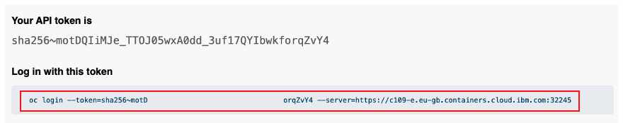
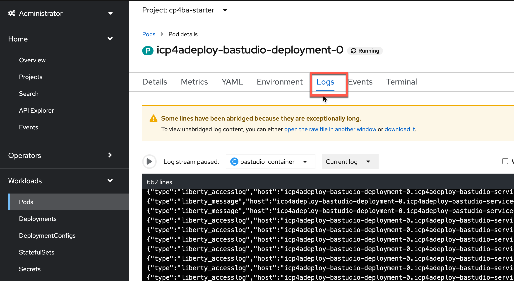
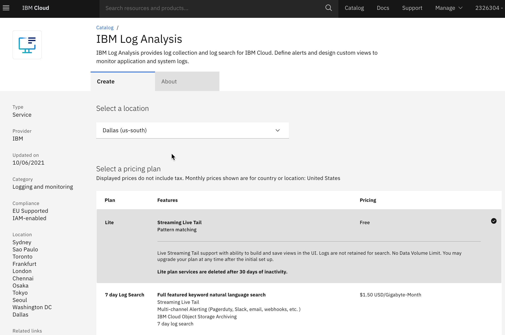
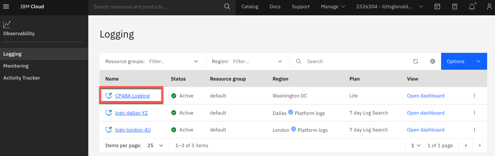

<a name="faq-overview"></a>

## 1. I can't access my team cluster
<a name="faq-01"></a>
??? note summary "Expand to view"
    If your OpenShift Web Console link does not appear to work, please obtain the link from your IBM Cloud account by doing the following:  
    <br>
    1. Log into your [IBM Cloud](https://cloud.ibm.com/){target="_blank"} account  
    2. Select the enterprise account: **2326304 - itztsglenablement01**  
    3. From the left navigation area, select: **Resource list**  
    4. From the Excel file provided in slack for team assignments, obtain your team's **Bastion Cluster Name** (ie. tech-academy-labXX)  
    5. Using the value from above, filter the Resource list using the **Name** column  
    6. Locate your cluster and double-check you have the correct team cluster. Upon confirmation, click on the cluster to display the cluster  
    7. From the cluster, select the **OpenShift web console** blue button in top-right area of the screen.
        {width=700}

    [Go to top of section](#faq-01) | [Go to top of page](#faq-overview)
    
## 2. I can't find or get an error when trying to access a lab or artifact
<a name="faq-02"></a>
??? note summary "Expand to view"
    Please report the issue to an instructor or in the slack channel.  
    <br>
    In the meantime, all the labs and artifacts can be accessed here:  
        - [**Solution Exports**](https://github.com/thomasyang44/sko-tech-academy/tree/main/docs/client-onboarding/Solution%20Exports){target="_blank"}  
        - [**Labs**](https://github.com/thomasyang44/sko-tech-academy/tree/main/docs/client-onboarding/labs){target="_blank"}  

    Please note: within each **Rebuild** capability lab, there may be a reference to a **Lab Data** folder. This **Lab Data** folder is located within the capability folder in the [**Labs**](https://github.com/thomasyang44/sko-tech-academy/tree/main/docs/client-onboarding/labs){target="_blank"} folder.  
    <br>
    For example, below is the **Lab Data** folder for ADS (in the **Decisions** capability folder):  
    [**ADS - Lab Data**](https://github.com/thomasyang44/sko-tech-academy/tree/main/docs/client-onboarding/labs/Decisions/Lab%20Data){target="_blank"}  
    
    !!! NOTE
        Recommendation is to [**clone**](https://docs.github.com/en/desktop/contributing-and-collaborating-using-github-desktop/adding-and-cloning-repositories/cloning-a-repository-from-github-to-github-desktop){target="_blank"} this [**GitHub**](https://github.com/thomasyang44/sko-tech-academy){target="_blanks"} repository so that you have all the artifacts and labs on your local machine.  

    **Reference**: the source SWAT TechJam materials are located here: [**IBM TechJam 21.0.3**](https://github.com/IBM/cp4ba-labs/tree/main/21.0.3){target="_blank"}  

    [Go to top of section](#faq-02) | [Go to top of page](#faq-overview)

## 3. What are the logins for each CP4BA capability?
<a name="faq-03"></a>
??? note summary "Expand to view"

    Please refer to the [**Client Onboarding - Deploy and Integrate - Installation Links**](../../client-onboarding/co-deploy-integrate/#installation-links){target="_blank"} section that identifies how to locate and download the **icp4adeploy-cp4ba-access-info** config map from the **OpenShift Web Console**.

    [Go to top of section](#faq-03) | [Go to top of page](#faq-overview)

## 10. What you need on IBM Cloud : infrastructure permissions
<a name="faq-10"></a>
??? note summary "Expand to view"
    Before you can order virtual machines and create clusters you need to convert your IBM Cloud account to a
    Pay-As-You-Go account. This is option can be found under account settings. If you have an IBM provided account
    your manage will need to approve this upgrade.

    [Go to top of section](#faq-10) | [Go to top of page](#faq-overview)

## 11. Daffy cluster permission error
<a name="faq-11"></a>
??? note summary "Expand to view"
        
    If you have errors with permissions, you may have selected the wrong account. In this situation, please access your [**IBM Cloud**](https://cloud.ibm.com/){target="_blank"} account and then log out of your account. Next, run your Daffy command again to have it prompt you again for your account selection.
    
    [Go to top of section](#faq-11) | [Go to top of page](#faq-overview)

## 12. Error with environment file edited using Microsoft Notepad
<a name="faq-12"></a>
??? note summary "Expand to view"
            
    If you edit your environment file using a Microsoft Windows machine and/or Microsoft Notepad, you may see extra characters at the end of each line (ie. \r\r\r\r\).
    
    [Go to top of section](#faq-12) | [Go to top of page](#faq-overview)

## 20. Getting Help : sharing an oc login command
<a name="faq-20"></a>
??? note summary "Expand to view"
    If the software on your cluster is not working as expected you may be asked by an expert to provide a login command or
    login token. This token allows them to log into your cluster using the CLI. To get the login token log into
    the OpenShift Web console, in the top right corner there is a drop-down, with your username as a label.
    Click the label and a Copy Login Command link will be shown, this is highlighted in red below.

    

    The next screen will display a link "Display Token". Click on this link and the page below will be displayed. Copy the
    oc login command as highlighted in red.

    
    
    [Go to top of section](#faq-20) | [Go to top of page](#faq-overview)

## 30. Finding Links : Most from Daffy
<a name="faq-30"></a>
??? note summary "Expand to view"
    
    You can find the common link for CP4BA in the cp4ba-access-info config map as shown below. Open the config map
    and scroll down to find the URL details.
    

    You can also use a Daffy command run from your bastion, Daffy will output the same information from the config map.
    ```
    /data/daffy/cp4ba/service.sh <your environment> --StarterConsole
    ```
     
    [Go to top of section](#faq-30) | [Go to top of page](#faq-overview)
    
## 31. Daffy - What is build, cleanup and rebuild?
<a name="faq-31"></a>
??? note summary "Expand to view"
    
    **/data/daffy**
    
    | Script        | Description                                                          |
    | :------------ | :------------------------------------------------------------------- |
    | build.sh      | This will build the cluster based on your environment file           |
    | cleanup.sh    | This will cleanup/destroy the cluster based on your environment file |
    | rebuild.sh    | This will call the cleanup.sh then it will call the build.sh         |
 
    **/data/daffy/ocp**
    
    | Script        | Description                                                          |
    | :------------ | :------------------------------------------------------------------- |
    | build.sh      | This will build the cluster based on your environment file           |
    | cleanup.sh    | This will cleanup/destroy the cluster based on your environment file |
    | rebuild.sh    | This will call the cleanup.sh then it will call the build.sh         |

    [Go to top of section](#faq-31) | [Go to top of page](#faq-overview)

## 32. Obscure Links : BAW Process Admin and Rest UI
<a name="faq-32"></a>
??? note summary "Expand to view"
    The link for Process Admin is not recorded in the access configmap. To get to Process Admin create the URL using the
    template below. Find the URL labeled Cloud Pak Dashboard and use it as the basis for the Process Admin URL:  
    ```
    <Cloud Pak Dashboard>/bas/ProcessAdmin
    ```
    
    To get to BPM Rest UI create the URL using the
    template below. Find the URL labeled Cloud Pak Dashboard and use it as the basis for the Rest UI URL:
    ```
    <Cloud Pak Dashboard>/bas/bpmrest-ui
    ```

    [Go to top of section](#faq-32) | [Go to top of page](#faq-overview)

## 40. Pods : what to look for and how to restart
<a name="faq-40"></a>
??? note summary "Expand to view"
    In the CP4BA Starter pattern many of the functional components run within the BA Studio pod. If your software is
    not behaving as expected (infinite blue spinning wheels, cases not starting) try restarting the BA Studio pod.
    Expand workloads and select pods, filter using studio and find the running BA Studio pod, click on the three dots
    and delete the pod. This will cause a new pod to be created, in several minutes login to CP4BA again and see if your
    fault has cleared.

    
         
    [Go to top of section](#faq-40) | [Go to top of page](#faq-overview)

## 50. Resource Registry : automation service not found - republish
<a name="faq-50"></a>
??? note summary "Expand to view"
    If you have published an automation service but the client apps that try to use it reports an error then try
    unpublishing the automtion service and republish it.
         
    [Go to top of section](#faq-50) | [Go to top of page](#faq-overview)

## 60. Slack groups for help (IBM Only)
<a name="faq-60"></a>
??? note summary "Expand to view"
    For issues with the SWAT COB assets : #dba-swat-asset-qna
    
    For Daffy: #daffy-user-group
     
    [Go to top of section](#faq-60) | [Go to top of page](#faq-overview)

## 70. Logs : where do the different components log
<a name="faq-70"></a>
??? note summary "Expand to view"
    To access logs from your pods click on the pod name then select the log tab :   

    

    It

    [Go to top of section](#faq-70) | [Go to top of page](#faq-overview)

## 71. Better logging : Using an external log service
<a name="faq-71"></a>
??? note summary "Expand to view"
    If you are using ROKS on IBM Cloud you can attach a log aggregation service running on IBM Cloud to your CP4BA
    cluster.

    Find the Log Analysis service in the IBM Cloud catalog and create an instance. The lite service doesn't have
    any log retention so choose the 7 Day search option.
    
     
    

    You'll be taken to the logging service page in IBM Cloud, refresh the page in a couple of minutes and your logging
    service will appear.
    

    Find your cluster and click on its name to open the cluster details page.
    
    
    Scroll down to the integrations area and connect to the logging service. Once connected the connect button will be
    replaced with a launch button.
    
    
    In your apps your log output will now flow through to the log analysis service. In this example a BAW Toolkit
    is logging info messages, see "Darth Vader" below.
    

    The log analysis service is now receiving all logs from the cluster. Y can now filter by source, here we are
    filtering for the **bastudio** pod but this isn't necessary, a global text search is still very effective.
    

    At the bottom of the screen you can enter your search term to find the specific log output.
    
    It is also useful to note the timestamp for the event then use "Jump To Timeframe" to find other events from
    other pods at the same timestamp for faultfinding. Log Analysis has many other features such as saved searches
    
    [Go to top of section](#faq-71) | [Go to top of page](#faq-overview)

## 80. Common faults & fixes : eg restart bastudio (edited)
<a name="faq-80"></a>
??? note summary "Expand to view"
    {width="800"}     
     
    [Go to top of section](#faq-80) | [Go to top of page](#faq-overview)

## 81. I can't find BAWTOS, CLOS or cp4bausers
<a name="faq-81"></a>
??? note summary "Expand to view"
    Content including the labs are based on the IBM SWAT Client Onboarding[^1] materials which are configured for the **Production** pattern.  Our environment uses the **Starter** pattern and based on that, you may encounter some differences at certain steps.  
    <br>
    Below are some differences you should be aware of, please post to the slack channel if you encounter additional differences.  
    
    **General**  
    For the Starter pattern, use **cp4admin** instead of **cp4bausers** which is used in the Production pattern.   
        
    **Content**  
    Target object store: **TARGET** in Starter vs **BAWTOS** in Production  
    Anywhere you see **CLOS** object store, use the **CONTENT** object store.

    **Decisions**  
    Published automation service: The decisions project name contains the admin username which is different in Starter vs Production. The project name is included in the resource registry which would be different.

    **Navigator**  
    The desktop uses the target object store and because of the difference in target object store names, we have to create different desktops for Starter vs Production. This GitHub has been updated with the correct artifacts to use the correct object store for the Starter pattern.

    **App Designer**  
    The Client Onboarding app points to the target object store and this cannot be done with environment variables so we have to create different applications for Starter vs Production.  This GitHub has been updated with the correct artifacts to use the correct object store for the Starter pattern.
    Otherwise, you need to republish the Decisions automation service to match the correct resource registry name

    **Workflow**  
    Environment variable needs an update to point to the right target object store. This GitHub has been updated with the correct artifacts to use the correct object store for the Starter pattern.
    Otherwise, you need to republish the Decisions automation service to match the correct resource registry name
    
    [Go to top of section](#faq-81) | [Go to top of page](#faq-overview)

[^1]:
    The Client Onboarding assets have been adapted from the
    <a href="https://github.com/IBM/cp4ba-labs/tree/main/21.0.3" target="_blank">IBM TechJam 21.0.3</a>
    materials as developed by the IBM SWAT Team  

## 90. Using Workflow to Orchestrate Asynchronous Long-Running RPA Tasks
<a name="faq-90"></a>
??? note summary "Expand to view"
    <a href="https://ibm.box.com/v/ASYNC-RPA-INVOKE-LAB" target="_blank">Using Workflow to Orchestrate Asynchronous Long-Running RPA Tasks</a>   
     
    [Go to top of section](#faq-90) | [Go to top of page](#faq-overview)


## 95. Adding Certificate for RPA Server
<a name="faq-95"></a>
??? note summary "Expand to view"

    There be dragons here  !!
    
    [Go to top of section](#faq-95) | [Go to top of page](#faq-overview)

## 100. Solution Exports and Labs
<a name="faq-100"></a>
??? note summary "Expand to view"

    [**Solution Exports**](https://github.com/thomasyang44/sko-tech-academy/tree/main/docs/client-onboarding/Solution%20Exports){target="_blank"}  
    [**Labs**](https://github.com/thomasyang44/sko-tech-academy/tree/main/docs/client-onboarding/labs){target="_blank"}  

    !!! NOTE
        Recommendation is to [**clone**](https://docs.github.com/en/desktop/contributing-and-collaborating-using-github-desktop/adding-and-cloning-repositories/cloning-a-repository-from-github-to-github-desktop){target="_blank"} this [**GitHub**](https://github.com/thomasyang44/sko-tech-academy){target="_blanks"} repository so that you have all the artifacts and labs on your local machine.  
     
    [Go to top of section](#faq-100) | [Go to top of page](#faq-overview)
