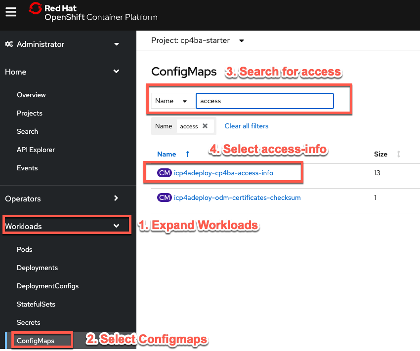

<a name="faq-overview"></a>

## 1. I can't access my team cluster
<a name="faq-01"></a>
??? note summary "Expand to view"
    If your OpenShift Web Console link does not appear to work, please obtain the link from your IBM Cloud account by doing the following:  
    <br>
    1. Log into your [IBM Cloud](https://cloud.ibm.com/){target="_blank"} account  
    2. Select the enterprise account: **2326304 - itztsglenablement01**  
    3. From the left navigation area, select: **Resource list**  
    4. From the Excel file provided in slack for team assignments, obtain your team's **Bastion Cluster Name** (ie. tech-academy-labXX)  
    5. Using the value from above, filter the Resource list using the **Name** column  
    6. Locate your cluster and double-check you have the correct team cluster. Upon confirmation, click on the cluster to display the cluster  
    7. From the cluster, select the **OpenShift web console** blue button in top-right area of the screen.
        {width=700}

    [Go to top of section](#faq-01) | [Go to top of page](#faq-overview)
    
## 2. I can't find or get an error when trying to access a lab or artifact
<a name="faq-02"></a>
??? note summary "Expand to view"
    Please report the issue to an instructor or in the slack channel.  
    <br>
    In the meantime, all the labs and artifacts can be accessed here:  
        - [**Solution Exports**](https://github.com/thomasyang44/sko-tech-academy/tree/main/docs/client-onboarding/Solution%20Exports){target="_blank"}  
        - [**Labs**](https://github.com/thomasyang44/sko-tech-academy/tree/main/docs/client-onboarding/labs){target="_blank"}  

    Please note: within each **Rebuild** capability lab, there may be a reference to a **Lab Data** folder. This **Lab Data** folder is located within the capability folder in the [**Labs**](https://github.com/thomasyang44/sko-tech-academy/tree/main/docs/client-onboarding/labs){target="_blank"} folder.  
    <br>
    For example, below is the **Lab Data** folder for ADS (in the **Decisions** capability folder):  
    [**ADS - Lab Data**](https://github.com/thomasyang44/sko-tech-academy/tree/main/docs/client-onboarding/labs/Decisions/Lab%20Data){target="_blank"}  
    
    !!! NOTE
        Recommendation is to [**clone**](https://docs.github.com/en/desktop/contributing-and-collaborating-using-github-desktop/adding-and-cloning-repositories/cloning-a-repository-from-github-to-github-desktop){target="_blank"} this [**GitHub**](https://github.com/thomasyang44/sko-tech-academy){target="_blanks"} repository so that you have all the artifacts and labs on your local machine.  

    Reference: the source SWAT TechJam materials are located here: [**IBM TechJam 21.0.3**](https://github.com/IBM/cp4ba-labs/tree/main/21.0.3){target="_blank"}  

    [Go to top of section](#faq-02) | [Go to top of page](#faq-overview)

## 3. What are the logins for each CP4BA capability?
<a name="faq-03"></a>
??? note summary "Expand to view"

    Please refer to the [**Client Onboarding - Deploy and Integrate - Installation Links**](../../client-onboarding/co-deploy-integrate/#installation-links){target="_blank"} section that identifies how to locate and download the **icp4adeploy-cp4ba-access-info** config map from the **OpenShift Web Console**.

    [Go to top of section](#faq-03) | [Go to top of page](#faq-overview)
    
## 4. Accessing business applications from the internet
<a name="faq-04"></a>
??? note summary "Expand to view"

    If your business application is accessible from the internet, consider the following security configurations for your application data.

    [**Securing business application data**](https://www.ibm.com/docs/en/cloud-paks/cp-biz-automation/21.0.x?topic=reference-securing-business-application-data){target="_blank"}
    
    [Go to top of section](#faq-04) | [Go to top of page](#faq-overview)
    
  
## 10. What you need on IBM Cloud : infrastructure permissions
<a name="faq-10"></a>
??? note summary "Expand to view"
    Before you can order virtual machines and create clusters you need to convert your IBM Cloud account to a
    Pay-As-You-Go account. This is option can be found under account settings. If you have an IBM provided account
    your manage will need to approve this upgrade.

    [Go to top of section](#faq-10) | [Go to top of page](#faq-overview)

## 11. Daffy cluster permission error
<a name="faq-11"></a>
??? note summary "Expand to view"
        
    If you have errors with permissions, you may have selected the wrong account. In this situation, please access your [**IBM Cloud**](https://cloud.ibm.com/){target="_blank"} account and then log out of your account. Next, run your Daffy command again to have it prompt you again for your account selection.
    
    [Go to top of section](#faq-11) | [Go to top of page](#faq-overview)

## 12. Error with environment file edited using Microsoft Notepad
<a name="faq-12"></a>
??? note summary "Expand to view"
            
    If you edit your environment file using a Microsoft Windows machine and/or Microsoft Notepad, you may see extra characters at the end of each line (ie. \r\r\r\r\).
    
    [Go to top of section](#faq-12) | [Go to top of page](#faq-overview)

## 20. Getting Help : sharing an oc login command
<a name="faq-20"></a>
??? note summary "Expand to view"
    If the software on your cluster is not working as expected you may be asked by an expert to provide a login command or
    login token. This token allows them to log into your cluster using the CLI. To get the login token log into
    the OpenShift Web console, in the top right corner there is a drop-down, with your username as a label.
    Click the label and a Copy Login Command link will be shown, this is highlighted in red below.

    

    The next screen will display a link "Display Token". Click on this link and the page below will be displayed. Copy the
    oc login command as highlighted in red.

    
    
    [Go to top of section](#faq-20) | [Go to top of page](#faq-overview)

## 30. Finding Links : Most from Daffy
<a name="faq-30"></a>
??? note summary "Expand to view"
    
    You can find the common link for CP4BA in the cp4ba-access-info config map as shown below. Open the config map
    and scroll down to find the URL details.
    

    You can also use a Daffy command run from your bastion, Daffy will output the same information from the config map.
    ```
    /data/daffy/cp4ba/service.sh <your environment> --StarterConsole
    ```
     
    [Go to top of section](#faq-30) | [Go to top of page](#faq-overview)
    
## 31. Daffy - What is build, cleanup and rebuild?
<a name="faq-31"></a>
??? note summary "Expand to view"
    
    **/data/daffy**
    
    | Script        | Description                                                          |
    | :------------ | :------------------------------------------------------------------- |
    | build.sh      | This will build the cluster based on your environment file           |
    | cleanup.sh    | This will cleanup/destroy the cluster based on your environment file |
    | rebuild.sh    | This will call the cleanup.sh then it will call the build.sh         |
 
    **/data/daffy/ocp**
    
    | Script        | Description                                                          |
    | :------------ | :------------------------------------------------------------------- |
    | build.sh      | This will build the cluster based on your environment file           |
    | cleanup.sh    | This will cleanup/destroy the cluster based on your environment file |
    | rebuild.sh    | This will call the cleanup.sh then it will call the build.sh         |

    [Go to top of section](#faq-31) | [Go to top of page](#faq-overview)

## 32. Obscure Links : BAW Process Admin and Rest UI
<a name="faq-32"></a>
??? note summary "Expand to view"
    The link for Process Admin is not recorded in the access configmap. To get to Process Admin create the URL using the
    template below. Find the URL labeled Cloud Pak Dashboard and use it as the basis for the Process Admin URL:  
    ```
    <Cloud Pak Dashboard>/bas/ProcessAdmin
    ```
    
    To get to BPM Rest UI create the URL using the
    template below. Find the URL labeled Cloud Pak Dashboard and use it as the basis for the Rest UI URL:
    ```
    <Cloud Pak Dashboard>/bas/bpmrest-ui
    ```

    [Go to top of section](#faq-32) | [Go to top of page](#faq-overview)

## 40. Pods : what to look for and how to restart
<a name="faq-40"></a>
??? note summary "Expand to view"
    In the CP4BA Starter pattern many of the functional components run within the BA Studio pod. If your software is
    not behaving as expected (infinite blue spinning wheels, cases not starting) try restarting the BA Studio pod.
    Expand workloads and select pods, filter using studio and find the running BA Studio pod, click on the three dots
    and delete the pod. This will cause a new pod to be created, in several minutes login to CP4BA again and see if your
    fault has cleared.

    
         
    [Go to top of section](#faq-40) | [Go to top of page](#faq-overview)

## 50. Resource Registry : automation service not found - republish
<a name="faq-50"></a>
??? note summary "Expand to view"
    If you have published an automation service but the client apps that try to use it reports an error then try
    unpublishing the automtion service and republish it.
         
    [Go to top of section](#faq-50) | [Go to top of page](#faq-overview)

## 60. Slack groups for help (IBM Only)
<a name="faq-60"></a>
??? note summary "Expand to view"
    For issues with the SWAT COB assets : #dba-swat-asset-qna
    
    For Daffy: #daffy-user-group
     
    [Go to top of section](#faq-60) | [Go to top of page](#faq-overview)

## 70. General Troubleshooting and Logs
<a name="faq-70"></a>
??? note summary "Expand to view"
    If you encounter an issue, try to determine the associated pod and then review the log file for that pod to further troubleshoot your issue.  

    To access the log file, locate and click on the pod name then select the **Logs** tab. Start reviewing the log file from the end of the file.  

    

    [Go to top of section](#faq-70) | [Go to top of page](#faq-overview)

## 71. Better logging : Using an external log service
<a name="faq-71"></a>
??? note summary "Expand to view"
    If you are using ROKS on IBM Cloud you can attach a log aggregation service running on IBM Cloud to your CP4BA
    cluster.

    Find the Log Analysis service in the IBM Cloud catalog and create an instance. The lite service doesn't have
    any log retention so choose the 7 Day search option.
    
     
    

    You'll be taken to the logging service page in IBM Cloud, refresh the page in a couple of minutes and your logging
    service will appear.
    

    Find your cluster and click on its name to open the cluster details page.
    
    
    Scroll down to the integrations area and connect to the logging service. Once connected the connect button will be
    replaced with a launch button.
    
    
    In your apps your log output will now flow through to the log analysis service. In this example a BAW Toolkit
    is logging info messages, see "Darth Vader" below.
    

    The log analysis service is now receiving all logs from the cluster. Y can now filter by source, here we are
    filtering for the **bastudio** pod but this isn't necessary, a global text search is still very effective.
    

    At the bottom of the screen you can enter your search term to find the specific log output.
    
    It is also useful to note the timestamp for the event then use "Jump To Timeframe" to find other events from
    other pods at the same timestamp for faultfinding. Log Analysis has many other features such as saved searches
    
    [Go to top of section](#faq-71) | [Go to top of page](#faq-overview)

## 80. Cases or a not starting up - ClassLoader issue
<a name="faq-80"></a>
??? note summary "Expand to view"
    
    When a user submits a client onboarding request (either from the end-to-end, or from the Workflow lab), the process to launch the Case is triggered and the case is triggered too but the case does not trigger any activities. This can be verified using Process Inspector and the Case Client. This is due to a ClassLoader known issue/bug. The way to resolve this is to re-create the cpe-deploy pod, load up ACCE and then re-create the bastudio pod.  
    
    Instructions to fix CPE Classloader problem (aka race condition)  
    1. Restart the CPE (cpe-deploy) Pod  
    2. Load the CPE Admin Console (ACCE), this will load the Java classes.  
    3. Restart the BA Studio (bastudio-deploy) Pod  
     
    [Go to top of section](#faq-80) | [Go to top of page](#faq-overview)

## 81. Error when launch a case
<a name="faq-81"></a>
??? note summary "Expand to view"
    
    If you encounter an error when you run the Process to launch the Case, this is most likely due to the fact that the properties in script does NOT match the properties defined in the Case  

    [Go to top of section](#faq-81) | [Go to top of page](#faq-overview)

## 82. I can't find BAWTOS, CLOS or cp4bausers
<a name="faq-82"></a>
??? note summary "Expand to view"
    Content including the labs are based on the IBM SWAT Client Onboarding[^1] materials which are configured for the **Production** pattern.  Our environment uses the **Starter** pattern and based on that, you may encounter some differences at certain steps.  
    <br>
    Below are some differences you should be aware of, please post to the slack channel if you encounter additional differences.  
    
    **General**  
    For the Starter pattern, use **cp4admin** instead of **cp4bausers** which is used in the Production pattern.   
        
    **Content**  
    Target object store: **TARGET** in Starter vs **BAWTOS** in Production  
    Anywhere you see **CLOS** object store, use the **CONTENT** object store.

    **Decisions**  
    Published automation service: The decisions project name contains the admin username which is different in Starter vs Production. The project name is included in the resource registry which would be different.

    **Navigator**  
    The desktop uses the target object store and because of the difference in target object store names, we have to create different desktops for Starter vs Production. This GitHub has been updated with the correct artifacts to use the correct object store for the Starter pattern.

    **App Designer**  
    The Client Onboarding app points to the target object store and this cannot be done with environment variables so we have to create different applications for Starter vs Production.  This GitHub has been updated with the correct artifacts to use the correct object store for the Starter pattern.
    Otherwise, you need to republish the Decisions automation service to match the correct resource registry name

    **Workflow**  
    Environment variable needs an update to point to the right target object store. This GitHub has been updated with the correct artifacts to use the correct object store for the Starter pattern.
    Otherwise, you need to republish the Decisions automation service to match the correct resource registry name
    
    [Go to top of section](#faq-82) | [Go to top of page](#faq-overview)

## 83. Rules changed in ADS but same result in Business App
<a name="faq-83"></a>
??? note summary "Expand to view"

    When rules are changed in a published ADS Automation Service you must publish a new version and update the app to
    use the newly published automation service. (This is a bit odd after using ODM and not requiring apps to change
    as ODM and ADS both have the concept of `latest`, however this isn't supported in Automaiton Services until the
    next release).

    Updating the version of an Automation Service in a Business App requires us to add the new version of the
    Automation Service. DO NOT try to edit the existing version of the Automation Service in App Designer.  In the
    example below the app currently uses v4.0 of an Automation Service called `life_ds` published from ADS.
    A new version of the business logic has been published as `life_ds` v4.1. To upgrade from v4.0 to v4.1 the
    user would click on the Add buttnon.

    
    
    Then select the new version of the Automation Service as shown, then click the Add button.
    

    As there are no breaking changes (such as changes to the interface) the update will be integrated into the app
    automatically. When an automatic update isn't possible it is often easier to remove any previsouly generated code
    before adding the new version of the Automation Service.


    [Go to top of section](#faq-83) | [Go to top of page](#faq-overview)

## 84. Preparing BAI Data
<a name="faq-84"></a>
??? note summary "Expand to view"

    It is strongly recommended that you prepare the BAI data on a Mac as Windows can easily corrupt the JSON. The
    instructions below assume you are using a Mac.

    Download or clone the github repository for the event to your Mac. Within this repo go to the location below: <br>
    `docs/client-onboarding/Solution Exports/Business Automation Insights`

    Within this directory you'll find the sample files : <br>

        Client Onboarding Completed.json
        ads-data.json
        case-data.json
        finalDashboardLayout.json
        process-data.json

    Two of these files have to be updated to reflect the index names in your CP4BA deployment.
    Using a text editor create a new file to called `commands.txt` , the name of the file doesn't matter, we'll
    just be using it to build and edit the commands. Copy the text below into your `commands.txt` file.

        ES_ADMIN=
        ES_PASSWORD=
        ES_HOST=
        curl -k -XGET -u ${ES_ADMIN}:${ES_PASSWORD} ${ES_HOST}/_aliases

    Use the BAI values from the config map on your OpenShift cluster to update the `command.txt` file. Here is an
    example with some of the password & URL obscured as an example:

        ES_ADMIN=icp4ba
        ES_PASSWORD=1Z*****Rj
        ES_HOST=https://iaf-system-es-cp4ba-starter.some-url.eu-gb.containers.appdomain.cloud
        curl -k -XGET -u ${ES_ADMIN}:${ES_PASSWORD} ${ES_HOST}/_aliases

    Copy the commands from your file and paste them into a terminal window on your Mac. This will set the user, password
    and URL and execute a curl command that will fetch the index names in your cluster. Take a note of the date used
    within the index names, in the example below it is `2022.06.28` which is the date on which CP4BA was installed.

    {width="600"}

    To update `process-data.json` paste the following command into your `command.txt` file.
        
        sed -i.bak 's/2021.11.11/2022.06.28/g' process-data.json

    The sed command is a stream editor and in the example above it will perform a global find and replace, wherever
    it finds `2021.11.11` it will replace it with `2022.06.28`. Update this command to replace `2021.11.11` with the
    date from the curl command, (it won't be `2022.06.28` you must use the value for your system).

    When you execute the command the sample data in `process-data.json` should be updated, the command will also
    create a backup file called `process-data.json.bak`

    To update `case-data.json` paste the following command into your `command.txt` file.
        
        sed -i.bak 's/2021.11.11/2022.06.28/g' case-data.json

    Again, make sure you update this command before you execute it. If you've made an error you can restore the original
    files from the backup.

    You can now upload the three sample data files (we only had to update two of them) by executing the following
    command in your terminal:

        curl -k -XPOST -H 'Content-Type: application/json' -u ${ES_ADMIN}:${ES_PASSWORD} ${ES_HOST}/_bulk --data-binary @case-data.json
        curl -k -XPOST -H 'Content-Type: application/json' -u ${ES_ADMIN}:${ES_PASSWORD} ${ES_HOST}/_bulk --data-binary @process-data.json
        curl -k -XPOST -H 'Content-Type: application/json' -u ${ES_ADMIN}:${ES_PASSWORD} ${ES_HOST}/_bulk --data-binary @ads-data.json

    The BAI sample data has now been uploaded. You can now return to the deployment instructions and continue

    [Go to top of section](#faq-83) | [Go to top of page](#faq-overview)

## 90. Using Workflow to Orchestrate Asynchronous Long-Running RPA Tasks
<a name="faq-90"></a>
??? note summary "Expand to view"
    <a href="https://ibm.box.com/v/ASYNC-RPA-INVOKE-LAB" target="_blank">Using Workflow to Orchestrate Asynchronous Long-Running RPA Tasks</a>   
     
    [Go to top of section](#faq-90) | [Go to top of page](#faq-overview)

## 91. Creating a git repo for ADS
<a name="faq-91"></a>
??? note summary "Expand to view"
    
    From your git home page click on the button to create a new repository and give it a meaningful name and click the
    green create button.  
    {width="300"}

    For ADS to connect to this repo you need to copy the URL which includes .git at the end.  
    

    ADS also requires a personal access token that it uses for authenticating with git. To create this token go
    to settings. You get this by clicking on you icon in the top right corner.  
    {width="300"}

    Within settings, now click on developer settings, this is in the left hand section at the bottom.  
    {width="300"}

    In developer settings select personal access tokens, then click `Generate new token`  
    

    Give your token a name, this name isn't important it just so you can remember what the token is used for.  
    {width="500"}

    ADS requires repo priveledges, these are at the top. No other priveleges are needed by ADS.  
    {width="500"}

    When the token is created copy it and paste it into the ADS github connection details along with the URL. You
    will not be able to retrieve this token again so make sure you copy it down now.  
    

    [Go to top of section](#faq-91) | [Go to top of page](#faq-overview)

## 95. Adding Certificate for RPA Server (CP4BA Starter)
<a name="faq-95"></a>
??? note summary "Expand to view"

    These are the steps required to enable connectivity between BAW and a remote RPA node. The example below will
    connect BAW (in this case running within BA Studio as part of CP4BA Starter) to a TechZone VM running RPA
    studio using a simple synchronous Rest API call. You should be able to adapt these instructions to enable BAW to
    call other untrusted servers.  
    
    These steps should be performed after Daffy steps 1 & 2, and before step 3.  

    1. Obtain the pem file (certificate) for the remote server. Log into the RPA VM and open Firefox. Click on the
    bookmark for IBM RPA Server, click the icon next to the address then click the button labeled 'Connection not secure'  
    {width="500"}  
    On the next dialogue box click 'More information'.  
    {width="500"}  
    When the information panel opens click on the view button.  
    {width="500"}  
    Now scroll down until you find the link to download the PEM cert.  
    {width="500"}
    2. Create the pem file to your bastion. You can open the pem file in an editor and copy the contents of the file
    into a new file on your bastion.
    3. Log into your OpenShift cluster using the CLI (you may need a login token from the OpenShift Web Console)
    and create an OpenShift secret in the cp4ba-starter project using the command below. You may have to adapt the
    command if you created the pem file in a different location.  
    ```
    oc create secret generic rpa-secret --from-file=tls.crt=/data/daffy/env/rpa.pem -n cp4ba-starter
    ```
    4. Update the CR to add the secret containing the pem file. As the formatting in YAML is critical it is not
    safe to provide the code here. Use the image below to help you find the updated code in this [sample YAML](rpa-updated.yaml), update
    your YAML file accordingly:  
    {width="600"}
    Pay extra attention to indentation using spaces. It is recommended that you use an editor that understands the
    syntax of yaml.

    5. The final change is to deactivate the SSL validation in the Liberty server used to host BAW. Again this change
    is present in the [sample YAML](rpa-updated.yaml). Use the image below to help you find the changes in the sample yaml
    file and apply this to your CR.  
    {width="600"}

    6. You can now proceed with step 3 of the Daffy build and create the CP4BA services. It is possible to modify the CR and reapply it to a running
    CP4BA cluster but this is beyond the scope of this guide.

    [Go to top of section](#faq-95) | [Go to top of page](#faq-overview)

## 96. Adding Certificate for RPA Server (CP4BA Production)
<a name="faq-95"></a>
??? note summary "Expand to view"

    Waiting for CP4BA 22.0.1 and Daffy Production Template (Q3 2022)

    [Go to top of section](#faq-96) | [Go to top of page](#faq-overview)

## 100. Solution Exports and Labs
<a name="faq-100"></a>
??? note summary "Expand to view"

    [**Solution Exports**](https://github.com/thomasyang44/sko-tech-academy/tree/main/docs/client-onboarding/Solution%20Exports){target="_blank"}  
    [**Labs**](https://github.com/thomasyang44/sko-tech-academy/tree/main/docs/client-onboarding/labs){target="_blank"}  

    !!! NOTE
        Recommendation is to [**clone**](https://docs.github.com/en/desktop/contributing-and-collaborating-using-github-desktop/adding-and-cloning-repositories/cloning-a-repository-from-github-to-github-desktop){target="_blank"} this [**GitHub**](https://github.com/thomasyang44/sko-tech-academy){target="_blanks"} repository so that you have all the artifacts and labs on your local machine.  
     
    [Go to top of section](#faq-100) | [Go to top of page](#faq-overview)


    [^1]:
        The Client Onboarding assets have been adapted from the
        <a href="https://github.com/IBM/cp4ba-labs/tree/main/21.0.3" target="_blank">IBM TechJam 21.0.3</a>
        materials as developed by the IBM SWAT Team  
