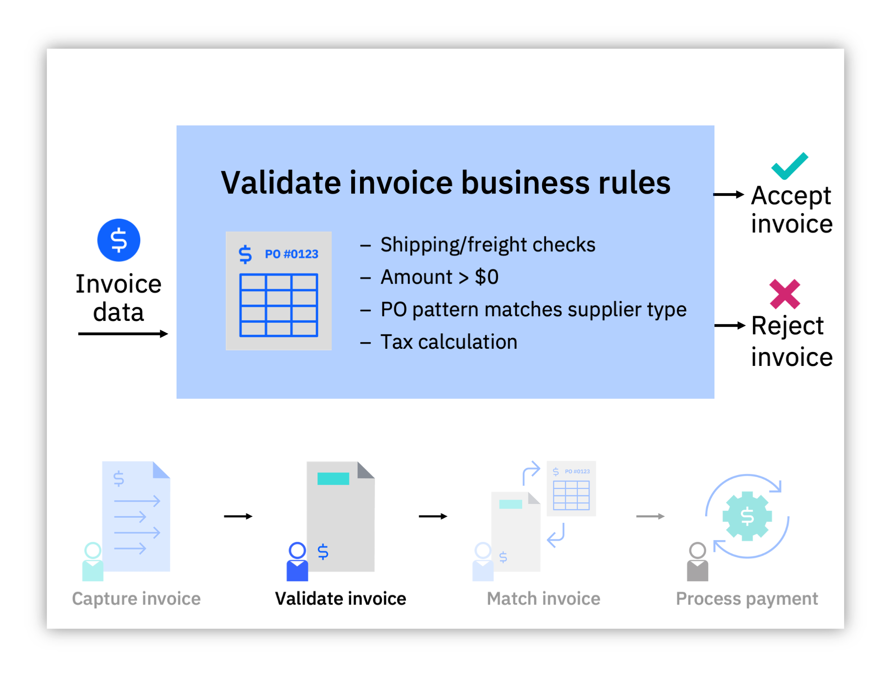
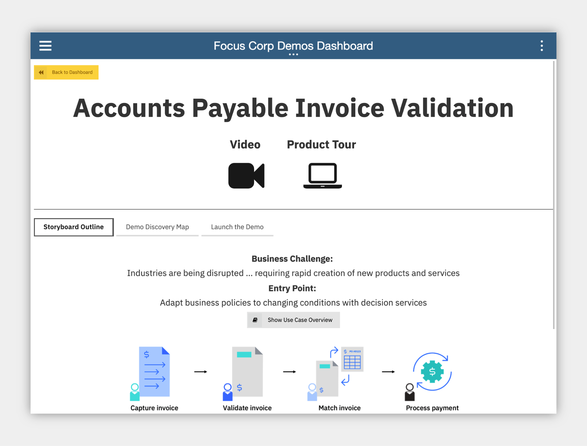
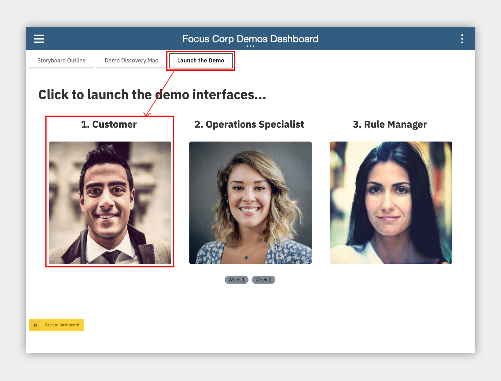
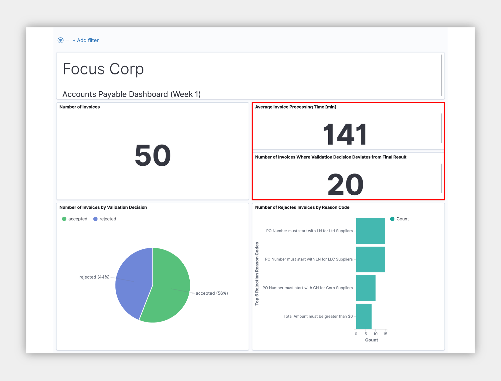
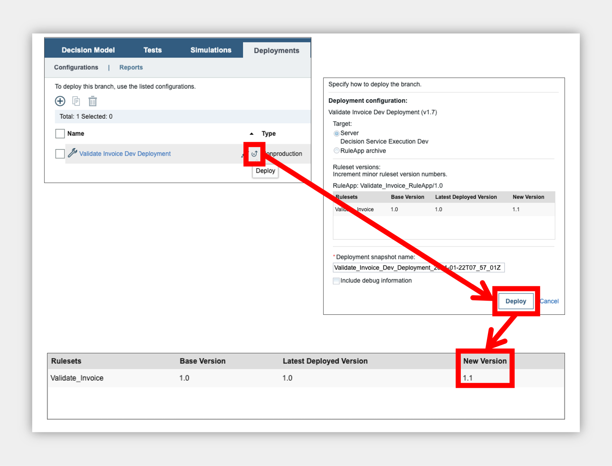
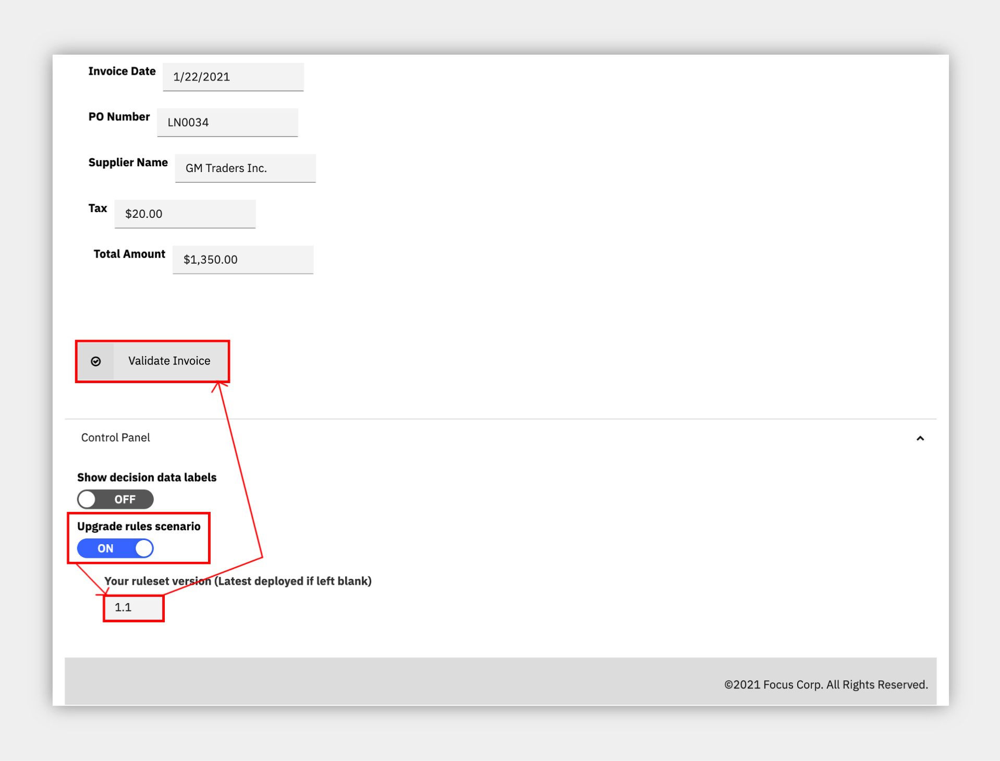
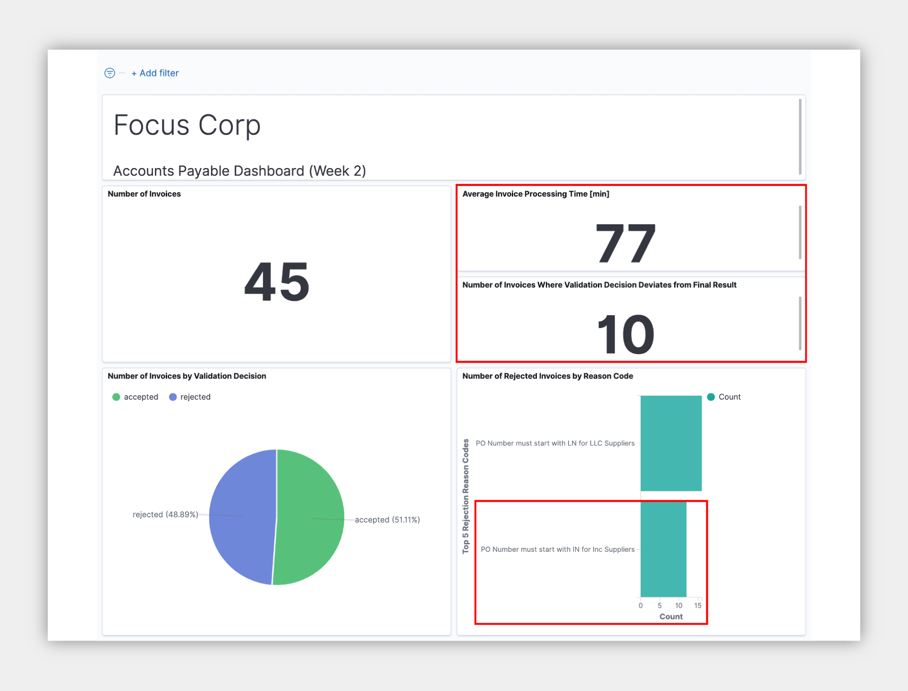

## Accounts Payable
**an IBM Cloud Pak for Business Automation use case**
***

# Introduction

**Use Case Overview:** Today, your accounts process is entirely manual, with the amount of invoices only increasing. When first capturing an invoice, you must enter the invoice data into multiple systems. From there, different people must validate the invoice data and match the invoice to the Purchase Order. This results in data entry errors and inconsistencies across multiple systems. After all these steps, you can finally process payment in the ERP system. In this demo, you will learn how to adapt business policies to changing conditions with business rules.

**Choose an option:**

  * **Cloud Pak for Business Automation as a Service demo environment (predeployed for IBMers only):** continue to the [Getting Started Lab](#getting-started-lab) section below.
  * **Install Yourself:** To deploy Accounts Payable on your own environment, and technical architecture information, see the <a href="https://github.com/ibm-cloud-architecture/dba-accounts-payable.git" target="_blank">dba-accounts-payable</a> git repository which includes the required deployment artifacts.

 

***

# Getting Started Lab

**Are you ready to see flexible business decisions in action?**

## 1. Scenario Introduction - Accounts Payable

??? note summary "Expand to view"
    **Demo Video**

    In this demo, you will learn how to adapt business policies to changing conditions with business rules

    

    ??? note summary "Demo Outline"
        **Demo Outline**

        [Full Demo Narration](#full-demo-narration)

        1. Use Case Overview
        1. Focus Corp Demo Dashboard review
        1. Customer persona
            1. Submit rejected invoice
            1. Turn on decision labels, fix $0 and submit approved
            1. Submit invoice that should be rejected, but is approved
        1. Operations Specialist persona
            1. Week 1 dashboard
        1. Rule Manager persona
            1. Decision model review
            1. Review $0 total amount text rule and Validate PO Against Supplier table
            1. Create new branch
            1. Add a new row in the table for IN / Inc scenario
            1. Validate
            1. Simulate rules and compare with original simulation report
            1. Deploy new version
        1. Customer persona
            1. Turn on new rule version
            1. Same invoice is correctly rejected
        1. Operations Specialist persona
            1. Week 2 dashboard
        1. Use case review and value of decision services

    ??? note summary "Discovery Map"
        

    [Go to top](#lab-section-1) | [Go to Getting Start Lab](#getting-started-lab)

## 2. Login and Setup Your Environment

??? note summary "Expand to view"

    **Select an option for your environment**

    ??? note summary "Option 2A - Using a Cloud Pak for Business Automation as a Service environment (predeployed for IBMers only) ?"

        

        IBM maintains multiple internal SaaS tenants for IBMers only.

        Please login to IBM Technology Zone and navigate to <a href="https://techzone.ibm.com/collection/5fdfcf8b99cf35001ee4954d" target="_blank">here</a> to learn about these **demo environments** via the **User Guide**.

        1\. Once you have access to an environment, please continue here:  
        &nbsp; &nbsp; &nbsp; • &nbsp; Enablement Users, this demo is not available on enablement tenants at this time.  
        &nbsp; &nbsp; &nbsp; • &nbsp; Demo Users, once your account administrator completes the below setup and provides you access, please continue.  
        &nbsp; &nbsp; &nbsp; • &nbsp; Administrator Users, please reference the <a href="https://techzone.ibm.com/collection/business-automation-saas#tab-2" target="_blank">Administration Guide</a> (IBM only) for any additional setup information including onboarding users.  
        &nbsp; &nbsp; &nbsp; &nbsp; &nbsp; &nbsp; > Note: Navigate to the **Demo tenants** tab after login.

        2\. Login to your Cloud Pak for Business Automation as a Service demo environment <a href="http://automationcloud.ibm.com" target="_blank">here</a> to access your portal.

        3\. Open the menu in the upper left.

        4\. Select **Production** and then **Run**.

        5\. Click the **Process Portal** tile

        6\. Wait for the portal to load in a new browser window/tab

         

        7\. On the left menu, under the **Dashboards**, click **Show more/less…**

        8\. Click **Focus Corp Demos Dashboard**

        9\. Wait for the dashboard to load on the right

        

        10\. Start by reviewing the available demos, they all represent a business automation use case so you can easily get started.

        

        11\. When ready, click the green **Accounts Payable** button to launch the use case.

        [Go to top (Option 2a)](#lab-section-2a) | [Go to Getting Start Lab](#getting-started-lab)

    ??? note summary "Option 2B - Are You Using Your Own Environment (not a SaaS demo) ?"
        

        1\. Standard Users, once your account administrator completes the below setup and provides you access, please continue.

        2\. Administrator Users, expand the following section to access additional information to setup access for yourself and others in your environment:

        ??? note summary "Additional Administrator Setup For Your Own Environment"

            See the <a href="https://github.com/ibm-cloud-architecture/dba-accounts-payable.git" target="_blank">dba-accounts-payable</a> git repository to deploy on your own platform.

        > Standard Users, continue here...

        3\. Ask your administrator for the Process Portal URL and your login credentials

        4\. Wait for the desktop to load in a new browser window/tab (it can take some time) and log in

         

        5\. Start by reviewing the available demos, they all represent a business automation use case so you can easily get started.

        6\. When ready, click the **Accounts Payable** tile to launch the demo and continue to [the next section](#lab-section-3).

        [Go to top (Option 2b)](#lab-section-2b) | [Go to Getting Started Lab](#getting-started-lab)

    [Go to top](#lab-section-2) | [Go to Getting Started Lab](#getting-started-lab)

## 3\. Submit invoices and review rules
??? note summary "Expand to view"

    #### Be your customer!

     
    You are now a customer with an invoice to submit for payment and you want to make sure it is valid.  What do you experience?
    As a customer, you want to be paid for your services on time and make sure you are doing your part to submit valid invoice data.  Clear and consistent business rules ensure you know what you need to do.

     

    1. Check the tabs to learn more about the demo
        1. **Storyboard Outline**
        1. **Demo Discovery Map**

     

    2\. Navigate to the **Launch the Demo** tab and then click on the picture of the **Customer**

     

    3\. Use the drop down to select the first invoice ending in **101R**.

    > NOTE: invoices ending in R should be rejected and A should be approved

     

    4\. Click **Validate Invoice** to see the results, the invoice is rejected

    5\. If you want, you can read the reason code and resubmit the invoice to fix the error

    6\. Choose to **Submit Another Invoice**

    7\. Select the invoice ending in **105R**

    8\. At the bottom, expand the **Demo Control Panel**

    9\. Turn on the decision labels to see which data is used to make the decision

    10\. Submit the invoice and see that it is not rejected as expected which leads to rework in downstream business processes

    

    [Go to top](#introduction) | [Go to Getting Start Lab](#getting-started-lab)

## 4\. Review the Operations Dashboard
??? note summary "Expand to view"

    > NOTE: If your environment does not have Kibana dashboards, you may need to skip executing this section and just read it as Business Performance Center dasbboards are not available at this time.

    You are now a Focus Corp employee, first an Operations Specialist and later a Rule Manager.  Time to see how invoice validation works.

    1\. Navigate back to the Focus Corp Demos Dashboard browser window/tab

    2\. Click on **Week 1** under the picture of the **Operations Specialist**

    3\. Login to the **Insights Dashboard**

    > NOTE: If this is your FIRST TIME, your password may not work; go back to the SaaS portal, mouse over your name in the upper right and click Set Password.  Once complete, come back and login to the Open Distro for Elasticsearch / Kibana.

     

    4\. Review the Week 1 dashboard metrics and note the following:
        1. Average invoice processing time is unmanageable at above 100 minutes
        1. The rules deviated from the final result on more than 60 invoices this week

     

    [Go to top](#introduction) | [Go to Getting Start Lab](#getting-started-lab)

## 5\. Review the business rules
??? note summary "Expand to view"

    **Continuing as the Focus Corp Rule Manager, how can you adapt your rules to reduce rework and process invoices faster with less exceptions?**

    Rule Managers can adjust rules, validate and simulate the decision service and deploy quickly and easily.

    1. Navigate back to the Focus Corp Demos Dashboard browser window/tab
    1. Click the picture of the **Rule Manager**
    1. Click **Validate Invoice** followed by **main** to open the decision model
    1. Review the decision model, green ovals are input data and blue boxes are decisions, each with their own business logic leading to the **Final Result** decision

    

    5\. Click the blue **Validate PO against Supplier** decision node

    6\. On the left pane, scroll to the bottom and click to open the **Validate PO against Supplier** logic

    7\. Review the decision table and note there is no row addressing Inc. suppliers.

    

    [Go to top](#introduction) | [Go to Getting Start Lab](#getting-started-lab)

## 6\. Update and simulate the business rules
??? note summary "Expand to view"

    1. At the upper left, click **Validate Invoice**
    1. On the left, just above **main**, click the plus icon
    1. Create a new branch name using a unique phrase such as your name, ensure **main** is the parent branch and click **Create**

     

    4\. On the upper right, click the pencil to edit the decision model

    5\. Open the same **Validate PO against Supplier** decision node and table

    6\. Right click on the row number for row 3 and select **Insert row** -> **Below**

    7\. Enter values in the new row 4 to look for **IN** when suppliers are **Inc** type as pictured

    > NOTE: you can copy and paste cells as you would in a spreadsheet editor

    

    8\. On the upper right, Save and Close when done editing the rules

    In the full lifecycle, a Rule Manager runs validations and test suites before deploying the rules, if you wish, explore by clicking Validate on the left side of the editor or selecting the Tests tab at the top to run the test suite provided.

    9\. Click the **Simulations** tab and **Simulations** sub tab

    10\. Place the mouse over the **Accounts Payable Simulation** and click the run icon on the right

    11\. After clicking **OK**, you will see the simulation running with a spinning status icon

    12\. Once a checkmark appears, place the mouse over the report name and click the compare icon on the right

    

    13\. Under **main**, select the simulation report that is furthest in the past

    14\. Click **Compare**

    On the left are the results for the new rules and the right are the results for the original rules

    15\. Compare and notice some important differences:
        1. (pie chart) more invoices were rejected (the new rule rejects a new incorrect pattern)
        1. (orange bar chart) higher value invoices are rejected more

    

    [Go to top](#introduction) | [Go to Getting Start Lab](#getting-started-lab)

## 7\. Deploy the business rules and see the results
??? note summary "Expand to view"

    1. On the upper left, to the right of **Validate Invoice**, click the name of the branch you created
    1. Click the **Deployments** tab and **Configurations** sub tab
    1. Place the mouse over **Validate Invoice Dev Deployment** and click the deploy icon on the right
    1. Review the deployment details and click **Deploy**
    1. Once a checkmark appears, click the name of the deployment report to open it and take note of the number under **New Version** at the bottom (such as **1.1**)

     

    6\. Navigate to the Customer’s browser window/tab or back to the **Focus Corp Demos Dashboard** browser window/tab and click on the picture of the **Customer**

    7\. Select the same invoice that was accepted earlier, ending in **105R**

    8\. At the bottom, expand the **Demo Control Panel** and activate the **Upgrade rules scenario**

    9\. In the **Your ruleset version** field that appears, enter the version you deployed (such as **1.1**)

    10\. Submit the invoice and confirm it is rejected with the reason code from your new rule table row

     

    [Go to top](#introduction) | [Go to Getting Start Lab](#getting-started-lab)

## 8\. Review latest operational performance
??? note summary "Expand to view"

    > NOTE: If your environment does not have Kibana dashboards, you may need to skip executing this section and just read it as Business Performance Center dasbboards are not available at this time.

    1. Navigate back to the **Focus Corp Demos Dashboard** browser window/tab
    2. Click on **Week 2** under the picture of the **Operations Specialist**
    3. Review the dashboard metrics and note the following:
        1. Lower average invoice processing time below 100 minutes
        1. Less deviation from the final result per week

    **The upgraded rules are reducing rework already!**

     

    [Go to top](#refund-request-automation) | [Go to Getting Start Lab](#getting-started-lab)

## 9\. Summary
??? note summary "Expand to view"

    We just used decision automation, a capability within IBM Cloud Pak for Automation, to automate an accounts payable process.  With growing volumes of invoices, business rule automation helps reduce the amount of human intervention for account processing, detect issues earlier, and incorporate changes quickly when needed.

    [Go to top](#introduction) | [Go to Getting Start Lab](#getting-started-lab)

***

# Full Demo Narration

??? note summary "Expand to view"
    **Demo Narration and Flow**

    **Demo Start Page**

    Reviewing the demo launch page we see a text summary describing the demo and a discovery map diagram for our reference.  We will only focus on the Validate Invoice Data step in the flow.  OK, let's launch the demo.

    **Customer invoice submissions**

    We start by becoming the customer.  From the Focus Corp Accounts Payable Invoices portal, we select an invoice ending with R (therefore it should be rejected) and submit for rule validation.  We review five key data fields extracted from the invoice using intelligent document processing and then submit for validation.  This invoice is rejected by the business rules as the total amount must be greater than 0.

    Let's resubmit that invoice by fixing the total amount to $100 and see what the rules say.  We can also take a look at the fields that the business rules use to make their decision.  And this time, the corrected invoice is accepted and passes rule validation.

    We have various other invoices to try, let's select another one ending in R that should be rejected, but this time the rules do not find an issue and it is accepted.  This type of result means more rework in downstream business processes as humans are involved in more review and the invoice is routed back and forth to be fixed.

    **Operations week 1**

    Further, we can see from the Operations Specialist's Accounts Payable dashboard that the average invoice processing time in the upper right is unmanageable at above 100 minutes.  Further, the rules deviated from the final result on more than 60 invoices this week, adding to rework. Rules must change at the speed of the changing business so let's see how we can improve the business rules.

    **Rules manager**

    As a rules manager, we have access to the invoice validation decision model. The invoice data move from the oval at the bottom through multiple sub-decisions including a text rule to check the total amount is more than $0 which resulted in our first invoice being rejected.  Another decision table looks for combinations of PO numbers and supplier types that do not follow the correct pattern (update!).  This is where the second invoice should have be rejected but the table is missing a new invalid pattern.

    The rules manager, a business user, edits the decision model, adds a new row, easily does a copy/paste of the existing row to get a head start, exactly like a spreadsheet, adjusts the values to match the new Inc. based rejection pattern and the rule is ready.  Tables automatically generate multiple text rules that follow the same pattern so we do not have to write them all from scratch.

    Let's validate our work in real time by running the same test case as before that should have been rejected.  Great, and with the new rule we get the rejection reason we just created.

    Once they save the new decision model for audit and compliance, the rule manager can run an automated regression test but instead we'll move on to simulation.  Loading an old simulation report before the rule change, we see rule metrics including the number of invoices approved and rejected as well as trends by date and invoice amount.  No high invoice amounts are being rejected, interesting.  The business knows most of the high value invoices are Inc. vendors so the new rule should catch more of these errors.

    After running a new simulation and comparing side by side, the business can make an informed decision about the impact of new rules before ever deploying to production.  Yes, this looks as expected so we are ready to deploy.  In this case, the business can deploy on their own but this can be configured for only certain safe rules and others must go through IT testing.

    **Customer approved to rejected**

    After the rules manager deploys the new rules, we go back to the invoice submission and choose the same invoice that should now be rejected.  We see the invalid pattern of PO number and supplier type and we select in the demo control panel to upgrade to the latest rule version.  The results, rejected with the reason code deployed by the business rule manager.

    **Operations week 2**

    After these new rules are in place for a week, the Operations Specialist reviews their updated dashboard and sees solid improvement with a reduction of average invoice processing time from less invoice rework and also less deviation between the rules and the final invoice decision.  Our rules are more accurate.

    **Use Case Summary**

    We just used decision automation, a capability within IBM Cloud Pak for Automation, to automate an accounts payable process.  With growing volumes of invoices, business rule automation helps reduce the amount of human intervention for account processing, detect issues earlier, and incorporate changes quickly when needed.

    [Go to top](#video-narration) | [Go to Getting Started Lab](#getting-started-lab) | [Go to Introduction](#introduction)
