## HR Onboarding Application
**an IBM Cloud Pak for Business Automation use case**
***

# Introduction

**Use Case Overview:** Existing HR applications are not easily modified and often require the IT team to work with the vendor and make code changes.  There are often higher priority development projects that deliver customer value than HR.  The result: adhoc spreadsheets, emails and local file shares and a disorganized process inhibits the flow of applicants and HR teams are frustrated with slow results.  It's time for an easy to use low-code build environment where HR can create dynamic applications that connect to existing systems and deliver value quickly.

**Choose an option:**

  * **Cloud Pak for Business Automation as a Service demo environment (predeployed for IBMers only):** continue to the [Getting Started Lab](#getting-started-lab) section below.
  * **Install Yourself:** To deploy HR Onboarding Application on your own environment, and technical architecture information, see the <a href="https://github.com/ibm-cloud-architecture/dba-hr-onboarding-app.git" target="_blank">dba-hr-onboarding-app</a> git repository which includes the required deployment artifacts.

 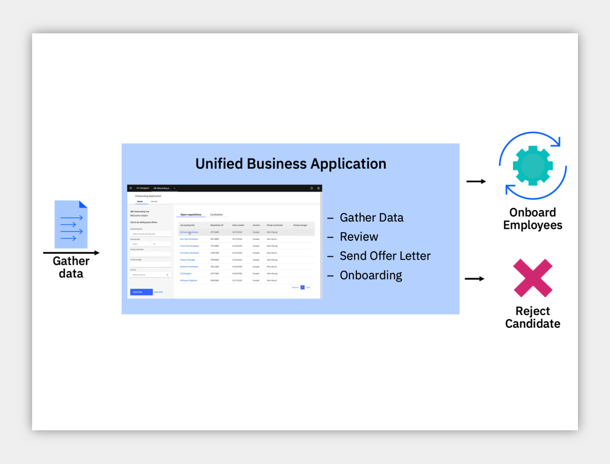

***

# Getting Started Lab

**Are you ready to build low-code business applications?**

## 1. Scenario Introduction - HR Onboarding Application

??? note summary "Expand to view"
    **Demo Video**

    In this demo, you will build a low-code business application that connect to existing systems for workflow and decisions

    

    ??? note summary "Demo Outline"
        **Demo Outline**

        [Full Demo Narration](#full-demo-narration)

        1. Use Case Overview
        1. Focus Corp Demo Dashboard review
        1. Application Assembler persona
            1. Automation service creation
            1. Preview onboarding application template
            1. Create application from template
            1. Add automation services to application
            1. Preview application
        1. HR Specialist persona
            1. Run the application
        1. Use case review and value of low-code applications

    ??? note summary "Discovery Map"
        

    ??? note summary "Process Diagram"
        

    [Go to top](#lab-section-1) | [Go to Getting Start Lab](#getting-started-lab)

## 2. Login and Setup Your Environment

??? note summary "Expand to view"

    **Select an option for your environment**

    ??? note summary "Option 2A - Using a Cloud Pak for Business Automation as a Service environment (predeployed for IBMers only) ?"

        

        IBM maintains multiple internal SaaS tenants for IBMers only.

        Please login to IBM Technology Zone and navigate to <a href="https://techzone.ibm.com/collection/5fdfcf8b99cf35001ee4954d" target="_blank">here</a> to learn about these **demo environments** via the **User Guide**.

        1\. Once you have access to an environment, please continue here:  
        &nbsp; &nbsp; &nbsp; • &nbsp; Enablement Users, this demo is not available on enablement tenants at this time.  
        &nbsp; &nbsp; &nbsp; • &nbsp; Demo Users, once your account administrator completes the below setup and provides you access, please continue.  
        &nbsp; &nbsp; &nbsp; • &nbsp; Administrator Users, please reference the <a href="https://techzone.ibm.com/collection/business-automation-saas#tab-2" target="_blank">Administration Guide</a> (IBM only) for any additional setup information including onboarding users.  
        &nbsp; &nbsp; &nbsp; &nbsp; &nbsp; &nbsp; > Note: Navigate to the **Demo tenants** tab after login.

        2\. Login to your Cloud Pak for Business Automation as a Service demo environment <a href="http://automationcloud.ibm.com" target="_blank">here</a> to access your portal.

        3\. Open the menu in the upper left.

        4\. Select **Production** and then **Run**.

        5\. Click the **Process Portal** tile

        6\. Wait for the portal to load in a new browser window/tab

         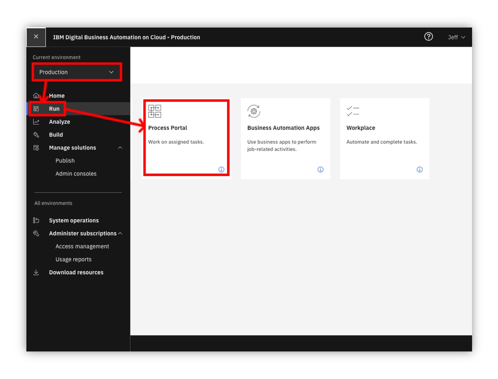

        7\. On the left menu, under the **Dashboards**, click **Show more/less…**

        8\. Click **Focus Corp Demos Dashboard**

        9\. Wait for the dashboard to load on the right

        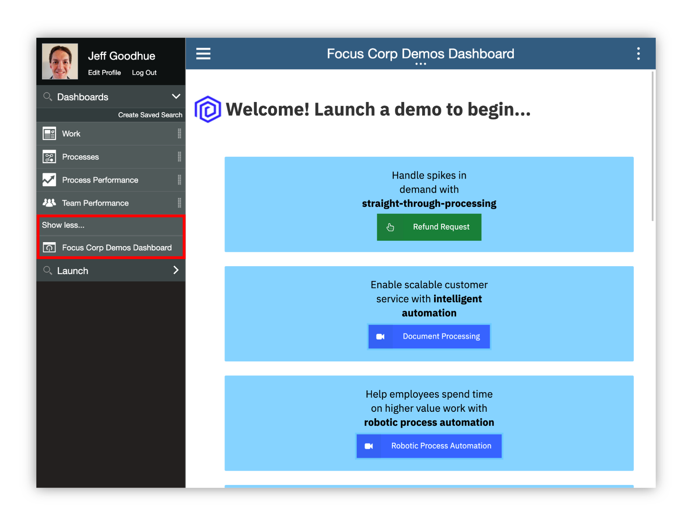

        10\. Start by reviewing the available demos, they all represent a business automation use case so you can easily get started.

        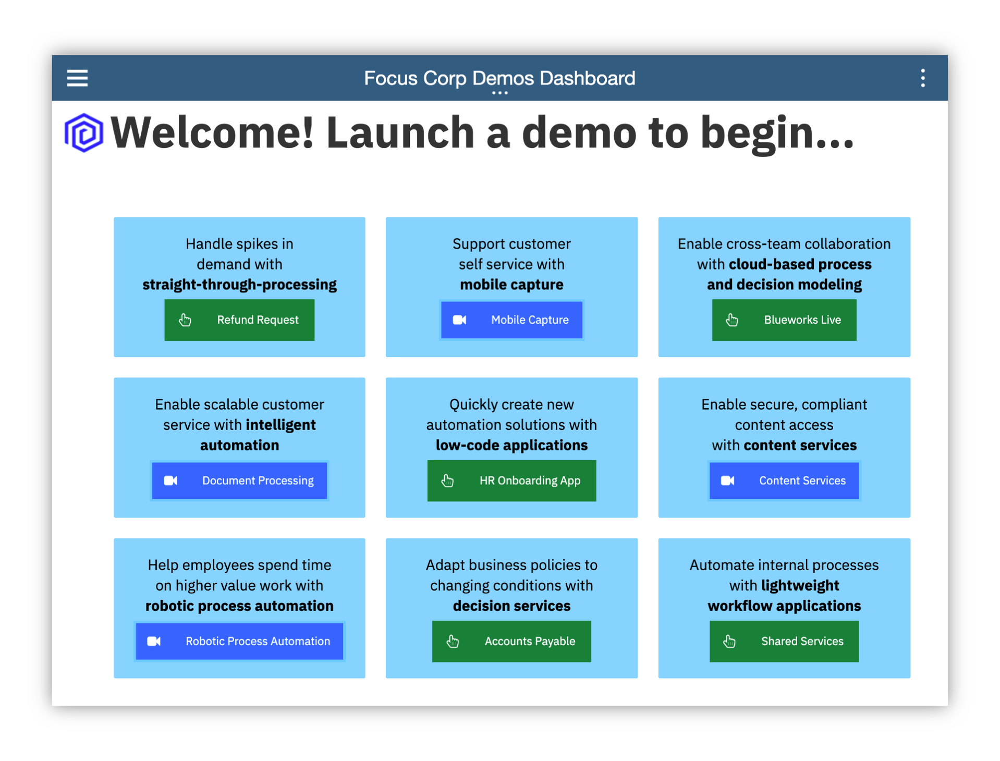

        11\. When ready, click the green **HR Onboarding App** button to launch the use case.

        [Go to top (Option 2a)](#lab-section-2a) | [Go to Getting Start Lab](#getting-started-lab)

    ??? note summary "Option 2B - Are You Using Your Own Environment (not a SaaS demo) ?"
        

        1\. Standard Users, once your account administrator completes the below setup and provides you access, please continue.

        2\. Administrator Users, expand the following section to access additional information to setup access for yourself and others in your environment:

        ??? note summary "Additional Administrator Setup For Your Own Environment"

            See the <a href="https://github.com/ibm-cloud-architecture/dba-hr-onboarding-app.git" target="_blank">dba-hr-onboarding-app</a> git repository to deploy on your own platform.

        > Standard Users, continue here...

        3\. Ask your administrator for the Process Portal URL and your login credentials

        4\. Wait for the desktop to load in a new browser window/tab (it can take some time) and log in

         

        5\. Start by reviewing the available demos, they all represent a business automation use case so you can easily get started.

        6\. When ready, click the **HR Onboarding App** tile to launch the demo and continue to [the next section](#lab-section-3).

        [Go to top (Option 2b)](#lab-section-2b) | [Go to Getting Started Lab](#getting-started-lab)

    [Go to top](#lab-section-2) | [Go to Getting Started Lab](#getting-started-lab)

## 3. Tour Business Automation Studio
??? note summary "Expand to view"

    **Create your own business app and drive automation**

     
    You are now a member of the HR team that has some interest and experience building simple apps such as office scripts or web sites and would like to help your HR Specialist colleagues and make their jobs easier.
    As an Application Assembler, you decide to create a low-code business appllication that connects to existing systems for workflow and decisions in a unified experience.

     

    1. Check the tabs to learn more about the demo
        1. **Storyboard Outline**
        1. **Demo Discovery Map**
        1. **Demo Diagram**

     

    2\. Navigate to the **Launch the Demo** tab and then click on the picture of the **Application Assembler**

     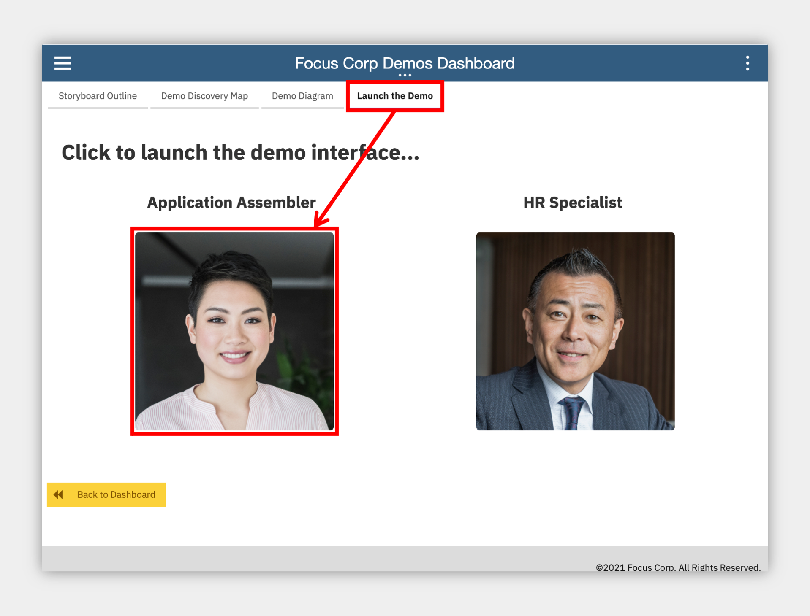

    3\. Allow Studio to load and then take a look around.

     

    [Go to top](#introduction) | [Go to Getting Start Lab](#getting-started-lab)

## 4. Create an automation service
??? note summary "Expand to view"

    Before you build your application, let's find and connect to some existing workflow and decision services to use within the application.  Studio can connect to external business automation services you already have today and unify them in a single application user experience with the low-code Application Designer.

    1. In the middle, click **Automations** to load the business automations section

     

    2\. Click **Create** -> **External** and wait for the dialog to appear (this can take multiple seconds the first time you use the interface).

     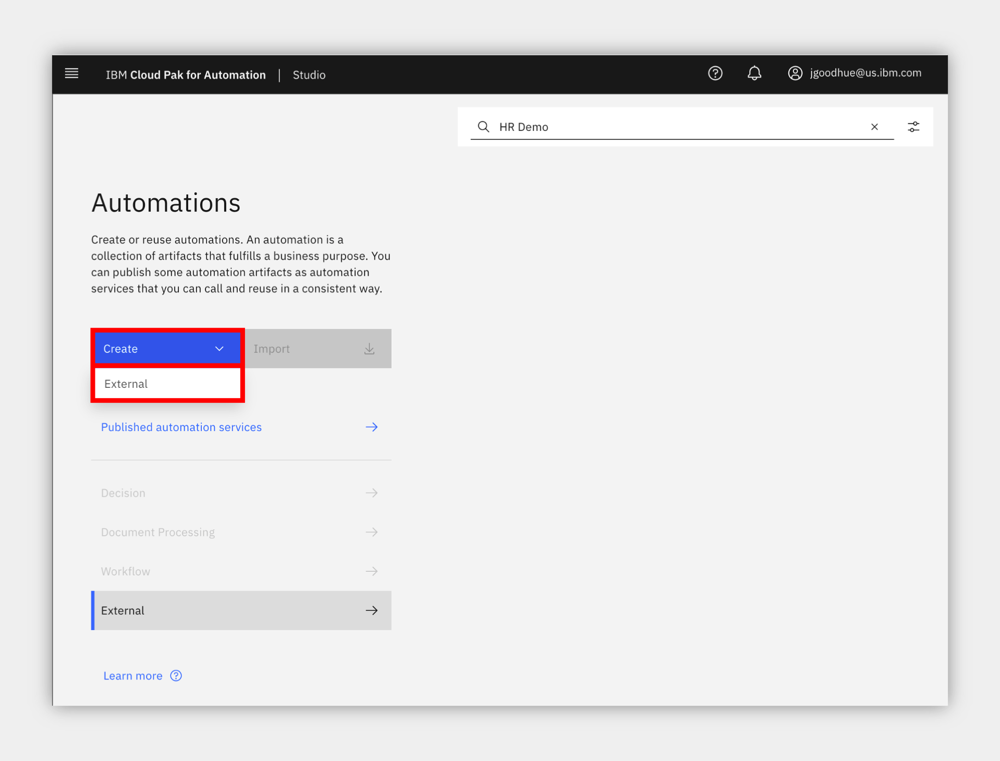

    3\. Select to create your automation service **From a new connection** unless another person using the environment already created a connection to the Business Automation Workflow instance that contains the HR Onboarding Application Services process application.

     

    4\. Enter your connection information as below and please be exact as the format is important.  Note, depending on your version of CP4BA, the form below may be different and not have all the fields such as Scheme or Port.

    | Field             | Value                                        |
    | :---------------- | :------------------------------------------- |
    | Connection Name         | any name you will recognize  |
    | Scheme             | `https`                   |
    | Host         | the URL for your BAW environment, this is currently the following format `https://<hostname>/dba/dev` so for example `https://cp4ba-trial01.automationcloud.ibm.com/dba/dev`                                     |            
    | Port         | `443`                                      |
    | Username  | the username of a non-SSO service credential created by the administrator of your BAW environment                          |
    | Password  | the password of a non-SSO service credential created by the administrator of your BAW environment                          |

    5\. When done, click **Next**

     

    6\. Select the **HR Onboarding Application Services** process application in the drop down.

    7\. Select all operation checkboxes and click **Next**.

     

    8\. Update the name and description as desired and click **Publish**

     

     > NOTE: be sure to remember the name as you will use this in a future section.

    9\. Wait to receive an **External service published** notification in the upper right before proceeding.

     

    [Go to top](#introduction) | [Go to Getting Start Lab](#getting-started-lab)

## 5. Preview onboarding application template
??? note summary "Expand to view"

    Now that you published the external automation services, you are ready to create your busienss application.  You decide to look for a template to accelerate application assembly.

    1. Click the upper left menu and select **Applications**

     

    2\. Click **Templates** to show all the templates in the Studio environment.

    3\. Locate or search for the **Onboarding Application template** and click **Preview** on the tile.

    > NOTE: it may take some time for the template to be deployed and run, more than 10 or 20 seconds in some cases.

    > NOTE: the application will launch in a new browser window/tab so be sure to look for the browser notification and allow it to launch.

     

    Explore the application, including:

    4a\. Try using the filters or search on the left side to find a candidate.

    4b\. Once you select a Candidate it will load a details page (that can take a moment).

    4c\. Try out some of the drop downs for status on the right side.

     

    5\. Once you are done, close that browser window/tab and come back to the Studio page.

    6\. Click **Create** -> **Application** (this can take multiple seconds the first time you use the interface).

     

    7\. Select the **Onboarding Application template** and give it a name and optional purpose.

     

    **Congratulations, you created your business application!**

     

    [Go to top](#introduction) | [Go to Getting Start Lab](#getting-started-lab)

## 6. Add automation services to your application
??? note summary "Expand to view"

    Now that you have an application, you can add the automation services you published so you can use them in the low-code build environment.

    1. On the right, locate the **All views** drop down under **Drag a component to your page** header, click and select **Automation service** at the bottom.

     

    2\. Click the **Add +** button

     

    3\. Click to select the name of the automation service you published earlier and then select all the operations and click **Next**.

     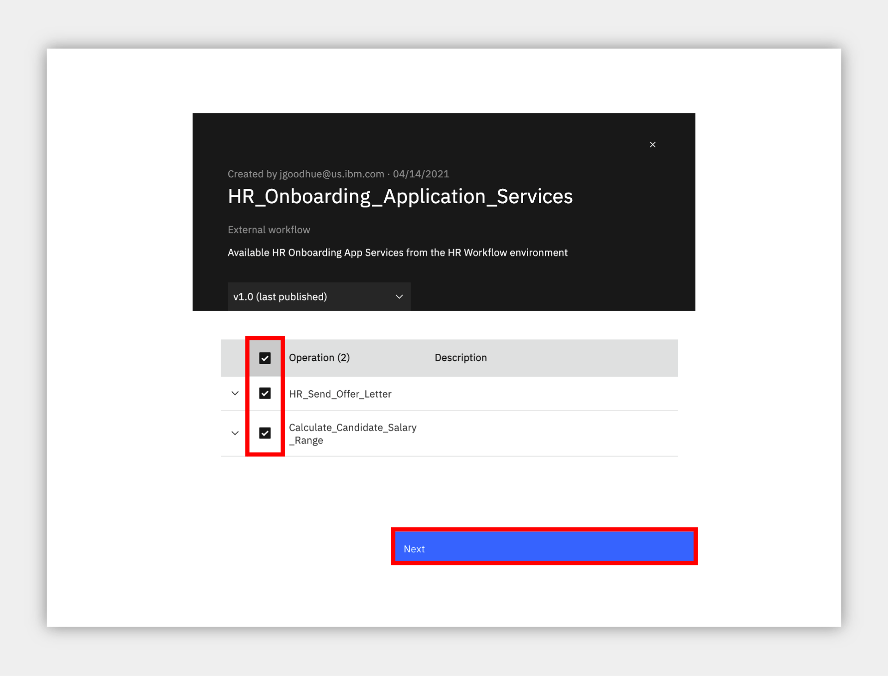

    4\. Now that you the automation service is in the palette on the right, click and drag it into the application as pictured below (or you can choose another location if you prefer).

     

    5\. First, select the operation at the top as **HR_Send_Offer_Letter**.

     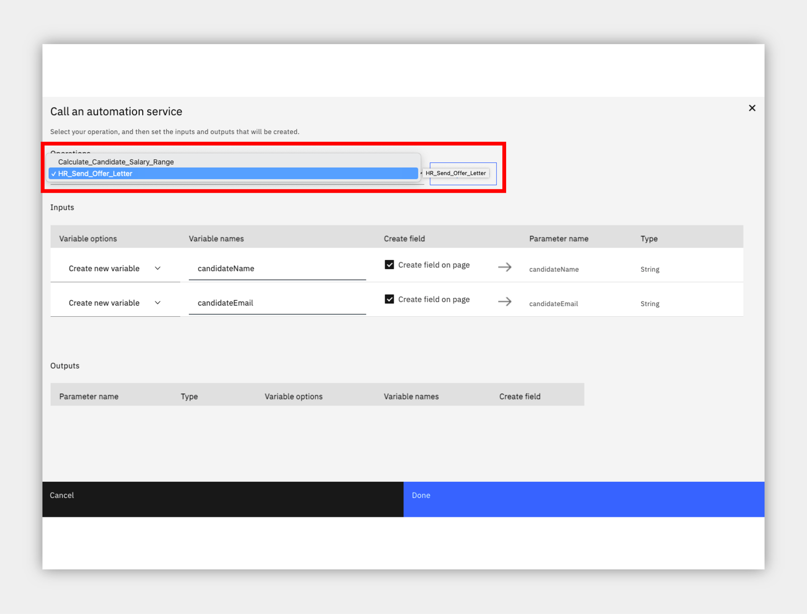

    6\. Now, we need to map data stored in the application (provided by the template) to the automation service so it will be sent to the HR Send Offer Letter process.  Make the following changes for the first variable row in the **Inputs** section:

    6a. under **Variable options**, click the drop down and select **Use existing variable**

    6b. under **Variable names**, click **Select** and expand **selectedCandidateDetails** and select **fullname**.

    6c. under **Create field**, uncheck the box as we do not need to see the candidates name since it is already in the upper left corner.

    7\. Repeat the same three steps above, selecting **selectedCandidateDetails -> personalEmail** for the second step.

     

    8\. Click **Done**.

    ** A new button is added to the application that will launch the process and send the two variables automatically! **

    9\. Feel free to click the button and edit it using the palette that appears directly below.  I would recommend using the pencil to change the name and you can also use the paint bucket to change the color.

     

    > Next, we will add the second automation service to the application, a decision service to calculate a suggested salary based on information from the candidate and position.

    10\. Use the right palette to click and drag the same automation service on to the application, this time below the blue header (or in a location you prefer).

     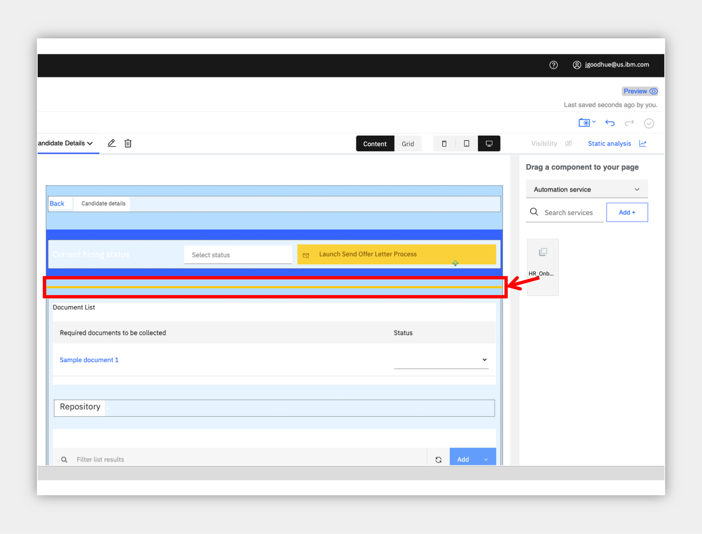

    11\. Select the operation at the top as **Calculate_Candidate_Salary_Range**.

    12\. Map the data stored in the application to the automation service as before so the business rules can use it to make the decision.  Make the following changes for the first variable row in the **Inputs** section:

    12a. under **Variable options**, click the drop down and select **Use existing variable**

    12b. under **Variable names**, click **Select** and expand **selectedCandidateDetails -> jobDetails -> jobStatus**.

    12c. under **Create field**, uncheck the box.

    13\. Repeat the same three steps above for the remaining three variables using the following values for the second step:

    13a. **selectedCandidateDetails -> country**

    13b. **selectedCandidateDetails -> jobDetails -> jobLevel**

    14c. **selectedCandidateDetails -> employmentType**

    14\. For the output variable at the bottom, you may retain the defaults to **Create a new variable** and **Create field on page**.

    15\. Click **Done**.

     

    > The result is that three elements are added to the page: a button to launch the service and two decimal/numeric fields for the output of minimum and maximum.

    16\. If you wish, you can perform some layout to move them around.  For example, right click on the button just added and create a horizontal layout or panel before it, then drag the three elements into it.

    17\. You may also try clicking on one of the numeric fields such as **Minimum** and clicking the gear to configure it, try to locate **Format** and set it to **Currency** to automatically show a currency symbol for your country.

    **Congratulations, you added a workflow and decision service to your application, all without writing any code!**

    

    [Go to top](#introduction) | [Go to Getting Start Lab](#getting-started-lab)

## 7. Preview the completed application
??? note summary "Expand to view"

    Let's preview the application again and try out the automation services you added.

    1. In the upper right, click **Preview**.

    > NOTE: as before, it may take some time for the template to be deployed and the application will launch in a new browser window/tab which may be blocked by your browser.

    2\. Search or select a requisition and then a candidate to open the candidate details page to see the automation services you added.

     

    3\. Click the second button you added for the Calculate Candidate Salary Range decision service, the values should be updated in the UI within a few seconds.

     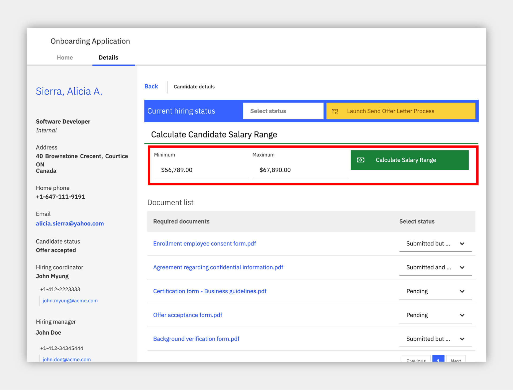

    4\. Click the first button you added for the HR Send Offer Letter process, this will launch a process in the background.

     

    5\. To see the process task you will need to open the workflow server's task list which is visible in a few locations:

    ??? note summary "Option 1 - a Cloud Pak for Business Automation as a Service (predeployed for IBMers only)"
        * go back to the SaaS portal that you first logged into and use the menu at the upper left to select **Development** (only select Production if that is the envionment you used for tour automation service connection) and then **Run** and finally the **Navigator** tile.
        * Use the upper left menu in Navigator and look for the **Work Dashboard** feature to load the task list.
        * If the above feature is not available in Navigator, you may also load the **Process Portal** tile from the Development -> Run page.
            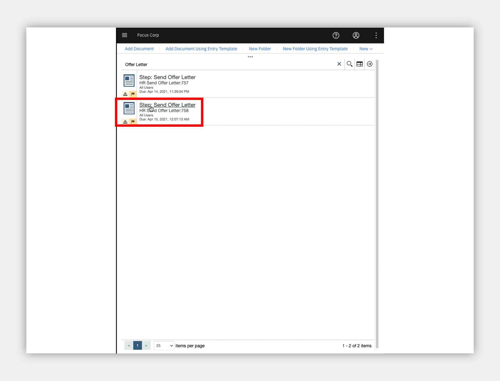

    ??? note summary "Option 2 - your own environment"
        open the Process Portal or Navigator -> Work Dashboard for the Business Automation Workflow server you used in the external automation service connection above.

    6\. Once you locate the **Send Offer Letter** task you can click to open it and see the data passed from your application to the process.

     

     [Go to top](#introduction) | [Go to Getting Start Lab](#getting-started-lab)

## 8. Summary
??? note summary "Expand to view"

    In just a few minutes, you created, tested and published a new, low-code business application from a template and connected it to existing workflow and decision automation services.  This low-code experience enables greater control and simplicity in application authoring while accelerating time to value for the business teams that use the applications.

    [Go to top](#introduction) | [Go to Getting Start Lab](#getting-started-lab)

***

# Full Demo Narration

??? note summary "Expand to view"
    **Demo Narration and Flow**

    **Intro**

    HR teams manage adhoc processes outside their systems of record, gathering data, performing reviews, sending offers, looping around to do rework unfortunately before finally obtaining the goal to onboard an employee.  Additionally, HR Specialists use multiple, disparate systems to complete their work and can easily lose track of the process.

    It's time for an easy to use low-code build environment where HR can create dynamic, unified business applications that connect to existing systems and deliver value quickly.

    **Demo Start Page**

    Reviewing the demo launch page we see a text summary describing the demo along with a discovery map and diagram for our reference.  OK, let's launch the demo.

    **Studio Intro**

    Welcome to the Studio low-code build environment.  As an Application Assembler you can use Studio to create Applications and connect to Business Automations.

    **Automation service creation**

    Before we build our application, let's find and connect to some existing workflow and decision services that we want to use.  Studio can connect to external business automation services you already have today and unify them in a single application user experience with the low-code Application Designer.

    After we connect to Business Automation Workflow HR environment, Studio prompts us to select our the application and operations to automatically import.  We'll select send offer letter and calculate salary range.  The Studio imports and automatically publishes a service and we can confirm the operations and relevant inputs and outputs.  Now we are ready to create our application!

    **Preview onboarding application template**

    Studio includes multiple templates to start from, let's preview and try out the Onboarding Application template.  The app pulls in our sample requisition and candidate data and provides an easy to use search and filter on the left.  After selecting a candidate, we see their details and status; let's mark Alicia as Prepare to onboard, and then change some document status values.

    **Create application from template**

    This template looks good, let's use it to create our own application.

    **Add automation service**

    We start in the low-code Application Designer and it's time to import our automation services from before so we can add them to the app.  It's as simple as drag and drop.  Let's add a button for send offer letter at the upper right, we select the operation, map the data since it already exists in our app from the template, and my button is automatically added.  Don't like grey buttons?  Change it to yellow, rename it, add an icon and make it a little smaller.  All with no code, we just integrated to an existing external workflow from inside our app!

    We also need to add that calculation service that uses business rules to decide a recommended salary range.  Let's drag it just below the right header and map the data in very much the same way as the other service.  This service returns an output so we let Application Designer create a new variable to hold it and add it to the page automatically, so simple.  With multiple elements on the screen, let's do some simple layout by adding a panel and dragging the fields into it.  We can also do advanced formatting such as setting the field to currency for the symbols and decimal places or moving to advanced mode to set a read only status and much more.  After doing the same to the second field, and formatting the button, we are ready to preview our app!

    **Preview and use automation services**

    Now in the running app, after selecting one of the candidates we immediately see our edits live.  First, let's calculate the salary range and see the values that the decision service brings back based on the candidate data.  Now, before we launch the send offer letter process, let's bring up the current work list.  On the right we see one task from an older process.  Now when we click to send a new offer letter, another task appears on the right for the assignee to complete.  For testing, we can even open the task and see the application passed along the required data.  Looks good to me.

    **Run in Navigator**

    After deploying to the production runtime, called Navigator, we can see the app appear on our home screen, run it and use it as before during the preview but now in a unified Navigator environment with multiple applications and tabs all in one experience and interface!

    **Use Case Summary**

    We just used the low-code Studio environment and its Application Designer to create a dynamic business application from a pre-built template to accelerate time to value.  Then we connected to external automation services including existing workflows and decision services, to help automate the onboarding process.  It's time to remove frustration and slow business results and replace them with productive and happy employees and customers.

    [Go to top](#video-narration) | [Go to Getting Started Lab](#getting-started-lab) | [Go to Introduction](#introduction)
