## Onboarding Automation
**an IBM Cloud Pak for Business Automation use case**
***

# Introduction

**Use Case:** Content and document services

**Use Case Overview:** Focus Corp accelerates the use of unstructured content in an employee onboarding use case using teamspaces and secure external file sharing. You will assume the role of Lucy, an HR employee onboarding specialist at Focus Corp. Lucy’s objective is to improve Focus Corp’s process and ensure various onboarding requirements are met in a secure, structured, consistent and timely manner to onboard the new employees. Focus Corp must collaborate both internally and externally during the employee onboarding process as well as enforce structured and adhoc workflows. 

**Choose an option:**

  * **Cloud Pak for Business Automation as a Service demo environment (likely an IBMer or Business Partner):** your environment is predeployed, continue to the [Getting Started Lab](#getting-started-lab) section below.
  * **Install Yourself:** To deploy Onboarding Automation on your own environment, and technical architecture information, see the <a href="https://github.com/ibm-cloud-architecture/dba-onboarding-automation" target="_blank">dba-onboarding-automation</a> git repository which includes the required deployment artifacts.

 
***

# Getting Started Lab

## 0. General Info

??? note summary "Expand to view icons used throughout this lab"
    | Icon   | Description                                   |
    | :----- | :-------------------------------------------- |
    | ℹ️     | **Informational note**                        |
    | ⚠️      | **Warning note**                              |
    | ⚙️      | **Sections identified with a ﹡ indicates that the section may require deeper technical expertise and should be skipped by non-technical users** |

## 1. Scenario Introduction - Onboarding Automation

??? note SUMMARY "Expand to view"

    **Use Case Overview**
    Employee applicant (John Doe) submitted an employee application and video interview along with other materials as part of the employment application process. During this process, HR processors initially reviewed the employment application making comments and annotations on the document along with entering video bookmarks, allowing additional reviewers to quickly locate key responses. Lucy along with other reviewers are able to review all the information and documents pertaining to applicant John Doe in the teamspace in a consistent and secure manner using an intuitive user-interface. Some of the information such as the applicant's SSN, is available on some of the documents but they are redacted so that only reviewers with the appropriate permission are able to see the redacted content. The use of video bookmarks also allows Lucy to quickly jump to key sections of the video without necessarily having to watch the entire video. Finally, Lucy is able to integrate with enterprise workflow to launch additional manual and automated processes.

    **Discovery Map**

    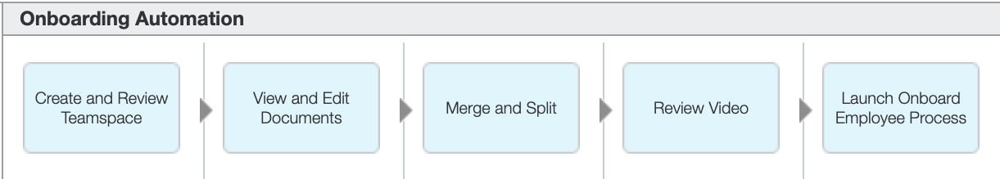

    [Go to top](#lab-section-1) | [Go to Getting Started Lab](#getting-started-lab)

## 2. Login and Setup Your Environment

??? note summary "Expand to view"

    **Select an option for your environment**
    
    ??? note summary "Option 2A - Using a Cloud Pak for Business Automation as a Service environment (likely an IBMer or Business Partner) ?"
        
            IBM maintains multiple SaaS tenants that can be reserved and accessed by both IBMers and Business Partners.

        Please login to IBM Technology Zone and navigate to <a href="https://techzone.ibm.com/collection/5fdfcf8b99cf35001ee4954d" target="_blank">here</a> to reserve an environment.

        1\. Once you have access to an environment, please continue here:  
        &nbsp; &nbsp; &nbsp; • &nbsp; Enablement Users, your environment setup should already be completed, please continue.  
        &nbsp; &nbsp; &nbsp; • &nbsp; Demo Users, once your account administrator completes the below setup and provides you access, please continue.  
        &nbsp; &nbsp; &nbsp; • &nbsp; Administrator Users, please reference the <a href="https://techzone.ibm.com/collection/business-automation-saas#tab-2" target="_blank">Administration Guide</a> (IBM only) for any additional setup information including onboarding users.  
        &nbsp; &nbsp; &nbsp; &nbsp; &nbsp; &nbsp; > Note: Navigate to the **Demo tenants** tab after login.
                2\. Login to your Cloud Pak for Business Automation as a Service demo environment <a href="http://automationcloud.ibm.com" target="_blank">here</a> to access your portal.

        3\. Open the menu in the upper left.

        4\. Select **Production** and then **Run**.

        5\. Click the **Business Automation Apps** tile to launch the Business Automation Navigator desktop

        

        6\. Wait for the desktop to load in a new browser window/tab (it can take some time)

        7\. Click the **Business Automation Apps** tile to launch the Business Automation Navigator desktop  

        

        8\. Wait for the desktop to load in a new browser window/tab (it can take some time)  

        9\. Start by reviewing the available demos, they all represent a business automation use case so you can easily get started.  

        

        10\. When ready, click the **Onboarding Automation** tile to launch the demo.  

        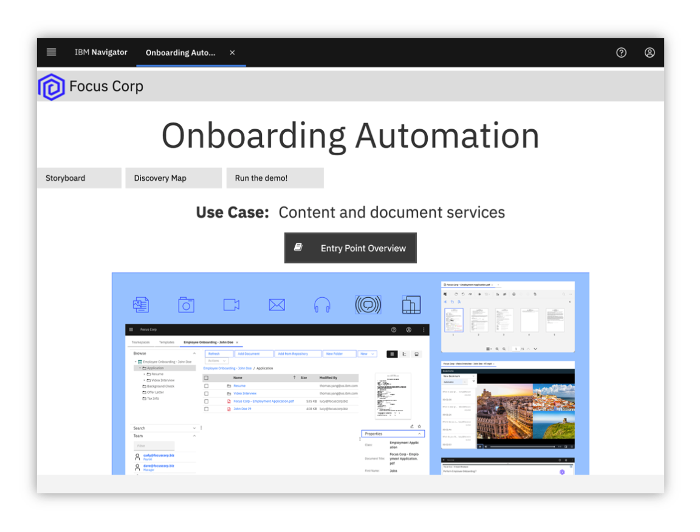

        11\. Check the tabs to learn more about the demo  
        &nbsp; &nbsp;&nbsp; &nbsp; a\. **Storyboard**  
        &nbsp; &nbsp;&nbsp; &nbsp; b\. **Discovery Map**  

        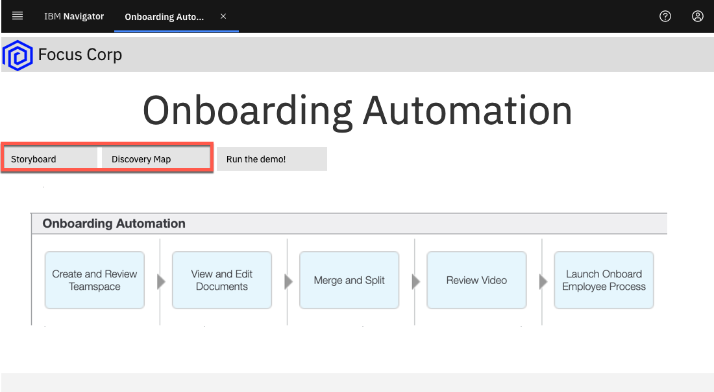

        12\. Navigate to the **Run the demo!** tab and then click on the picture of the **Lucy - HR Employee Onboarding Specialist**  

        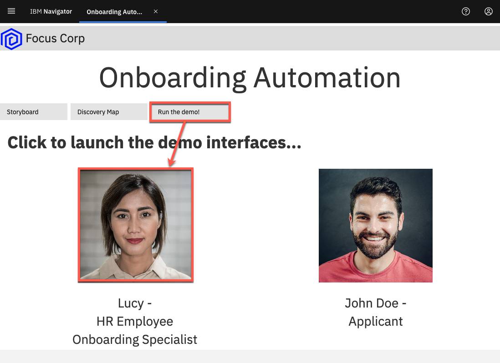

        > Please continue to the [next](#lab-section-3) section

        [Go to top (Option 2A)](#lab-section-2a) | [Go to Getting Started Lab](#getting-started-lab)

    ??? note summary "Option 2B - Are You Using Your Own Environment (not an on Cloud trial/demo) ? "
        
            1\. Standard Users, once your account administrator completes the below setup and provides you access, please continue.

        2\. Administrator Users, expand the following section to access additional information to setup access for yourself and others in your environment:

        ??? note summary "Additional Administrator Setup For Your Own Environment"

            See the <a href="https://github.com/ibm-cloud-architecture/dba-onboarding-automation" target="_blank">dba-onboarding-automation</a> git repository to deploy on your own platform.

        > Standard Users, continue here...

        3\. Ask your administrator for the URL to the desktop in Business Automation Navigator and your login credentials

        4\. Wait for the desktop to load in a new browser window/tab (it can take some time) and log in

        5\. Start by reviewing the available demos, they all represent a business automation use case so you can easily get started.

        

        6\. When ready, click the **Onboarding Automation** tile to launch the demo.  

        

        7\. Check the tabs to learn more about the demo  
        &nbsp; &nbsp;&nbsp; &nbsp; a\. **Storyboard**  
        &nbsp; &nbsp;&nbsp; &nbsp; b\. **Discovery Map**  

        

        8\. Navigate to the **Run the demo!** tab and then click on the picture of the **Lucy - HR Employee Onboarding Specialist**  

        

        > Please continue to the [next](#lab-section-3) section

        [Go to top (Option 2B)](#lab-section-2b) | [Go to Getting Started Lab](#getting-started-lab)

    [Go to top](#lab-section-2) | [Go to Getting Started Lab](#getting-started-lab)

## 3. Tour IBM Navigator

??? note SUMMARY "Expand to view"

    **IBM Navigator is a desktop for an organization's workers to find and organize information.**

    You are now a Human Resources (HR) Onboarding Specialist, Lucy, at Focus Corp reviewing an applicant, John Doe, for employment. As an onboarding specialist, Lucy will use the IBM Navigator user interface to review content submitted by John such as the employment application and video interview.

    Let's take a quick tour of the **IBM Navigator** user interface.

    1\. Click on the navigation menu icon in the upper left corner of the screen  

    The navigation menu icon (also commonly referred to as the hamburger icon) is used to access the navigation menu and features such as **Browse**, **Search**, **Share**, **Teamspaces**, **Work**, **Cases** and **Reports**. Additional features can also be added using plugins. This interface including the top banner, list of features and menu options are configurable through the use of desktops.

    Note: The **Reports** feature is used for Records Management and may or may not be installed on your environment. Records Management related activities such as declaring a record can be done automatically and also manually using the **Browse** feature. The **Work** and **Cases** feature show workflow tasks assigned to the user and case manager activities (respectively).

    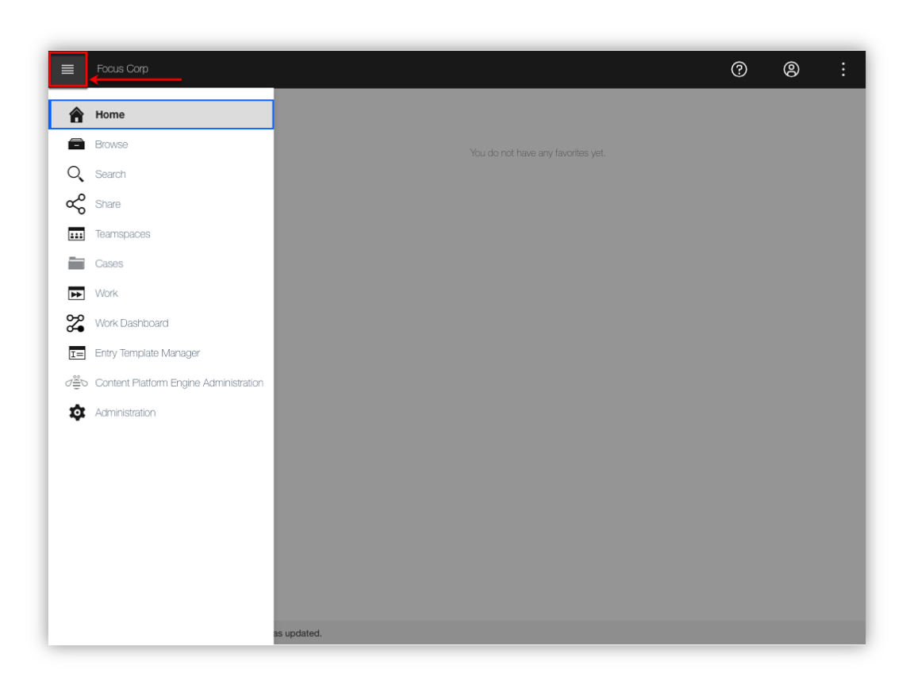

    2\. Click the **Browse** feature  

    

    You are now viewing a repository called **Corporate Operations** which is an **IBM FileNet Content Manager** repository.
    
    !!! note
        You can also access other repositories and perform cross-repository searches using **CM8** (IBM Content Manager), **CMOD** (IBM Content Manager OnDemand), **Box®** and **CMIS** (Content Management Interoperability Services) compliant repositories like **Alfresco®** and **Microsoft SharePoint®** On-Premises.

    3\. From the folder structure on the left side of the screen, traverse and click on the **Focus Corp Docs / Human Resources / Onboarded Employees** folder representing content for onboarded employees.  

    

    As shown the diagram above, the center or content area of the screen shows the selected content which may also be used to traverse the folder structure. Additionally, the top of the content area displays the full folder structure of the selected content.

    4\. Click on the **Selena Swift** checkbox as shown in the diagram below.  

    Please note that the folder can be selected by either clicking on the checkbox -OR- by clicking on the folder row. If a checkbox is not visible, contact your administrator to enable **Content list checkboxes** at the desktop level. Clicking on the folder name text will select the folder and additionally traverse into the folder.

    

    For onboarded employee – **Selena Swift**, you can see custom folder properties such as the **First Name**, **Last Name**, **Employee ID**, **Onboarded** status and **Hire Date**.

    5\. Navigate to the **Focus Corp Docs / Human Resources / Onboarded Employees / Selena Swift / Employee Packet** folder and then click on the checkbox for the first document. Next, in the upper-right corner, select the different **Views** (**Details**, **Magazine**, **Filmstrip**). As shown in the diagram below, the **Details** view is shown as the default view.  

    

    In our example, Focus Corp maintains an **Employee Packet** folder that contains new employee info documents such as the **Confidentiality Agreement** and **Employee Manual**. In the **Details** view, you are able to see the thumbnail and properties of the selected content.

    6\. Select the **Magazine** view  

    

    In the **Magazine** view, you can now see the same content along with social features such as **Likes**, **Tags**, **Downloads** and **Comments**.

    7\. Select the **Filmstrip** view. The **Filmstrip** view is very useful for looking at media such pictures. Select the **Photos** folder below the **Employee Packet** folder and then select each picture document.

    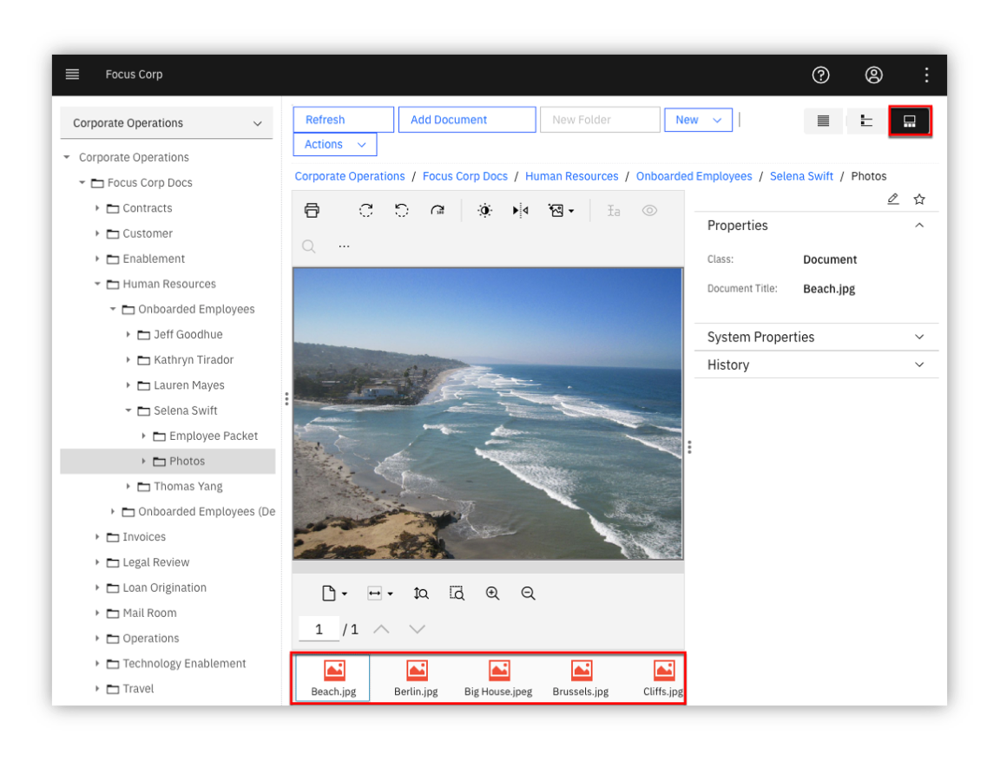

    [Go to top](#lab-section-3) | [Go to Getting Started Lab](#getting-started-lab)

## 4. Create and Review Teamspace

??? note SUMMARY "Expand to view"
    
    **Let’s now look at teamspaces. Teamspaces represent a focused view of the relevant folders, documents and searches that a team needs to complete their tasks.**

    Our use case revolves around Lucy reviewing an existing teamspace for employee applicant John Doe. Typicaly, the teamspace would already be created, processed and reviewed by a few HR processors before reaching Lucy to further review and approve the applicant for onboarding. In this section, you first create an employee onboarding teamspace for the employee applicant John Doe. Next, you will review how a teamspace is used once it is created.   

    
    ??? note SUMMARY "4.1 - Create Teamspace"
        
        An **Employee Onboarding** teamspace template should already be available. If not or if you want to learn more about creating teamspace templates, please proceed to the section below - [**4.1.1 - Teamspace Template Builder**](#lab-section-411). Otherwise, proceed to section [**4.1.2 - Teamspace Builder**](#lab-section-412).   

        
        ??? note SUMMARY "4.1.1 - Teamspace Template Builder"

            !!! info ""
                ℹ️  This section is recommended but optional. If you do not want to perform this section and use the existing teamspace template, please proceed to section [4.1.2 Teamspace Builder](#lab-section-412).
            
            This section covers the creation of a teamspace template using the teamspace template builder.

            The use of teamspace templates allows for the configuration of the folder hierarchy, documents, search templates, and security in a user-friendly wizard interface which can then be used to create teamspaces in a timely, secure and consistent manner.  

            1\. From the navigation menu, click on **Teamspaces**  

            

            2\. Click on the **Templates** tab and then click on **New Template**  

            

            As shown in the diagram below, the **Teamspace Template Builder** is displayed.

            The teamspace template builder uses a wizard-driven user interface that guides you through the following steps:
            - Define Teamspace Template
            - Select Searches
            - Select Classes or Entry Templates
            - Folders and Documents Tree
            - Select Roles

             

            3\. Teamspace Template Builder - Define Teamspace Template  

            Enter a value for the **Template name** and **Template description**. If you are using a shared environment and plan to share the template, please select a value that distinguishes your template from others. In the diagram below, a generic template name and description is used for the employee onboarding use case and specified not to share the template.

            At this point, you can continue to the next step by clicking on the **Next** button for the remaining configuration items (searches, classes/entry templates, folders/documents and roles). At any point, you can complete the configuration of the template by clicking on the **Finish** button and optionally edit the configuration at a later time.

            When complete, click on the **Next** button to continue to the next step.

             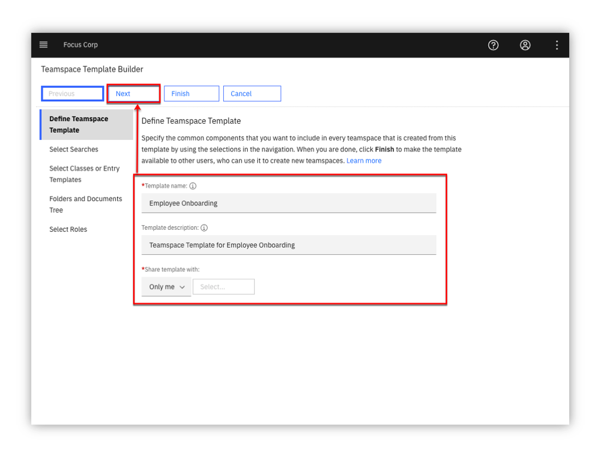

            4\. Teamspace Template Builder - Select Searches  

            You will not specify any searches for the teamspace, click the **Next** button to continue to the next step

            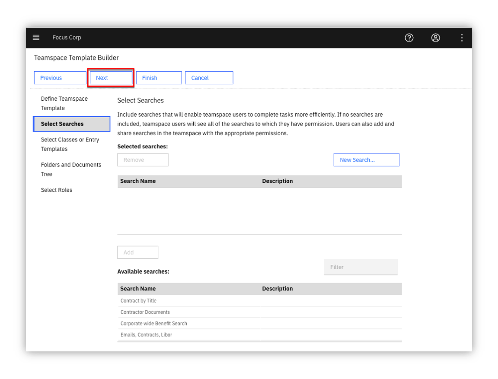

            5\. Teamspace Template Builder - Select Classes or Entry Templates  

            This step specifies either document classes or entry templates that can be used to store documents into the teamspace. You will configure this step using classes. As shown in the diagram below, first click the option for **Use classes to add documents**. Select the **Employment Application** and the **Document** classes and click the **Add** button. Finally, click on the **Next** button to continue to the next step.

            

            !!! note ""
                ℹ️ If the **Employment Application** class is not available, please contact your Administrator to make it available to you. Otherwise, selecting the default **Document** class is sufficient - you will just not see the custom properties (First Name, Last Name, Application Date) when adding the application document to the teamspace.

            6\. Teamspace Template Builder - Folders and Documents Tree

            This step configures the folder structure that will be used for the teamspace. Additionally, documents can be added to the folder(s). The use of a common folder structure and default documents provides a consistent process so that any teamspaces created with this template uses a consistent and standardized folder hierarchy and documents.

            Click **New Folder** and then build the folder structure shown below or create your own custom folder structure. To add a document to a folder, click on the **Add Document** button and add a document. When complete, click on the **Next** button to continue to the last step.

            

            7\. Teamspace Template Builder - Select Roles

            This steps allows you to either associate existing role templates or create custom roles for the teamspace template. Click **New Role**, enter a **Role Name** / **Role Description** and then set the desired permissions for the role.

            As shown in the diagram below, create one or more the following custom roles: HR - Human Resources, Payroll - Payroll, Manager - Department Manager, IT - Information Technology. Alternatively, you can also select an existing role template available at the bottom and add them to the teamspace template. When complete, click on the **Finish** button to complete the setup of the teamspace template. The teamspace template can be updated at a later time if desired.

            

            !!! success
                The teamspace template is now complete, please refer to the next section **4.1.2 Teamspace Builder** to create a teamspace from this template.

            [Go to top (Teamspace Template Builder)](#lab-section-411) | [Go to Getting Started Lab](#getting-started-lab)

        
        ??? note SUMMARY "4.1.2 - Teamspace Builder"
            This section covers how to create a teamspace from the **Employee Onboarding** teamspace template that was created in the section above.

            Download the items below, these items will be added later to the teamspace.
            
            | Item                     | Download Link                                |
            | :----------------------- | :------------------------------------------- |
            | Employment Application   | [Focus Corp - Employment Application.pdf](https://github.com/ibm-cloud-architecture/dba-onboarding-automation/raw/main/content-services/sample-content/Focus%20Corp%20-%20Employment%20Application.pdf)                          |
            | Video Interview          | <a href="https://ibm.box.com/s/wrg8tk9cx7bi4g23wjk19esxi1rmnl8l" target="_blank">Focus Corp - Video Interview - John Doe - KT.mp4</a>      |

            1\. From the navigation menu, click on **Teamspaces**

            

            2\. Click on the **Teamspaces** tab and then click on **New Teamspace**

            

            As shown in the diagram below, the **Teamspace Builder** is displayed.

            Similar to the **Teamspace Template Builder**, the **Teamspace Builder** uses a wizard-driven user interface that guides you through the following steps:
            - Define Teamspace
            - Select Searches
            - Select Classes or Entry Templates
            - Folders and Documents Tree
            - Select Users

            

            3\. Teamspace Builder - Define Teamspace  

            Enter a value for the **Template name** and **Template description**. If you are using a shared environment, please select a value that distinguishes your teamspace from others. Next, select the **Employee Onboarding** template or the teamspace template that was created in section **4.1.1 Teamspace Template Builder**.

            When complete, review the information after the diagram below and then click on the **Next** button to continue to the next step.

            

            You can directly build the teamspace or you can specify the teamspace template that contains some predefined configuration settings. Using the template allows us to consistently build the teamspace ensuring the proper folder, documents, searches and roles are configured for every new project. At the same time, you are also able to slightly modify these settings as you create the teamspace for any additional configuration that may be needed for the specific teamspace.

            At this point, you can continue to the next step by clicking on the **Next** button for the remaining configuration items (searches, classes/entry templates, folders/documents and roles). At any point, you can complete the configuration of the template by clicking on the **Finish** button and optionally edit the configuration at a later time.

            When complete, click on the **Next** button to continue to the next step.

            4\. Teamspace Builder - Select Searches

            Any saved searches that were included in the teamspace template should be listed in the **Selected searches** area. If desired, add any searches that you would like to be included in the teamspace. When complete, click the **Next** button to continue to the next step.

            

            5\. Teamspace Builder - Select Classes or Entry Templates

            This step identifies the classes or entry templates that were configured with the teamspace template. Any document classes or entry templates that were included in the teamspace template should be listed in the **Selected Classes / Entry Templates** area.

            Click the **Next** button

            

            6\. Teamspace Builder - Folders and Documents Tree

            As shown below, the folder structure and associated documents were automatically created based on the teamspace template. In this step, you will add the [Employment Application](https://github.com/ibm-cloud-architecture/dba-onboarding-automation/raw/main/content-services/sample-content/Focus%20Corp%20-%20Employment%20Application.pdf) into **Application** folder.

            Right-click on the **Application** folder and click on **Add Document from Local Drive**

            

            7\. Teamspace Builder - Folders and Documents Tree - Add Document - Employment Application

            As shown in the diagram below, enter the following:
            
            | Field             | Value                                        |
            | :---------------- | :------------------------------------------- |
            | File name         | **Focus Corp - Employment Application.pdf**  |
            | Class             | **Employment Application**                   |
            | First Name        | **John**                                     |            
            | Last Name         | **Doe**                                      |
            | Application Date  | < select any date >                          |
            
            When complete, click on the **Add** button

            

            8\. Teamspace Builder - Folders and Documents Tree - Add Document - Video Interview

            Using the same process as the step above, add the <a href="https://ibm.box.com/s/wrg8tk9cx7bi4g23wjk19esxi1rmnl8l" target="_blank">Video Interview</a> into the **Application / Video Interview** folder.

            As shown in the diagram below, enter the following:  

            | Field             | Value                                               |
            | :---------------- | :-------------------------------------------------- |
            | File name         | **Focus Corp - Video Interview - John Doe - KT.mp4**|
            | Class             | **Document**                                        |

            When complete, click on the **Add** button

            

            9\. Teamspace Builder - Select Users

            As shown in the diagram below, your user name should be identified as an owner of the teamspace. To add yourself to another role, click on a role in the **Available roles** area. To add additional users to the teamspace, click on **Add Users and Groups...** and add any additional users or groups to the teamspace.

            When complete, click the **Finish** button to complete the setup of your teamspace.

            

            [Go to top (Teamspace Builder)](#lab-section-412) | [Go to Getting Started Lab](#getting-started-lab)

        [Go to top (Create Teamspace)](#lab-section-41) | [Go to Getting Started Lab](#getting-started-lab)

    
    ??? note SUMMARY "4.2 - Review Teamspace"
        1\. From the navigation menu, select **Teamspaces**  

        

        A list of teamspaces should be displayed. In the diagram below, the  **Employee Onboarding - John Doe** teamspace is highlighted.

        

        !!! info ""
            ℹ️  Please use the teamspace that was created in **4.1.2 - Teamspace Builder**. Let's refer to this as **your teamspace** going forward.

        2\. Locate your teamspace and right-click on it and select **Modify**, **Roles**  

        

        A teamspace can be configured with custom roles for granular security permissions. Clicking on a role allows you to view and manage the security permissions of the role. In the diagram below, the **HR - Human Resources** custom role and associated permission are shown. The **Team** tab can also be selected to view and manage users/groups assigned to the role.

        

        3\. Click **Cancel** to exit the **Modify Teamspace** screen  

        4\. You are now back at the list of teamspaces, click on your teamspace name to view it  

        

        As shown in the digram below, this is your teamspace - note the three sections on the left side of the screen for **Browse** to manage content, **Search** to manage saved searches, **Team** to view members of the teamspace.

        Note the folder structure in the **Browse** section, this and the associated documents were automatically created using the teamspace template.

        The middle/main section of the screen displays the content selected in the **Browse** and **Search** section. As shown in the diagram above, the **Application** folder is selected in the **Browse** section with the contents of the folder displayed in the main section.

        On the right side of the screen, you will see a thumbnail of the document selected in the main section along with a **Properties** section showing the custom document properties associated with the document (**First Name**, **Last Name**, **Application Date**) along with the document **System Properties**.

        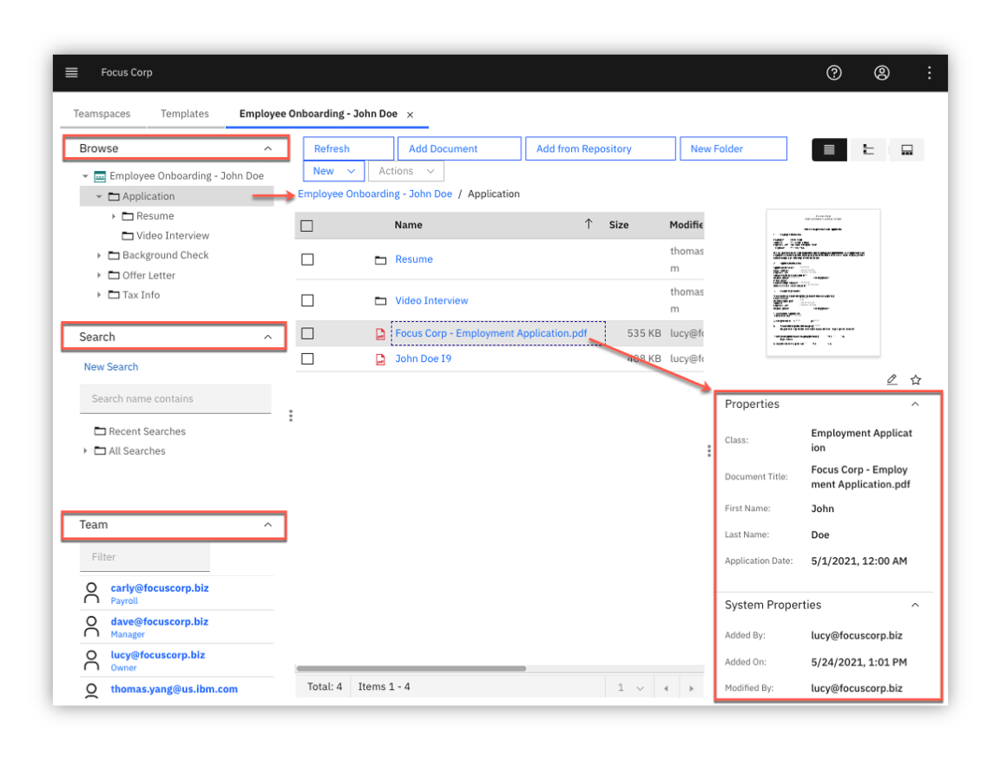

        [Go to top (Review Teamspace)](#lab-section-42) | [Go to Getting Started Lab](#getting-started-lab)
        
    
    ??? note SUMMARY "4.3 - Prepare Teamspace Content"

        !!! info ""
            ⚠️ This section is optional and covers the preparation of teamspace content, if you do not want to perform this section, please proceed to the next section. The preparation of the Employment Application document assumes you have familiarity with creating annotations.

        The following teamspace content will be prepared in this section:

        * **Employment Application**: prepare the document with initial annotations for lab section [**5. View and Edit Documents**](#lab-section-5)

        * **Video Interview**: prepare the video with intial bookmarks for lab section [**7. Review Video**](#lab-section-7)

        
        ??? note SUMMARY "4.3.1 - Prepare Employment Application"
            You will create annotations to the application document in prepartion for section [**5. View and Edit Documents**](#lab-section-5).

            1\. Continuing from section [**4.2 - Review Teamspace**](#lab-section-42) - open your teamspace and open the application document (Focus Corp - Employment Application.pdf)  

            

            2\. Using the diagram below as a reference, create the following annotations/comments:  
            &nbsp; &nbsp; &nbsp; &nbsp; a\. Redaction annotation on the Social Security Number with redaction reason **Social Security Number**  
            &nbsp; &nbsp; &nbsp; &nbsp; b\. Highlight annotation on the salary desired amount (85,000)  
            &nbsp; &nbsp; &nbsp; &nbsp; c\. Sticky note annotation with text: Salary request exceeds job posting - please review  
            &nbsp; &nbsp; &nbsp; &nbsp; d\. Text annotation with text: Salary request exceeds job posting - please review  
            &nbsp; &nbsp; &nbsp; &nbsp; e\. Stamp annotation with the **Received date** stamp  
            &nbsp; &nbsp; &nbsp; &nbsp; f\. Stamp annotation with the **Reviewed date** stamp  
            &nbsp; &nbsp; &nbsp; &nbsp; g\. Document comment with comment: Salary request exceeds job posting - please review  
            &nbsp; &nbsp; &nbsp; &nbsp; h\. Document comment with comment: Salary adjust was approved, please proceed with this candidate  
            &nbsp; &nbsp; &nbsp; &nbsp; i\. Document comment with comment: This is a test comment, right-click this comment and select Edit/Delete to edit or delete this comment  

            

            3\. When complete, click on the **Save** icon to save your updates and then the **X** icon to exit the viewer.  

            

            [Go to top (Prepare Employment Application)](#lab-section-431) | [Go to Getting Started Lab](#getting-started-lab)

        
        ??? note SUMMARY "4.3.2 - Prepare Video Interview"  
            You will create video bookmarks to the video interview in preparation for section [**7. Review Video**](#lab-section-7).
            
            1\. From your teamspace, click on the video name (Focus Corp - Video Interview - John Doe - KT.mp4) in the folder: **Employee Onboarding \ Application \ Video Interview**.  
            
            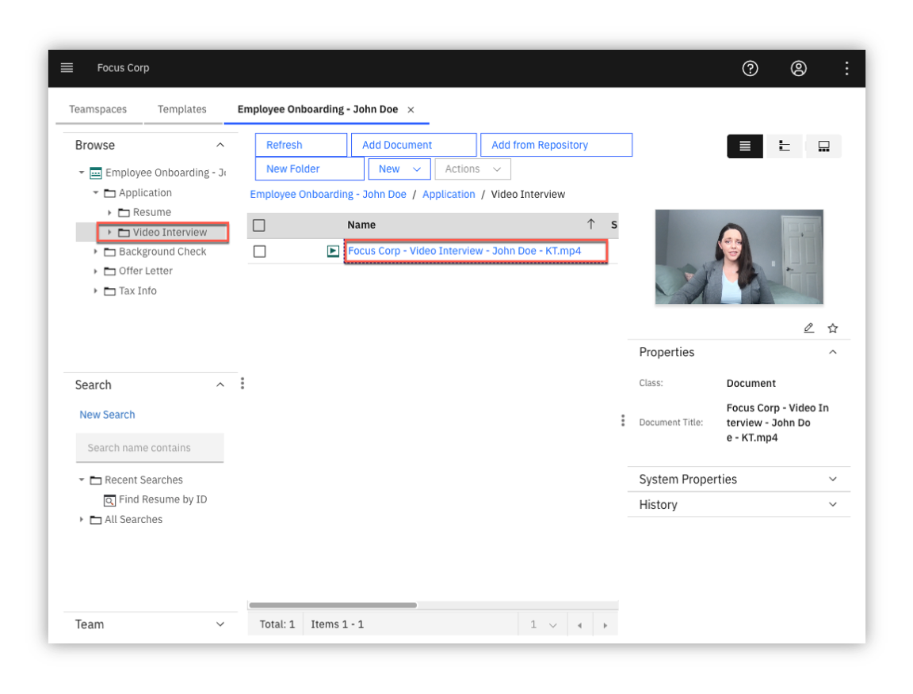
            
            2\. Click on the **Open in New Window** icon in the upper right corner of the viewer to open the viewer in a new window so you can access the video bookmark feature.  
            
            
            
            3\. Create some bookmarks
            
            !!! info inline end
                | Start Time | Name                                    |
                | :--------- | :-------------------------------------- |
                | 00:00:07   | Tell me about yourself                  |
                | 00:00:31   | Why shoud we hire you?                  |
                | 00:00:51   | Why did you leave your last job?        |
                | 00:01:05   | What is your greatest weakness?         |
                | 00:01:21   | What are your greatest strength?        |
                | 00:01:42   | Where do you see yourself in 5 years?   |
                | 00:01:57   | What do you like to do outside of work? |

            !!! note ""
                Locate a time in the video to create a bookmark. This can be done by playing the video and pausing at the desired location. Once you have a good idea where to place the bookmark, click on **Bookmarks**, **New Bookmark** and then enter the **Name** and optionally the **Description**. If necessary, adjust the **Start Time** to the desired time in the video. Lastly, click on the **Ok** button to save the bookmark.
                
                
                
            When complete, exit the viewer.
            
            [Go to top (Prepare Video Interview)](#lab-section-432) | [Go to Getting Started Lab](#getting-started-lab)
            
        [Go to top (Prepare Teamspace Content)](#lab-section-43) | [Go to Getting Started Lab](#getting-started-lab)
        
    [Go to top (Create and Review Teamspace)](#lab-section-4) | [Go to Getting Started Lab](#getting-started-lab)

## 5. View and Edit Documents

??? note SUMMARY "Expand to view"

    !!! info ""
        ℹ️ Use the application document (**Focus Corp - Employment Application.pdf**) that was added to the teamspace in section [4.1.2 - Teamspace Builder](#lab-section-412). This document represents the employee applicant's employment application and also contains an I9 document which will you split into a second document using the **Merge and Split** option. Additional, please review section [4.3.1 - Prepare Employment Application](#lab-section-431) for the initial annotations that should be placed on the application document.

    1\. From your teamspace, click on the application document (Focus Corp - Employment Application.pdf)  

    

    2\. Review the different areas of the viewer including the various tools/icons as shown in the diagram below.  

    !!! info ""
        ℹ️ Hovering the mouse over each tool displays a tool tip identifying the purpose of the tool.

    

    3\. From view settings area of the screen, click on the **Fit to window** icon to fit a full page of the document in the display  

    

    As displayed in the diagram above, the page should now fit in the display window. You can now see the full page of the document including all the redactions and annotations on the first page. Annotations allow you to mark up a document with items such as lines, rectangles, redactions, text, highlights, sticky notes, pencil and stamps. Each annotation has security permissions and includes the user and timestamp the annotation was created/modified.

    !!! info ""
        ℹ️ The annotations displayed in the steps above/below may not be present if you did not create them when you added the document to the teamspace. If so, use the diagram to identify what would have displayed and optionally create the annotation identified in the step. Otherwise, simply ignore the step and continue to the next step.

    4\. For each redaction and annotation, hover the mouse over the item to see who created the item and the creation timestamp.  

    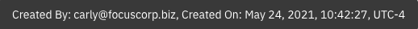

    5\. Right-click on a redaction then select the first option which is **Select redaction reason**  

    

    As displayed in the diagram above, the reason for the redaction is displayed and can also be set to a different reason if desired. Redaction Reasons use role-based security so that only users within a configured role can see behind the redaction and/or manage the redaction. Additionally, data capture/processing solutions can be configured to automatically redact values such as a Social Security Number and associate with the redaction reason.

    6\. Click **Cancel** to exit out of the **Select Redaction Reason** dialog window.  

    7\. From the annotation toolbar, click on the **Filled rectangle** annotation (also referred to as a redaction). Next, draw a rectangle around the Driver's License value (Y521793367692).  

    

    8\. Right-click on the redaction created above and click on the **Edit redaction reason** option to bring up the **Select redaction reason** dialog. From the dialog, select **PII** and then click on the **OK** button.  

    

    9\. On the application document, locate the yellow sticky note on the document and either double-click on the sticky note -OR- right-click on the sticky note and then click on the second menu option for **Edit text**  

    

    As displayed in the diagram above, the text for the **Sticky note** annotation is displayed along with the creation/modified timestamp. With appropriate security, you are also able to modify the text. The **Sticky note** in the annotation toolbar is also identified in the diagram if you want to create a new **Sticky note** annotation.

    To the right of the **Sticky note** annotation on the application document, there is also a **Text** annotation to display text without having to open the annotation.

    10\. In the upper-right corner of the viewer, click on the **View Comments** icon  

    

    As displayed in the diagram above, any existing document comments are displayed here. The **Filter** box can be used to search for a specific comment. A new comment can be added by entering text at the bottom of the viewer and then pressing the **Enter** button. If the user has appropriate security, existing comments can be edited or deleted by right-clicking on a comment and then clicking on the **Edit** or **Delete** option as shown in the diagram above.

    Additionally, document comments can be added directly from the document by right-clicking on the document and then selecting the **Properties** menu option.

    When complete, click on the **View Comments** icon at the top of the viewer to toggle out of the **View Comments** mode.

    11\. After exiting the **View Comments** mode, review the existing **Stamp** annotations and enter a new **Stamp** annotation by clicking on the **Stamp** annotation in the **Annotations** bar area on the right side of the viewer. Next, click on the **Approved** annotation icon and then click where you want the annotation to be located on the document.  

    

    As displayed in the diagram above, the existing stamp annotations are shown magnified. These stamp annotations represent when the document was received and reviewed. After clicking on the **Approved** stamp annotation, the **Stamp** annotation should now appear on the document with your email address along with the date.

    When complete, click on the **Save** icon to save the document with the newly created annotation.

    12\. Click on the **Thumbnails view** icon from the bottom of the viewer.  

    

    As displayed in the diagram above, the thumbnails of each page of the document are displayed.

    

    !!! success
        Congratulations, you completed the **View and Edit Documents** steps.
        
        Please note the additional features to view and edit documents:
        
        |                                       |                                             |
        | :------------------------------------ | :------------------------------------------ |
        | IBM Content Navigator Edit Service    | Edit directly in any desktop application    |
        | IBM Navigator Sync                    | Sync and collaborate on documents directly from a computer desktop or mobile device |
        | IBM Navigator Mobile                  | Access, manage and sync content on your mobile device |
        | IBM Navigator for Microsoft Office®   | Access and manage content within Microsoft Office |
        | Microsoft Office Online Editing®      | Collaborative editing using Microsoft Office 365® or  Microsoft Office Online Server® |
        | IBM Enterprise Video Streaming        | Stream video with automatic caption generation and automated transcoding for multiple bitrates, video size and quality |

    [Go to top](#lab-section-5) | [Go to Getting Started Lab](#getting-started-lab)

## 6. Merge and Split ⚙️

??? note SUMMARY "Expand to view"

    !!! info ""
        ℹ️ &nbsp; This section is optional, if you do not want to perform this section, please proceed to the next section.

    Continuing from the previous section viewing the thumbnails of the application document - the first five pages represent the actual application document. The next four pages is an **I9 - Employment Verification** document that does not belong in the same document. You will use the **Merge and Split** feature to first create a copy of our document and then remove the first five pages to create a separate I9 document. Next, you will remove the last four pages of our employment application document so that it only contains the correct pages.

    1\. From the upper-right corner of the viewer, select the **Open in New Window** icon to open the viewer in a separate window which allows us to select the **Merge and Split** option.  

    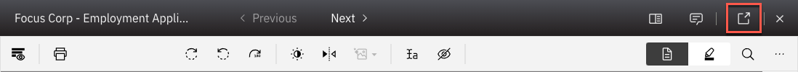

    2\. From the separate viewer window, select the **Merge and Split** icon at the top of the viewer.  

    

    As displayed in the diagram below, you are now in the **Merge and Split** mode where you can see the three icons for **Cut**, **Copy** and **Paste**. You are also able to move one or more pages by selecting the page(s) and dragging it to the desired location.

    

    3\. Select the **Add document** icon from the top menu bar so that you can create the separate document  

    

    As displayed in the diagram below, the **Add Document** window appears. Update the **Class** property to **Document** and the **Document Title** property to **John Doe - I9**.  Next, click the **Add** button to add the document.

    

    4\. There should now be two tabs in the document viewer with the second tab representing the newly added **John Doe - I9** document. You want to remove the employee application pages - select the first five pages of the document and then click on the **Cut** icon to remove the selected pages.  

    

    5\. As shown in diagram below, there should be four document pages. Click on the **Check in document** icon to save and check-in the document to the repository.  

    

    6\. Click on the first document tab which is our original employment application document.  

    

    7\. Select the last four pages of the document and then select the **Cut** icon to remove the I9 document pages.  

    

    8\. Click on the **Check in document** icon to save and check-in the document to the repository.  

    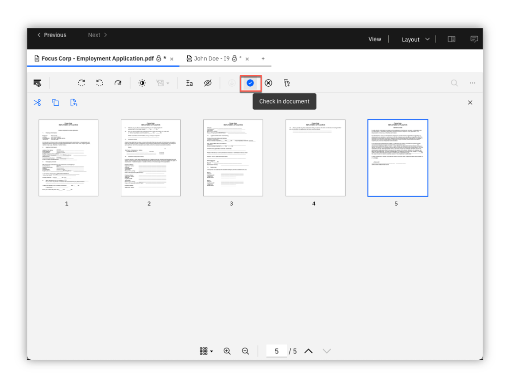

    You can now exit the document viewer to return back to the teamspace.

    [Go to top](#lab-section-6) | [Go to Getting Started Lab](#getting-started-lab)

## 7. Review Video ⚙️

??? note SUMMARY "Expand to view"
    !!! info ""
        ℹ️ &nbsp; This section is optional, if you do not want to perform this section, please proceed to the next section. If you perform this section, please review section [4.3.2 Prepare Video Interview](#lab-section-432) to prepare the video with bookmarks.

    **Let's now take a look at the video viewer to view and stream videos and audio files.**

    1\. From your teamspace, click on the video name in the folder: **Employee Onboarding \ Application \ Video Interview**.  

     

    Note that selecting the video will also provide a short live preview of the video in the right pane along with the properties of the video.

    2\. Click on the **Open in New Window** icon in the upper right corner of the viewer to open the viewer in a new window so you can access the video bookmark feature.  

     

    3\. Click on **Bookmarks** on the top left area of the viewer  

     

    After selecting **Bookmarks**, the list of video bookmarks will be displayed. These were manually entered by an HR specialist during the initial application review process. Each bookmark identifies the name of the bookmark, bookmark description, the time of the bookmark and the user who created the bookmark. The use of video bookmarks is very valuable for Focus Corp to be able to quickly review key segments of the video without viewing the entire video. Additionally, the video viewer enables you to view, collaborate and easily stream large video files without requiring any browser plugins.

    Entering text in the **Filter** field also allows you to search on the name of the bookmark allowing for even faster location of a particular bookmark in the event there are numerous bookmarks. For example, enter **strengths** to quickly go to the bookmark named **What is your greatest strengths**

    4\. From the bookmark list, click on a bookmark and then cycle through the bookmarks by clicking on the **Previous** and/or **Next** buttons  

    

    Notice that the video starts immediately as you click each bookmark with little or no lag. When the video is initially opened, the video can be played right away as the video is streamed in the background.

    5\. Let's now create a new bookmark. Locate a time in the video to create a bookmark. This can be done by playing the video and pausing at the desired location. Once you have a good idea where to place the bookmark, click on **New Bookmark** and then enter the **Name** and optionally the **Description**. If necessary, adjust the **Start Time** to the desired time in the video.  

     

    [Go to top](#lab-section-7) | [Go to Getting Started Lab](#getting-started-lab)

## 8. Launch Onboard Employee Process

??? note SUMMARY "Expand to view"
    **Lucy is now ready to approve the employee applicant, let's trigger a workflow to start the downstream onboarding process.**

    1\. From your teamspace, browse to the **Application** folder and right-click on the employment appliction to select the menu option for **Workflow**, **Launch Process**  

    

    2\. Select the **Onboard Employee** process and click the **OK** button  

    

    3\. Enter any comments in the **Review Request Details**  

    

    As shown in the diagram above, the launch screen is displayed with properties such as the **Document Name**, **First Name**, **Last Name**, and **Application Date** automatically populated from the document properties. You are able to view the contents of employement application as a final check and ultimately trigger the process by clicking on the **Launch process** button.

    4\. Click the **Launch process** button to start the process.  

    

    !!! info
        Although not fully implemented within this scenario, the process just launched would orchestrate downstream activities to onboard the applicant including manual and automated steps such as sending the offer letter and employee packet, preparing backend systems for enrollment such as benefits, payroll and IT accounts.

    [Go to top](#lab-section-8) | [Go to Getting Started Lab](#getting-started-lab)

## 9. Summary

??? note SUMMARY "Expand to view"
    As you saw, content services enables secure and compliant content access through the use of teamspaces, viewing and editing capabilities such as role-based Redactions, merge and split, video bookmarks and finally workflow to automate additional processes. The Cloud Pak for Business Automation provides a powerful, pre-integrated platform including Content Services alongside additional business automation services such as Workflow (BAW), RPA, Decisions (ODM and ADS) and more.

    Please visit the [Additional Assets](#additional-assets) section for additional features not covered in this lab.  

    >BAW - Business Automation Workflow, ODM - Operational Decision Manager, ADS - Automation Decision Services
    
    [Go to top](#lab-section-9) | [Go to Getting Started Lab](#getting-started-lab)

## 10. Troubleshooting

??? note SUMMARY "Expand to view"

    1\. Focus Corp folder/documents or Teamspaces are not available  
    If using a Cloud Pak for Business Automation as a Service tenant, please ensure you have selected the Production environment.  Otherwise, contact the environment administrator to confirm the set up instructions have been completed.  

    2\. Navigator Browse - I see folders but no documents in the Focus Corp folder structure
    Confirm with your tenant admin that your user id is added to the TE_DEMO management access group. Refer to <a href="https://github.com/ibm-cloud-architecture/dba-onboarding-automation" target="_blank">dba-onboarding-automation</a> for more information (Section 1ibc - Groups).  In the meantime, please proceed to the next section of the lab as your access to folders and documents when creating a teamspace is not affected.  
    
    3\. Navigator Browse - Unable to modify folder and document  
    When using an Enablement environment, security permissions are restricted to allow only viewing of folders and documents. One exception is the folder: Corporate Operations / Focus Corp / Human Resources / Onboarded Employees / Unsecured.  Please use this folder and/or proceed to the next section of the lab as your access to folders and documents when creating a teamspace is not affected.  

    4\. Launch Onboard Employee Processing  
    Chrome is the recommended browser to display the document in the viewer. If using Firefox, you may need to temporarily disable the CSP header to view the document at this time.  For both viewers, ensure the default action to display PDF documents is set to use the browser.  

    [Go to top](#lab-section-10) | [Go to Getting Started Lab](#getting-started-lab)

***

# Additional Assets

**Optional - additional assets to explore**

## 100 - Automation Document Processing

??? note SUMMARY "Expand to view"
    Video: <a href="https://youtu.be/Y3dyHRjFvxU" target="_blank">Automation Document Processing Overview (3:46)</a>

    

    Traditional document capture solutions cannot meet the document processing demands of today’s digital world. Increased market demand for speed and flexibility, combined with exponential growth in regulatory compliance requirements prevent enterprises from realizing the potential for digital transformation. Applying a full document processing workflow with low-code development tools and advanced AI with deep learning, enterprises can use IBM Automation Document Processing to eliminate manual work across the enterprise.
    [Go to top](#additional-assets) | [Go to Introduction](#introduction) | [Go to Getting Started Lab](#getting-started-lab)
## 105. External Share

??? note SUMMARY "Expand to view"
    Video: <a href="https://youtu.be/DXaPzYLYaGc" target="_blank">Securely Share Content with External Users (3:37)</a>

    

    Content management is a team sport, and some of your team may be trusted external users. In this demo, you'll provide external users access to content in a simplified Navigator interface with security, full access control, and the same redaction of your sensitive or private data.

    [Go to top](#additional-assets) | [Go to Introduction](#introduction) | [Go to Getting Started Lab](#getting-started-lab)

## 110. GraphQL

??? note SUMMARY "Expand to view"
    Video: <a href="https://ibm.biz/SimplifyDevelopmentFileNetGraphQL" target="_blank">Simplify Development using the FileNet GraphQL API (7:18)</a>

    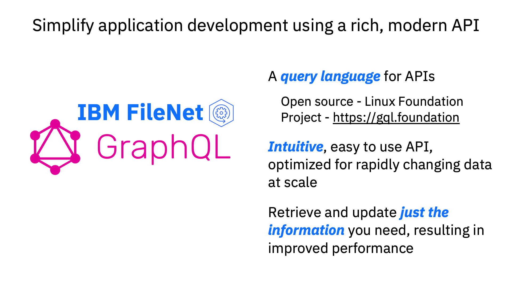

    The FileNet GraphQL API enables you to query and manipulate data easily through an intuitive and flexible syntax that simplifies application development for your Content Platform Engine. The API allows you to request the exact information you need and receive predictable results reducing the number of network calls and bandwidth requirements improving performance.

    [Go to top](#additional-assets) | [Go to Introduction](#introduction) | [Go to Getting Started Lab](#getting-started-lab)

## 115. Records Management

??? note SUMMARY "Expand to view"
    Video: <a href="https://youtu.be/a-iOyZdHHv8" target="_blank">Records Management (3:15)</a>

    

    IBM Enterprise Records provides content, processes and connectivity to help you maintain and provide a record of compliance for electronic and physical records. The comprehensive solution enables you to streamline records-based activities and help enforce compliance with retention policies, with or without user participation. Using IBM, you can capture, declare, classify, store and dispose of electronic and physical records according to fiscal, legal and regulatory requirements. IBM Enterprise Records is also available as managed service on cloud and for a containerized deployment in a private or public cloud.

    [Go to top](#additional-assets) | [Go to Introduction](#introduction) | [Go to Getting Started Lab](#getting-started-lab)

## 120. Salesforce Integration

??? note SUMMARY "Expand to view"
    Video: <a href="https://ibm.biz/FileNetSalesforce" target="_blank">Salesforce CRM Content to FileNet (6:29)</a>

    

    Seamlessly connect Salesforce with FileNet Content Manager to eliminate a content silo and manage Salesforce content within the leading, modern FileNet Content Manager platform. This native integration allows Salesforce users to store and manage related content seamlessly in FileNet Content Manager as it relates to Salesforce accounts, cases, opportunities, and more. They will no longer need to switch applications to find related information. With a Salesforce-oriented user experience, this connector will require minimal to no training, and IT teams can take advantage of the feature-rich content management capabilities of FileNet and govern enterprise content in one place.

    [Go to top](#additional-assets) | [Go to Introduction](#introduction) | [Go to Getting Started Lab](#getting-started-lab)

## 125. Enterprise Video Streaming

??? note SUMMARY "Expand to view"
    Video: <a href="https://youtu.be/QGdUarOt9hc" target="_blank">Stream and Manage Video with FileNet Enterprise Video Streaming (3:14)</a>

    

    With the FileNet Enterprise Video Streaming connector, you can upload, manage, quickly access video alongside other documents in FileNet Content Manager and search through automatically generated closed captions. IBM’s Enterprise Video Streaming offering features multi-quality streaming and adaptive bit rates to eliminate download delays and provide users with fast access to relevant video moments.

    [Go to top](#additional-assets) | [Go to Introduction](#introduction) | [Go to Getting Started Lab](#getting-started-lab)

## 130. Parallel / Serial Workflow
??? note SUMMARY "Expand to view"
    Coming soon!

    [Go to top](#additional-assets) | [Go to Introduction](#introduction) | [Go to Getting Started Lab](#getting-started-lab)

## 135. Microsoft Online Editing

??? note SUMMARY "Expand to view"
    Coming soon!

    [Go to top](#additional-assets) | [Go to Introduction](#introduction) | [Go to Getting Started Lab](#getting-started-lab)

##  210 - Automate End-to-End Workflows

??? note SUMMARY "Expand to view"
    Video: <a href="https://youtu.be/-swuUUNH3nw" target="_blank">Automate End-to-End Workflows (4:40)</a>

    

    Automating workflows, including business processes and case work, can both increase productivity and improve customer experience. By using a single workflow automation platform, organizations can quickly scale their business.  This demonstration shows how IBM Business Automation Workflow enables collaboration, integrates with content management, and provides analytics to automate and optimize end-to-end workflows.  

    [Go to top](#additional-assets) | [Go to Introduction](#introduction) | [Go to Getting Started Lab](#getting-started-lab)
