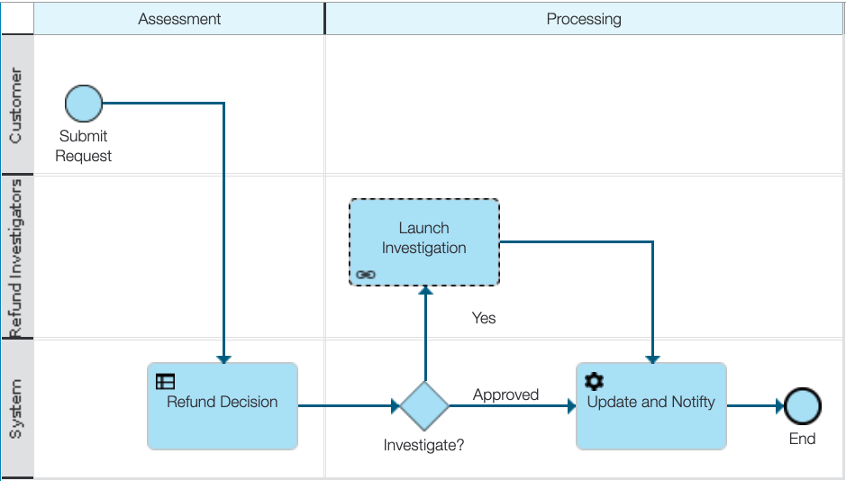
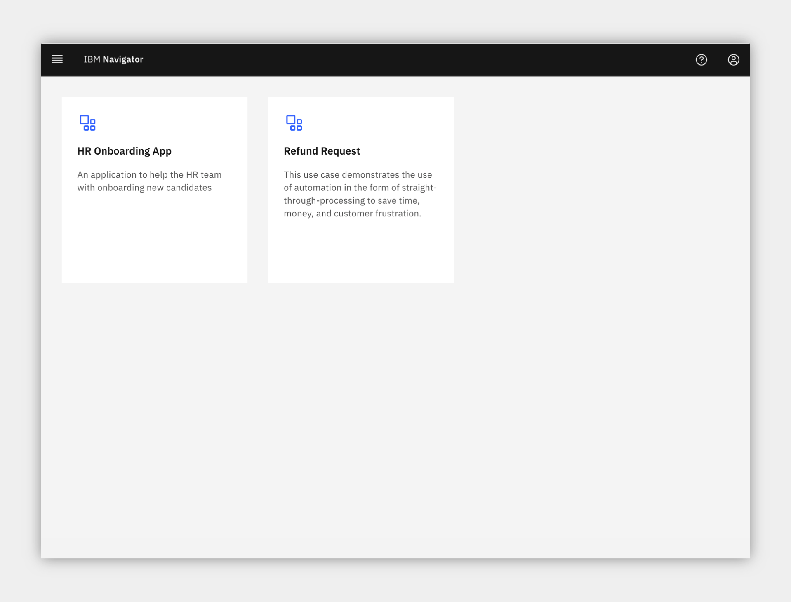
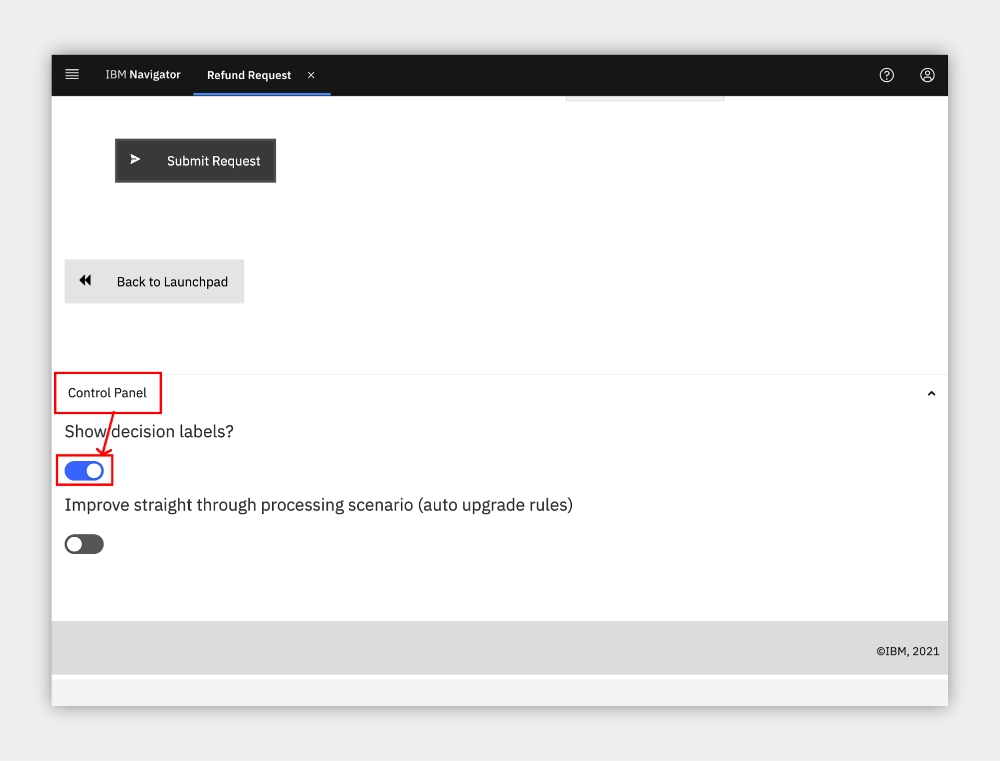
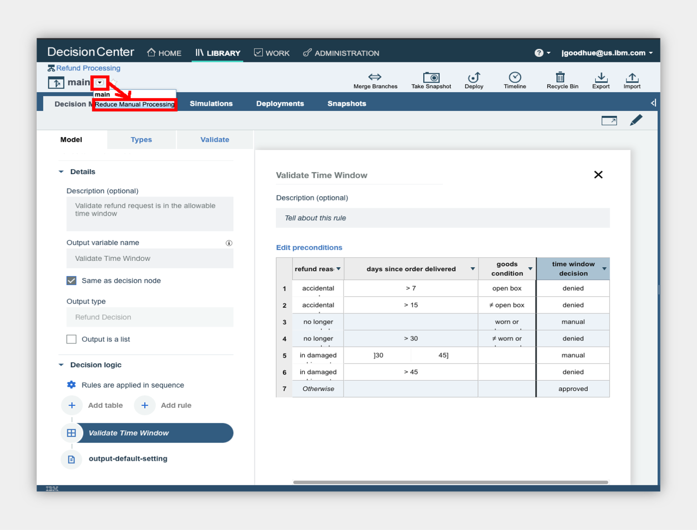
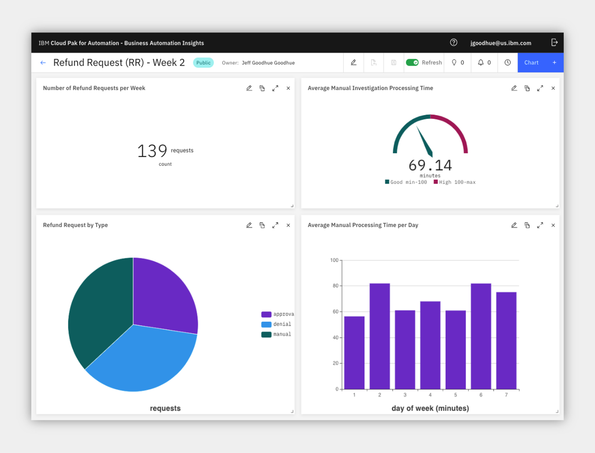

## Refund Request
**an IBM Cloud Pak for Business Automation use case**

***

# Introduction

**Use Case Overview:** Imagine that a customer purchases your product, but is unfortunately unsatisfied and requests a refund. Today, your refund process has several manual steps. Managing high volumes of refunds that require manual investigation leads to slow average completion times, inconsistent status updates to customers, and higher costs for any errors made.
This use case demonstrates the use of automation in the form of straight-through-processing to save time, money, and customer frustration.

**Choose an option:**

  * **Cloud Pak for Business Automation as a Service demo environment (likely an IBMer or Business Partner):** your environment is predeployed, continue to the [Getting Started Lab](#getting-started-lab) section below.
  * **Install Yourself:** To deploy Refund Request on your own environment, and technical architecture information, see the <a href="https://github.com/ibm-cloud-architecture/dba-refund-request.git" target="_blank">dba-refund-request</a> git repository which includes the required deployment artifacts.

 

***

# Getting Started Lab

** Are you ready to see straight through processing in action? **

## 1. Scenario Introduction - Refund Request

??? note summary "Expand to view"

    **Demo Video**
    In this demo, you will learn how to handle spikes in demand with straight-through processing through business automation.  Note, this video uses an older version of the use case than the current Getting Started Lab.

    

    ??? note summary "Demo Outline"
        **Demo Outline**

        [Full Demo Narration](#full-use-case-video-narration)

        1. Use Case Overview
        2. [Customer] Submit some refunds
        3. [Refund Investigator] Complete the investigation task
        4. [Business Analyst] Review the week 1 Operations Dashboard
        5. [Rule Manager] Improve the business rules
        6. [Customer] Test the new business rules
        7. [Business Analyst] Review the week 2 Operations Dashboard
        8. Use case review and value of straight-through processing

    ??? note summary "Discovery Map"
        

    ??? note summary "Process Map"
        

    [Go to top](#lab-section-1) | [Go to Getting Started Lab](#getting-started-lab)

## 2. Login and Setup Your Environment

??? note summary "Expand to view"

    **Select an option for your environment**

    ??? note summary "Option 2A - Using a Cloud Pak for Business Automation as a Service environment (likely an IBMer or Business Partner) ?"

        

        IBM maintains multiple SaaS tenants that can be reserved and accessed by both IBMers and Business Partners.

        Please login to IBM Technology Zone and navigate to <a href="https://techzone.ibm.com/collection/5fdfcf8b99cf35001ee4954d" target="_blank">here</a> to reserve an environment.

        1\. Once you have access to an environment, please continue here:  
        &nbsp; &nbsp; &nbsp; • &nbsp; Enablement Users, your environment setup should already be completed, please continue.  
        &nbsp; &nbsp; &nbsp; • &nbsp; Demo Users, once your account administrator completes the below setup and provides you access, please continue.  
        &nbsp; &nbsp; &nbsp; • &nbsp; Administrator Users, please reference the <a href="https://techzone.ibm.com/collection/business-automation-saas#tab-2" target="_blank">Administration Guide</a> (IBM only) for any additional setup information including onboarding users.  
        &nbsp; &nbsp; &nbsp; &nbsp; &nbsp; &nbsp; > Note: Navigate to the **Demo tenants** tab after login.

        2\. Login to your Cloud Pak for Business Automation as a Service demo environment <a href="http://automationcloud.ibm.com" target="_blank">here</a> to access your portal.

        3\. Open the menu in the upper left.

        4\. Select **Production** and then **Run**.

        5\. Click the **Business Automation Apps** tile to launch the Business Automation Navigator desktop

         

        6\. Wait for the desktop to load in a new browser window/tab (it can take some time)

        7\. Start by reviewing the available demos, they all represent a business automation use case so you can easily get started.

         

        8\. When ready, click the **Refund Request** tile to launch the use case.

        You have the following options to navigate the Refund Request use case:

        * **Option 1: Technical deep dive**: the default interface is configured for experienced users who explore using the launchpad that provides easy access to the product interfaces for each part of the use case. If you chose **Technical deep dive**, continue to [the next section](#lab-section-3).

        * **Option 2: Guided or Live Walkthrough**: you may wish to have the application provide you with a single page view of the use case across multiple steps so you do not have to go to multiple interfaces.
            * There is both a **Guided** approach with instructions, step completion check boxes, and a summary of what you learned in each step, or a **Live Walkthrough** approach that includes the same single page app without instructions which is great for showing someone else the use case.
            * To activate these options, scroll to the bottom of the app and locate the Control Panel section (if hidden, click just above the grey footer to show it), expand the Control Panel and select your choice.
            * If you choose this option, _**please STOP reading this page here and continue in the application**_.

        

        [Go to top](#lab-section-2a) | [Go to Getting Started Lab](#getting-started-lab)

    ??? note summary "Option 2B - Are You Using Your Own Environment (not an on Cloud trial/demo) ?"
        

        1\. Standard Users, once your account administrator completes the below setup and provides you access, please continue.

        2\. Administrator Users, expand the following section to access additional information to setup access for yourself and others in your environment:

        ??? note summary "Additional Administrator Setup For Your Own Environment"

            See the <a href="https://github.com/ibm-cloud-architecture/dba-refund-request.git" target="_blank">dba-refund-request</a> git repository to deploy on your own platform.

        > Standard Users, continue here...

        3\. Ask your administrator for the URL to the desktop in Business Automation Navigator and your login credentials

        4\. Wait for the desktop to load in a new browser window/tab (it can take some time) and log in

         

        5\. Start by reviewing the available demos, they all represent a business automation use case so you can easily get started.

        6\. When ready, click the **Refund Request** tile to launch the demo and continue to [the next section](#lab-section-3).

        [Go to top (Option 2b)](#lab-section-2b) | [Go to Getting Started Lab](#getting-started-lab)

    [Go to top](#lab-section-2) | [Go to Getting Started Lab](#getting-started-lab)

##  3. Submit some refunds

??? note summary "Expand to view"

    **Be your customer!**

    You are now a customer that just purchased a product, but unfortunately you are unsatisfied and request a refund.  What do you experience?
    As a customer, you want quick answers to your refund requests, especially when there are no special circumstances that should cause a delay.  Straight through processing would be ideal for you.

    !!! info
        You should only continue with these steps if you choose the **Technical deep dive** option listed above in section 2 !

    1\. Check the tabs to learn more about the demo

    &nbsp; &nbsp;&nbsp; &nbsp; a\. **Storyboard Outline**

    &nbsp; &nbsp;&nbsp; &nbsp; b\. **Demo Discovery Map**

    &nbsp; &nbsp;&nbsp; &nbsp; c\. **Demo Diagram**

    

    2\. Navigate to the **Run the demo!** tab and then click on the picture of the **Customer**

    

    3\. Use the drop down to select the order ending in **AP**.

    !!! info There are three orders setup to provide the following results
        * AP = approved
        * DE = denied
        * MA = manually investigated

     

    4\. Click **Submit** to see the results

     

    5\. Choose to submit another refund request

    6\. Select the order ending in **DE**

    7\. At the bottom, expand the **Demo Control Panel**

    8\. Turn on the decision labels to see which data is used to make the decision

    

    9\. Review the data used to make the decisions

    

    10\. Submit the refund if desired

    11\. Choose to submit another refund request

    12\. Select the order ending in **MA**

    13\. Submit the refund and see that a manual investigation is required

    

    [Go to top](#lab-section-3) | [Go to Getting Started Lab](#getting-started-lab)

## 4. (Optional) Complete the investigation task

??? note summary "Expand to view"

    You are now a Focus Corp employee, first an Refund Investigator and later a Business Analyst and Rule Manager.

    Refund Investigators are busy people as they not only process refunds that cannot be automatically approved or denied, but they also look into trends and perform data analysis across the Focus Corp organization.  When they need to take time out from their high priority work to perform a refund request, they are not too happy.  Luckily, Cloud Pak for Business Automation provides them all the information they need in one place and streamlines the investigation process.

    1\. Click **Return to launchpad**

    2\. Click the picture of the **Refund Investigator**

    3\. Depending on your platform you may see one or more of the new Workplace interface or Navigator's Work Dashboard or Process Portal

    > Note the data is passed from the application to the process which then retrieved additional information and routed the work to the appropriate Refund Investigator

    ### Workplace

    

    ### Navigator's Work Dashboard

    

    ### Process Portal

    

    4\. Review the list of tasks and click on the most recent Investigation task to claim it

    5\. Complete the task by approving or denying the refund

    ### Workplace (others are similar)

    

    [Go to top](#lab-section-4) | [Go to Getting Started Lab](#getting-started-lab)

## 5. Review the Operations Dashboard

??? note summary "Expand to view"

    You are now a different Focus Corp employee, a Business Analyst.  How can you help to improve straight through processing?

    Business Analysts are able to easily monitor business automation performance and identify problems before they become large.

    1\. Navigate back to the Refund Request application browser window/tab

    2\. Click the picture of the **Business Analyst**

    3\. Click to open the **Refund Request (RR) - Week 1** dashboard

    

    4\. Review the week 1 dashboard metrics and note the following:

    &nbsp; &nbsp;&nbsp; &nbsp; a\. A large number of manual requests in the pie chart

    &nbsp; &nbsp;&nbsp; &nbsp; b\. The high time for average manual investigation processing (~120 minutes)

    

    [Go to top](#lab-section-5) | [Go to Getting Started Lab](#getting-started-lab)

## 6. Improve the business rules

??? note summary "Expand to view"

    Now, take on the role of a Focus Corp Rule Manager who can adjust rules, validate and simulate the decision service and deploy quickly and easily.

    1\. Navigate back to the Refund Request application browser window/tab

    2\. Click the picture of the **Rule Manager**

    3\. Click **Refund Processing** followed by **main** to open the decision model

    

    4\. Review the decision model, green ovals are input data and blue boxes are decisions, each with their own business logic leading to the **Final Refund Decision**

    5\. Click the blue **Validate Time Window** decision node

    6\. On the left pane, scroll to the bottom and click to open the **Validate Time Window** logic

    

    7\. Review the decision table and note multiple rows that lead to manual review.

    

    > The Rule Manager already created a new branch to try some rule adjustments.

    8\. At the upper left, click the down arrow next to **main** and select **Reduce Manual Processing**

    

    9\. Open the same **Validate Time Window** decision node and table

    10\. Review the decision table and note there are less manual review rows.

    > NOTE: In the full lifecycle, a Rule Manager runs test suites and simulations before deploying the rules.  If you wish and feel comfortable, you can explore this on your own.

    

    [Go to top](#lab-section-6) | [Go to Getting Started Lab](#getting-started-lab)

## 7. Test the new business rules

??? note summary "Expand to view"

    Time to test the new business rules in the customer's interface and see if the results change based on the new business rules.

    1\. Navigate back to the Refund Request application browser window/tab

    2\. Click the picture of the **Customer**

    3\. Scroll to the bottom and expand the **Demo Control Panel**

    4\. Turn on the improved straight through processing scenario

    

    5\. Select the recent order ending with **MA** and submit

    **The "MA" order was previously categorized as a manually processed refund request, now it is APPROVED!  The will improve straight-through processing and get answers to customers faster!**

    

    [Go to top](#lab-section-7) | [Go to Getting Started Lab](#getting-started-lab)

## 8. Review the updated Operations Dashboard

??? note summary "Expand to view"

    1\. Navigate back to the Refund Request application browser window/tab

    2\. Click the picture of the **Business Analyst**

    3\. Click to open the **Refund Request (RR) - Week 2** dashboard

    4\. Review the dashboard metrics and note the following

    &nbsp; &nbsp;&nbsp; &nbsp; a\. a smaller number of manual requests in the pie chart

    &nbsp; &nbsp;&nbsp; &nbsp; b\. a lower time for average manual investigation processing (~60 minutes)

     

    **The improved straight-through processing is making an impact on Focus Corp's results!**

    [Go to top](#lab-section-8) | [Go to Getting Started Lab](#getting-started-lab)

## 9. Summary

??? note summary "Expand to view"

    With combined workflow and decision automation, both capabilities within IBM Cloud Pak for Business Automation, and updated business rules, we reduce the manual processing queues significantly.

    Increased straight through processing results in lower average completion time, lower costs, and more consistent communication with the customer throughout the process.  Now our processes can truly increase customer satisfaction.

    [Go to top](#9-summary) | [Go to Getting Started Lab](#getting-started-lab)

***

# Full Use Case Video Narration

??? note summary "Expand to view"

    The below uses an older version of the use case than the current [Getting Started Lab](#getting-started-lab).

    **Focus Corp Demos Dashboard**

    Reviewing the Focus Corp Demos Dashboard we see a text summary describing the demo, a discovery map diagram and a flow diagram for our reference.  OK, let's launch the demo...

    **Customer refund requests**

    We start by becoming the customer.  From the Focus Corp Your Returns and Refunds portal, we select one of our recent orders and submit a return.  The result is approved with an expected date to receive funds.

    We select and submit another order for refund but before we submit, let's take a peak behind the form at some of the business rules.  A few of the fields are used by a set of business rules to make the refund decision and we see those here.  This refund request results in a denial but it is still straight through processing without any manual work.

    Upon selecting a final, third order, the rules this time are not certain and send the refund request off to a human queue for manual investigation.  This bottom investigation branch of the straight through process can utilize significant resources.

    **Operations week 1**

    A few manual refunds are not a problem for the team, but too many will cause delays and our customer satisfaction will go down.  The Operations Specialist reviews the Refund Dashboard, powered by Business Automation Insights and see not only the percentage of manually processed requests is high at more than 67% but the average manual investigation time across all requests is more than 2 hours.  They pass their findings to the Rule Manager to take action.

    **Rules manager**

    As a rules manager, we have access to the decision model behind our refund process. The data is passed from the process system to the rules in the form of an order and refund request.  This moves through various decision tables including a time window validation that deals with the return reason, the days since delivery and the condition of the goods.  In combination, these lead to various processing decisions and we see a few that result in manual processing listed.  Another decision table deals with the type of goods and may also result in some manual processing.  Finally, this is then combined with a simple text rule to make the final decision.

    The rules manager drafted up a new branch of the decision model with some updates, let's take a look.  To reduce manual processing, the rules manager adjusted the tables to remove some of the manual processing decisions.  Comparing the two versions shows that row 3 column 3 moved from manual to denied, for example.  Other rows were removed which results in an default approved decision.  We could also test and simulate the rule changes and compare historical results but we won't cover that here in this demo.

    **Customer manual to approved**

    After the Rules Manager deploys the new rules, let go back to being a customer and try them out.  Submitting the same order as before which resulted in a manual result now is approved!

    **Operations week**

    After these new rules are in place for a week, the Operations Specialist sees some solid improvement with a reduction in half for manual requests and also lower manual processing time average from above 120, down to only 60 mins.

    **Use Case Summary**

    With combined workflow and decision automation, both capabilities within IBM Cloud Pak for Automation, and updated business rules, we reduce the manual processing queues significantly

    Increased straight through processing results in lower average completion time, lower costs, and more consistent communication with the customer throughout the process.  Now our processors can truly increase customer satisfaction.

    [Go to top](#video-narration) | [Go to Getting Started Lab](#getting-started-lab) | [Go to Introduction](#introduction)
