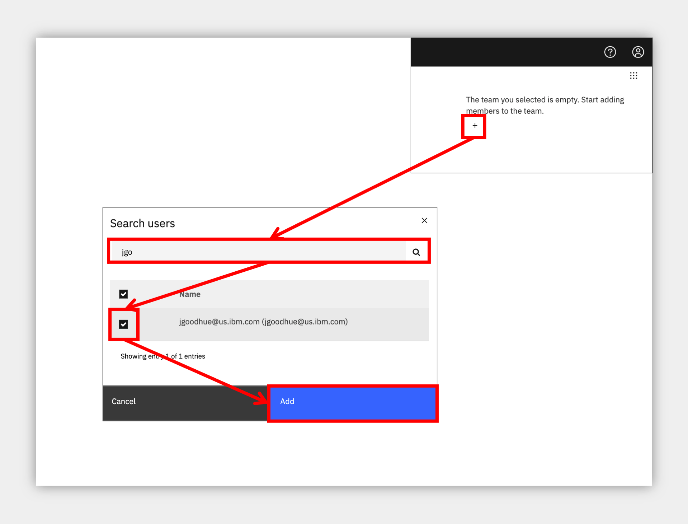
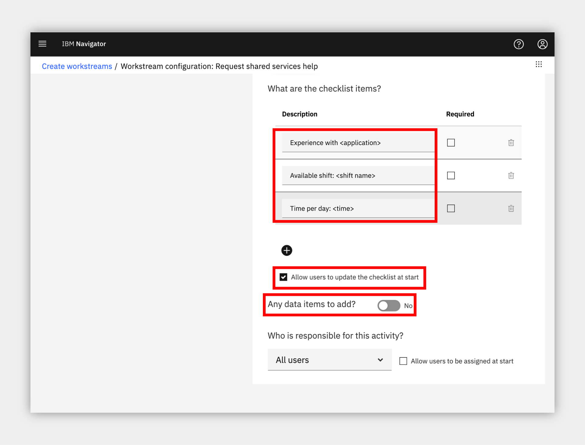
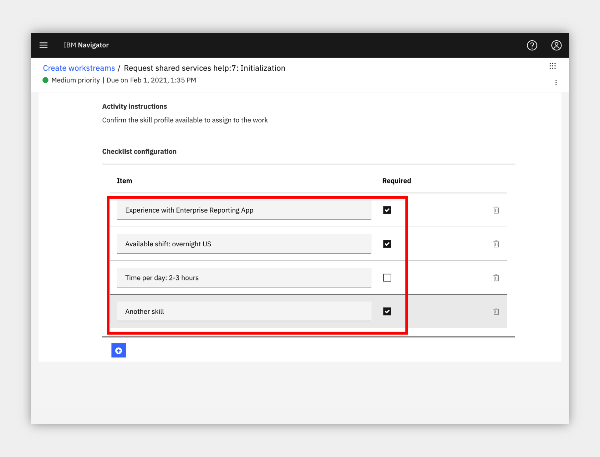
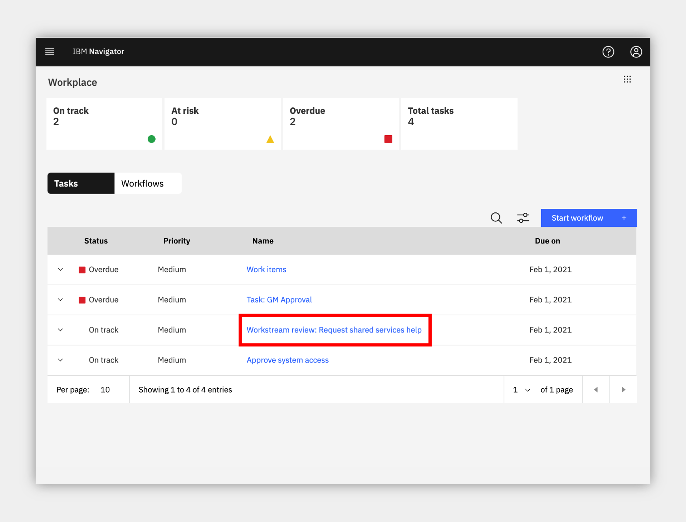

## Shared Services
**an IBM Cloud Pak for Business Automation use case**

***

# Introduction

**Use Case Overview:** Working in a remote environment adds complexity to most tasks. Imagine you lead a shared services team and receive requests from other departments such as Accounts Payable or HR. In person, it's simple to collect information and share status. However, in a remote environment, organizing work is more challenging. Relying on email and phone is just not enough. Work can be duplicated or executed inconsistently, resulting in lost data and delays. You need a lightweight workflow to manage incoming requests.

**Choose an option:**

  * **Cloud Pak for Business Automation as a Service trial or demo environment:** your environment is predeployed, continue to the [Getting Started Lab](#getting-started-lab) section below.
  * **Install Yourself:** To run Shared Services on your own environment you just need to install <a href="https://www.ibm.com/docs/en/cloud-paks/cp-biz-automation/21.0.3?topic=software-automation-workstream-services" target="_blank">IBM Automation Workstream Services</a>, there are no additional artifacts to deploy.

 

***

# Getting Started Lab

**Are you ready to accelerate activities in your daily work ?**

## 1. Scenario Introduction - Shared Services

??? note summary "Expand to view"
    **Demo Video**

    In this demo, you will learn how to use lightweight workflows to manage incoming requests.

    

    ??? note summary "Demo Outline"
        **Demo Outline**
        [Full Demo Narration](#full-demo-narration)

        1. Use Case Overview
        1. Focus Corp Demo Dashboard review
        1. Workstream Supervisor persona
            1. Workplace Tour
            1. Confirm Workstreams access
            1. Create workstream
            1. Test workstream
            1. Publish workstream
        1. Use case review and value of lightweight workflow applications

    ??? note summary "Discovery Map"
        

    [Go to top](#lab-section-1) | [Go to Getting Started Lab](#getting-started-lab)

## 2. Login and Setup Your Environment

??? note summary "Expand to view"

    **Select an option for your environment**

    ??? note summary "Option 2A - Using a Cloud Pak for Business Automation as a Service trial or demo environment ?"

        

        Any IBM maintained SaaS tenant with Automation Workstream Services will support this use case including the public trial for external users and multiple tenants that can be reserved and accessed by both IBMers and Business Partners.

        If you are using the trial, login <a href="http://automationcloud.ibm.com/" target="_blank">here</a>.

        For IBMers and Business Partners, please login to IBM Technology Zone and navigate to <a href="https://techzone.ibm.com/collection/5fdfcf8b99cf35001ee4954d" target="_blank">here</a> to reserve an environment.

        For all users:

        1\. Open the menu in the upper left.

        2\. Select **Production** and then **Run**.

        3\. Click the **Workplace** tile to launch the Workplace interface

        [Go to top](#lab-section-2a) | [Go to Getting Started Lab](#getting-started-lab)

    ??? note summary "Option 2B - Are You Using Your Own Environment (not a SaaS trial/demo) ?"
        

        1\. Standard Users, once your account administrator completes the Workstreams install and provides you access, please continue.

        > Standard Users, continue here...

        2\. Ask your administrator for the URL to Workplace and your login credentials

        [Go to top (Option 2b)](#lab-section-2b) | [Go to Getting Started Lab](#getting-started-lab)

    [Go to top](#lab-section-2) | [Go to Getting Started Lab](#getting-started-lab)

## 3. Tour Workplace

??? note SUMMARY "Expand to view"
    **Manage your work, don't let it manage you**

    You are now a manager leading a Shared Services team that receives requests from other departments such as Accounts Payable or HR for assistance.
    As a Line of Business Supervisor, you decide to create a lightweight workflow application to manage incoming requests and avoid a disorganized email inbox.

    1\. Allow Workplace to fully load and then look around.  If no one has used Workplace yet, it might be empty similar to below

    

    Once it is used, tasks and workflows will appear and the counters at the top will populate based on due date (**On track** and **Overdue**) and expected completion based on past performance (**At risk**). All views can be easily configured using built-in filter and search.

    

    2\. Click on the blue **Start workflow** button highlighted in red above and review the activities and workflows available to launch, but do not launch any yet.

    

    3\. When done, close the **Start workflow** dialog.

    [Go to top](#lab-section-3) | [Go to Getting Started Lab](#getting-started-lab)

## 4. Confirm Workstreams access

??? note SUMMARY "Expand to view"

    To start using Workplace, your administrator must first assign you, and any of your colleagues, a workstreams team which controls access in the Workplace environment.

    1\. Click the menu grid icon in the upper right corner.

    2\. If you see **Create workstreams** you have been given the required access to continue (Note, if you do not see this menu option, close the menu, wait 5-10 seconds and try again)

    

    3\. If you do not have **Create workstreams** in your menu, contact your administrator or respond to the email confirm for your trial and ask for the Configurators workstream team to be added and be sure to refresh your browser window to make it effective.

    4\. Administrator Users, expand the following section to access additional steps to setup access for yourself and others in Workplace:

    ??? note SUMMARY "Additional Workstreams Administrator Setup"
        

        1\. Click the menu grid icon in the upper right corner and select **Manage workstream teams**.

        2\. Click the radio button to the left of **Administrators** and wait for the right side list to load, which may be empty.

        

        3\. Click the plus sign in the right side to search for and add a new user to the team.  It is recommended to add yourself to **Administrators** and **Configurators** and optionally **Team managers**.

        

        4\. Optionally, create a new team named **Shared Services** and add yourself to represent assigning work to your team.

        5\. **IMPORTANT**: now that you have the correct teams set, refresh your browser window/tab to make the roles effective.

        6\. You will know once the role is effective when you click the menu grid icon in the upper right corner and see the following options.

        

        [Go to top](#lab-section-4a) | [Go to Guided Tour](#getting-started-lab)

     [Go to top](#lab-section-4) | [Go to Guided Tour](#getting-started-lab)

## 5. Create a workstream

??? note SUMMARY "Expand to view"

    As a Supervisor, you are now ready to create a new workstream and publish it so the departments you work with, such as Accounts Payable and HR, can submit their requests in an organized manner.

    1\. Click the menu grid icon in the upper right corner and select **Create workstreams**

    

    2\. Review the workstreams provided with the platform as examples that you can keep or edit or wait and review once you create your own workstream.

    3\. Once done reviewing, click the blue **New** button and configure your definition as pictured below, then click **Next** when ready.

    

    > NOTE: selecting **All users** will allow any user in the system to submit a new request to your team; this could also be restricted to a team that you create, if desired.

         

    4\. Review the workstream editor:

    !!! note ""
        a\. Your workflow will show vertically on the left.

        b\. The currently selected activity in your workflow is configurable on the right.

        c\. A draft can be saved at any time.

        d\. The Save button will place the workflow in trial mode for testers to try out.

         

    5\. Name the first activity **Skill profile** and select **Checklist** as the type.

    

    6\. Scroll down on the right side to configure your workflow's first activity

    !!! note ""
        a\. Add some checklist items.

        b\. Select **Allow users to update the checklist at start** (it might make sense to use placeholders as depicted below).

        

        c\. Activate the data items slider, click **Select data items**, click the plus sign and add two data items as pictured below.

        d\. Select each data item and **Add selected items**.

        

        e\. Click **Who is responsible for this activity** and choose either **Shared Services**, if you created that optional team and added yourself, or **All users**.  Note, if you leave this screen to go check the teams, be sure to save a draft first.

        

     

    7\. When you are done and ready to create your second activity, you can either:

       * click the plus icon at the bottom, or

       * scroll to the top and click the plus icon in the left side flow diagram.

    8\. Name the second activity **Approve Resource** and select **Approval** as the type.  This creates a two-way branch in the flow.

    

    9\. As above, click the plus sign next to **If approved** to add a third activity for that branch.

    !!! note ""
        a\. Name the third activity **Approval Notification**

        b\. Select **Form** as the type.

        c\. Optionally click **Select data items** to add some data and select Read only.

        

     

    10\. In the left diagram, click the **Approve Resource** activity box, then click the plus sign next to **If rejected** to add a fourth and final activity for the other branch.

    !!! note ""
        a\. Name the fourth activity **Denial Notification**

        b\.  Select **Form** as the type.

        c\. Optionally add data as Read only.

     

    11\. You may change the **Who is responsible for this activity** selection for the two notification activities to **The user who starts the workstream** and/or the approval activity to **Team managers** (just make sure you are a member of the selected team).

    !!! success
        Congratulations, you created your first lightweight workflow!  Anyone can submit and route a workflow to the Shared Services team who respond with their skills and an approval with a notification sent to the submitter with the response.

    12\. When complete, scroll to the top and click the blue **Save** button to put the workflow in trial mode

    

    [Go to top](#lab-section-5) | [Go to Getting Started Lab](#getting-started-lab)

## 6. Test the workstream

??? note SUMMARY "Expand to view"

    **It is time to test your new workstream. There is a built-in Testers group that allows you to delegate this role but for now, let us test ourselves.**

    1\. Click the menu grid icon in the upper right corner and select **Create workstreams**.

    2\. Locate the new workstream you just created and click the three-dot menu on the right, then select **Test**.

    

    3\. The initialization screen is specific to this workflow; read the instructions and scroll down to customize the checklist available to you as the workflow starter.  An example is below

    

    4\. Once ready, scroll to the top right and click the blue **Start workstream** button.

    5\. To test the first task as a Shared Services team member, click the menu grid icon in the upper right corner and select **Workplace**

    6\. You should see a **Skill profile** task in the list, click the name and claim it.

    !!! info "If you do not see the task in the list, you can either click the magnifying glass and search for `skill` or click the browser refresh button.  The task list may not refresh automatically in some browsers so searching should be faster than a full refresh.""

     

     

    7\. You are now testing as a Shared Services resource on the team you lead.

    !!! note ""
        a\. Check off the items in the checklist

        b\. Fill in the data fields

        c\. Optionally upload a document or picture to securely include in the request.

        d\. Optionally add a comment.

        e\. Submit the task.

        

     

    8\. Back at the task list, use the magnifying glass to search for **Approve Resource** and claim the task.

    

    9\. You are now the shared services team manager again, time to approve or decline the request.

    !!! note ""
        a. Review the approval screen.

        b. If you added data, it is read-only by default

        c. If you added comments in the previous task, they are present.

        d. Either **Reject** or **Approve** the request.

        

     

    10\. Back at the task list, use the magnifying glass to search for **Notification** and claim the task.

    

     

    11\. You are now the original submitter/requestor such as an Accounts Payable team member.

    !!! note ""
        a\. Review the notification, including optional data and comments.

        b\. When done, click **Complete** at the upper right.

        

     

    [Go to top](#lab-section-6) | [Go to Getting Started Lab](#getting-started-lab)

## 7. Publish the workstream

??? note SUMMARY "Expand to view"

    **After testing, you are ready to publish your new workflow.**

    1\. Click the menu grid icon in the upper right corner and select **Create workstreams**

    2\. Locate the new workstream you just created and click the three-dot menu on the right, then select **Request publish**.

    

    **The system has a built-in workflow for approving and publishing -- a workstream for publishing workstreams !**

    3\. Choose to **Assign to any publisher** and click **Assign**

    

    4\. Confirm the workflow is in the **Published requested** status as below.

    

    5\. Click the menu grid icon in the upper right corner and select **Workplace**.

    6\. Locate or search for the task titled **Workstream review...** and click to claim it.

    

    7\. Review the workstream and note the **Read-only** notice next to the name since you are only reviewing, not editing.

    8\. Click to **Publish** the workflow.

    

    9\. Click **Start workflow** and locate the just published workflow to launch.

    

    !!! success
        In just a few minutes, you created, tested and published a new, lightweight workflow available to anyone in your organization !

    [Go to top](#lab-section-7) | [Go to Getting Started Lab](#getting-started-lab)

## 8. Summary

??? note SUMMARY "Expand to view"
    As you saw, Workstream Services helps you manage remote work more effectively by allowing business users to create lightweight workflows that automate internal processes, no coding required. Get ready to improve your team's productivity by simplifying common tasks and decreasing the complexity and limitations of remote work.

    [Go to top](#lab-section-8) | [Go to Getting Started Lab](#getting-started-lab)

# Full Demo Narration

??? note summary "Expand to view"

    **Intro**

    Working in a remote environment adds complexity to most tasks.  Imagine you lead a shared services team and receive requests from other departments such as Accounts Payable or HR. In person, it's simple to collect information and share status.

    However, in a remote environment, organizing work is more challenging.  Relying on email and phone is just not enough. Work can be duplicated or executed inconsistently, resulting in lost data and delays.  You need a lightweight workflow to manage incoming requests.

    **Demo Start Page**

    After reviewing the demo launch page including the outline and discovery map, we are ready to launch the Line of Business Supervisor's Workplace interface, the single place you manage all your work.

    **Manage workstream teams**

    You check out the start workflow list and see great starting activities and workflows such as approval, checklist and more.

    You start by managing the teams.  It's a good idea to add yourself to at least Administrators and Supervisors and maybe Team managers.  You can also create a Shared Services team so you can assign work to them later.

    **Create a workstream**

    Now it's time to create a workstream for incoming shared services requests.  We'll set it so everyone can start and give a description.  The simple, no-code editor allows you to assemble a workflow in just a few clicks.  Start with a checklist activity to represent the skill profile requested.  To make this reusable, we add checklist items with placeholders and allow the user that launches the flow to update and add more.  Let's also add a couple data items for the country and date available.  Once the request is submitted, the shared services team member will complete this form and confirm their skills.  Your first activity is complete!

    We add another step to get manager approval and setup a simple branch flow.  For the approval branch we add a form to notify of the result.  Then, head back to our approval and add the rejection branch.  So simple!  To complete the workstream, we save and we're ready to go.

    **Test a workstream**

    The new flow starts in trial mode for the author or a testing group to try it out safely before the end users.  Simple to test, we see the launch screen specific to this workstream where the user starting the flow, such as an Accounts Payable clerk, will configure available options including checklist items, and also any activity assignments allowed by the workstream, which we did not activate yet.

    Once started, we go back to the main Workplace.  Let's take on the role of a shared services team member and see how easy it is to complete the first step. Claim and open the task, check the checklist items, fill in the data, optionally attach a document for review, type a comment and submit.  This is much easier and more organized than email.  Now taking on my team manager role for approval, all looks good and I accept.  Finally, the original requestor receives an approval notification to complete the request. Back at the task list we can switch to workflows and without any customization, the tool provides a complete audit trail of all work by default.

    **Publish a workstream**

    Once ready, I can request a publish to share my workstream with other teams.  The platform has a built-in approval workstream for workstreams!  So we head to the same task list, click to review the workstream definition.  As a publisher, I may send it back with comments or publish directly.  And in just a few minutes, I created, tested and published a new, lightweight workflow available to anyone in my organization: ready to launch!

    **Use Case Summary**

    As you saw, Workstream Services helps you manage remote work more effectively by allowing business users to create lightweight workflows that automate internal processes, no coding required. Get ready to improve your team's productivity by simplifying common tasks and decreasing the complexity and limitations of remote work.

    [Go to top](#video-narration) | [Go to Getting Started Lab](#getting-started-lab) | [Go to Introduction](#introduction)
